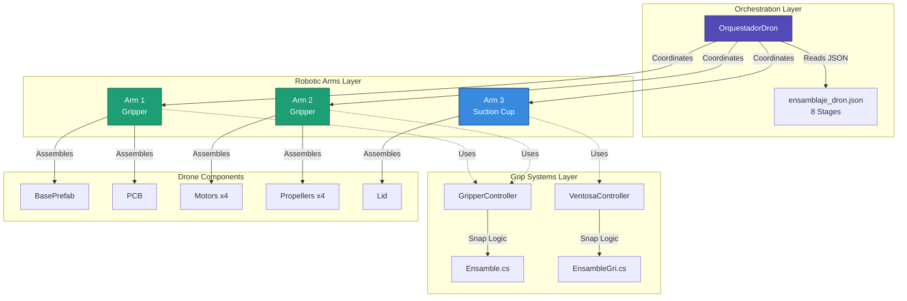
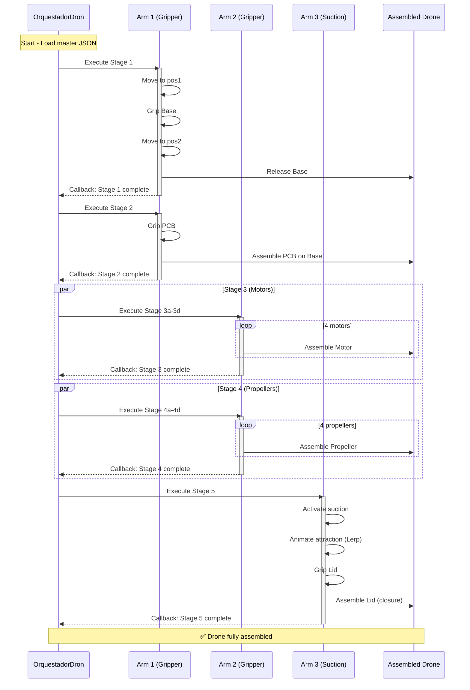
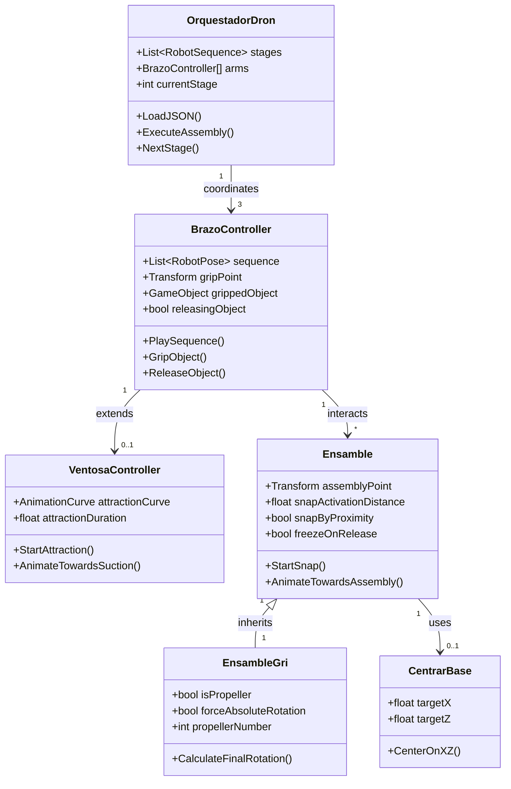
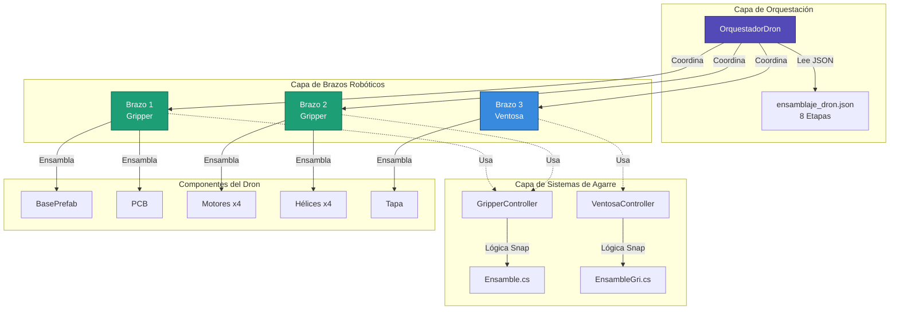
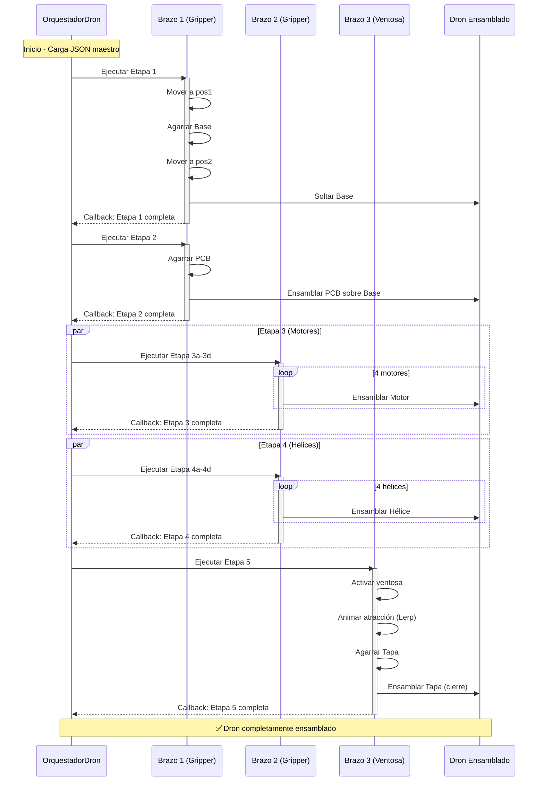
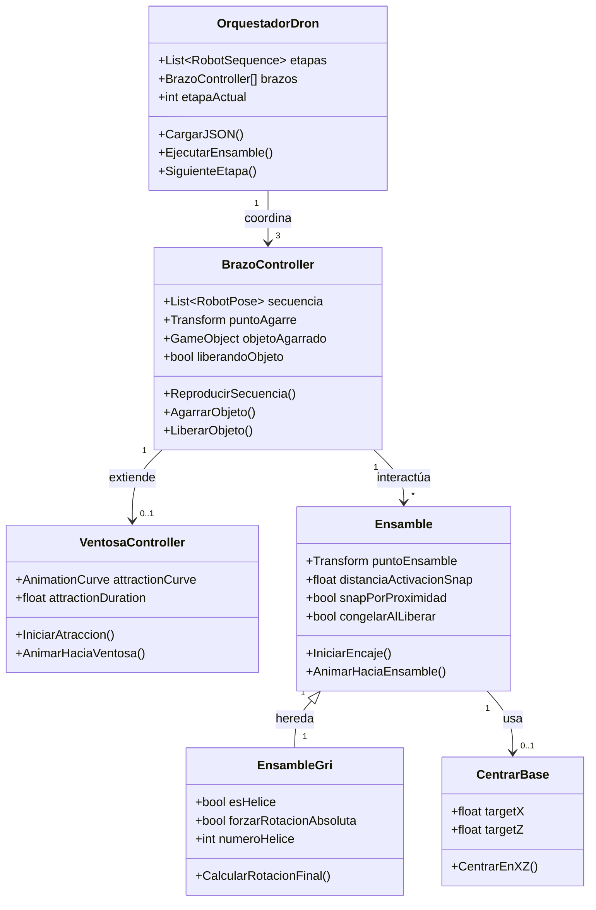

# 🤖 Drone Packaging Simulation — Unity

<div align="center">


**Industrial Robotic Assembly Cell Simulation**  
Coordinated Articulated Arms · JSON-Driven Motion · Realistic Physics · Festo-Inspired Systems

**English** | [Español](#-simulación-de-empaquetado-de-dron--unity-1)

</div>

---

## 📋 Table of Contents

- [Overview](#-overview)
- [Technical Stack](#-technical-stack)
- [System Architecture](#-system-architecture)
- [Implemented Systems](#-implemented-systems)
- [Project Structure](#-project-structure)
- [Installation](#-installation)
- [Resolved Issues](#-resolved-issues)
- [Roadmap](#-roadmap)
- [Authors](#-authors)
- [License](#-license-and-rights)

---

## 🎯 Overview

This project is a **Unity-based industrial simulation** of a robotic drone assembly cell. It reproduces an automated production process in which three articulated robotic arms collaborate to assemble a drone through physically realistic interactions, coordinated motion sequences, and differentiated gripping mechanisms.

The simulation is intended for **virtual process validation** in industrial and academic contexts, drawing inspiration from systems similar to those found in **Festo-type** automation platforms.

### Key Features

- 🦾 **Three coordinated robotic arms** with ArticulationBody physics
- 🔄 **8-stage assembly orchestration** with JSON-driven sequences
- ⚙️ **Dual end effectors**: Gripper (pinza) and Suction Cup (ventosa)
- 🎯 **Proximity-based snap system** for component assembly
- 📊 **Coroutine-based asynchronous execution** with dependency management
- 🔧 **World-space preservation** to prevent rotation artifacts

---

## 🛠️ Technical Stack

### Unity 2021.3.45f1 LTS

| Criterion | Justification |
|-----------|---------------|
| **LTS (Long-Term Support)** | Stability guaranteed through 2024, ideal for industrial simulation projects |
| **Mature ArticulationBody** | Introduced in 2020.1, fully stable in 2021.3 for precise robotic simulation |
| **Deterministic Physics** | Configurable solver iterations, essential for robotics |
| **C# 10.0** | Modern language features: records, pattern matching, global usings |
| **Native JSON Support** | Optimized `JsonUtility` + Newtonsoft.Json compatibility |
| **Performance** | DOTS preview available for future scalability |

### Core Unity Components

```csharp
ArticulationBody      // Robotic joint system (superior to standard Rigidbody)
ArticulationDrive     // Motor control (target, stiffness, damping)
ArticulationJointType // Revolute (rotation) and Prismatic (linear)
Coroutines            // Asynchronous sequences
JsonUtility           // Data serialization
Physics.IgnoreCollision // Dynamic collision control
```

### External Dependencies

- **Newtonsoft.Json** (optional): Enhanced JSON parsing capabilities
- **Unity FBX Exporter** (`com.unity.formats.fbx`): Asset export for external workflows

---

## 🏗️ System Architecture

### Component Diagram



### Arm Configuration

| Arm | End Effector | Role | Components Handled |
|-----|-------------|------|-------------------|
| **Arm 1** | Gripper (pinza) | Large component handling | Base, PCB |
| **Arm 2** | Gripper (pinza) | Mechanical component handling | Motors x4, Propellers x4 |
| **Arm 3** | Suction Cup (ventosa) | Delicate component handling | Lid (final closure) |

### Assembly Sequence Flow



### Script Interaction Diagram



---

## ⚙️ Implemented Systems

### 1. Gripper System

**Challenge**: When using `SetParent`, the object's rotation and position would change unexpectedly.

**Solution**: Preserve offsets in world-space before re-parenting:

```csharp
// Save offsets in world space
Vector3 worldPos = grippedObject.transform.position;
Quaternion worldRot = grippedObject.transform.rotation;

grippedObject.transform.SetParent(gripPoint);

// Restore in world space
grippedObject.transform.position = worldPos;
grippedObject.transform.rotation = worldRot;
```

**Critical bug fixed**: Removed `localRotation = Quaternion.identity` which was causing unexpected flips.

**Configuration**:
- ✅ Local offsets: `grabLocalOffset`, `grabLocalRotOffset`
- ✅ Fixed rotations per prefab in Inspector
- ❌ **Never** use `localRotation = Quaternion.identity` after `SetParent`

---

### 2. Suction Cup System

**Behavior**: Visual magnetic attraction animation before attachment.

**Implementation**:
```csharp
// Attraction animation with easing
float t = attractionCurve.Evaluate(elapsedTime / attractionDuration);
object.transform.position = Vector3.Lerp(startPos, suctionPos, t);
object.transform.rotation = Quaternion.Lerp(startRot, suctionRot, t);
```

**Advantages**:
- Clear visual feedback for the user
- Configurable easing via `AnimationCurve`
- Smooth transition without teleportation

---

### 3. JSON Motion Sequencer

Each arm's movement is defined in an external JSON file specifying target position, target rotation, duration, and action on completion (grip / release / none). This architecture decouples motion data from logic, allowing sequence changes without recompilation.

**Data Structure**:
```json
{
  "arm": "Arm1",
  "sequence": [
    {
      "position": { "x": 1.2, "y": 0.5, "z": -0.3 },
      "rotation": { "x": 0, "y": 90, "z": 0 },
      "duration": 2.0,
      "delay": 0.5,
      "action": "grip"
    }
  ]
}
```

**Available Actions**:
- `grip` — Activate gripper/suction cup
- `release` — Release object
- `""` — Movement only

---

### 4. Multi-Arm Orchestrator

`OrquestadorDron.cs` is the central coordination MonoBehaviour. It reads the master assembly sequence, triggers each arm in the correct order, and awaits completion callbacks before advancing to the next stage.

**Design Pattern**:
```csharp
private IEnumerator ExecuteAssembly()
{
    // Stage 1: Base
    yield return StartCoroutine(arm1.ExecuteSequence("base"));
    
    // Stage 2: PCB (depends on Stage 1)
    yield return StartCoroutine(arm1.ExecuteSequence("pcb"));
    
    // Stage 3-4: Motors and propellers (parallelizable)
    yield return StartCoroutine(arm2.ExecuteSequence("motors"));
    
    // Stage 5: Lid (final closure)
    yield return StartCoroutine(arm3.ExecuteSequence("lid"));
}
```

---

### 5. Snap Mechanics

**Two Approaches**:

| Method | Trigger | Advantages | Disadvantages |
|--------|---------|------------|---------------|
| **Proximity** | `snapActivationDistance` | Precise, configurable | Requires polling |
| **Collision** | `OnTriggerEnter` | Event-driven, efficient | Requires colliders |

**Snap Animation**:
```csharp
Vector3 startPos = piece.transform.position;
Vector3 finalPos = assemblyPoint.position + 
                   assemblyPoint.up * sinkOffset;

float t = 0f;
while (t < 1f) {
    t += Time.deltaTime / snapDuration;
    piece.transform.position = Vector3.Lerp(startPos, finalPos, t);
    yield return null;
}

// Fix as child
piece.transform.SetParent(basePrefab.transform);
piece.GetComponent<Rigidbody>().isKinematic = true;
```

---

### 6. Race Condition Prevention

**Problem**: `PlaySequence()` and `ReleaseInSequence()` ran in parallel.

**Solution: Boolean Semaphore**
```csharp
private bool releasingObject = false;

IEnumerator ReleaseInSequence() {
    releasingObject = true;
    // ... release logic
    releasingObject = false;
}

IEnumerator PlaySequence() {
    if (releasingObject) 
        yield return new WaitUntil(() => !releasingObject);
    // ... continue
}
```

---

### 7. Projectile Release Point Calculation

Inverse projectile kinematics are used to calculate the exact horizontal position at which an arm must release an object so that it lands on a target, accounting for free-fall physics from the release height.

```csharp
// Free-fall time from yR to yT
float deltaY = yR - yT;
float fallTime = Mathf.Sqrt(2 * deltaY / Physics.gravity.magnitude);

// Required horizontal distance
float distH = horizontalVelocity * fallTime;
Vector3 releasePoint = target.position - direction * distH;
```

---

## 📁 Project Structure

```
drone-packaging-simulation-unity/
├── Assets/
│   ├── Scripts/
│   │   ├── Core/
│   │   │   ├── OrquestadorDron.cs       # Master coordinator (8 stages)
│   │   │   ├── SecuenciadorJSON.cs      # Sequence parser
│   │   │   └── CentrarBase.cs           # XZ centering with gravity
│   │   ├── Arms/
│   │   │   ├── BrazoController.cs       # Base arm control
│   │   │   ├── Brazos.cs                # Gripper implementation
│   │   │   └── Ventosa.cs               # Suction cup implementation
│   │   └── Assembly/
│   │       ├── Ensamble.cs              # Base snap/assembly
│   │       └── EnsambleGri.cs           # Gripper variant
│   ├── Data/
│   │   ├── ensamblaje_dron.json         # Master JSON (8 stages)
│   │   ├── secuencia_brazo1.json
│   │   ├── secuencia_brazo2.json
│   │   └── secuencia_brazo3.json
│   ├── Prefabs/
│   │   ├── BasePrefab.prefab
│   │   ├── PCBPrefab.prefab
│   │   ├── MotorPrefab.prefab
│   │   ├── HelicePrefab.prefab
│   │   └── TapaPrefab.prefab
│   └── Scenes/
│       └── SimulacionEnsamblaje.unity
└── Documentation/
    ├── Unity_Robotica_Resumen.md
    ├── __Historial_de_Trabajo_en_Unity.md
    ├── unity_documentacion_completa.md
    └── Unity_Reciente_Mar24_Abr4.md
```

---

## 🚀 Installation

### Prerequisites

- **Unity Hub** 3.x or higher
- **Unity 2021.3.45f1 LTS** (installable from Unity Hub)
- **Git** (to clone the repository)
- **OS**: Windows 10/11, macOS 10.15+, or Ubuntu 20.04+

### Installation Steps

1. **Clone the repository**
   ```bash
   git clone https://github.com/jorgefajardom-coder/drone-packaging-simulation-unity.git
   cd drone-packaging-simulation-unity
   ```

2. **Open in Unity Hub**
   - Open Unity Hub
   - Click "Add" → Select the project folder
   - Verify version is **2021.3.45f1 LTS**
   - If not installed, Unity Hub will download it automatically

3. **First Run**
   - Open `Assets/Scenes/SimulacionEnsamblaje.unity`
   - Wait for initial script compilation (1-2 min)
   - Press **Play** ▶️

4. **JSON Configuration**
   - Verify paths in `OrquestadorDron` Inspector
   - Master JSON: `Assets/Data/ensamblaje_dron.json`
   - Individual JSONs: `Assets/Data/secuencia_brazoX.json`

---

## 🐛 Resolved Issues

### Issue #1: Rotation Flips on Grip

**Symptoms**:
- Object rotates 180° unexpectedly when `SetParent` is called
- Incorrect orientation after gripping

**Root Cause**:
```csharp
// ❌ INCORRECT
grippedObject.transform.SetParent(gripPoint);
grippedObject.transform.localRotation = Quaternion.identity; // <-- BUG
```

**Solution**:
```csharp
// ✅ CORRECT
Vector3 worldPos = grippedObject.transform.position;
Quaternion worldRot = grippedObject.transform.rotation;

grippedObject.transform.SetParent(gripPoint);

grippedObject.transform.position = worldPos;
grippedObject.transform.rotation = worldRot;
// DO NOT touch localRotation
```

**Lesson**: Preserve **world-space** before and after `SetParent`.

---

### Issue #2: Lid Penetrating Components

**Symptoms**:
- Lid falls through assembled PCB/motors
- Reaches table and "jumps" upward

**Root Cause**:
- `PositionOnBand()` was called **before** releasing
- Abrupt repositioning with active gravity
- Incorrect collision layers

**Solution**:
```csharp
bool isPieceToFreeze = assembleScript != null && 
                       assembleScript.freezeOnRelease;

if (!isPieceToFreeze) {
    PositionOnBand(); // Only for PCB
}

// For Lid:
// snapByProximity = true
// freezeOnRelease = true
// isKinematic = true BEFORE releasing
```

**Collision Matrix Configuration**:
```
✅ Lid vs WorkTable: Enabled
✅ Lid vs AssemblablePart: Enabled
❌ Lid vs AssemblyPoint: Disabled (trigger only)
```

---

### Issue #3: Sequence Race Condition

**Symptoms**:
- Objects hit during release
- Deviated trajectories
- Non-deterministic behavior

**Root Cause**:
- `ReleaseInSequence()` and `PlaySequence()` ran in parallel
- No synchronization between coroutines

**Solution: Semaphore Flag**
```csharp
private bool releasingObject = false;

IEnumerator ReleaseInSequence() {
    releasingObject = true;
    yield return new WaitForSeconds(preReleaseTime);
    // ... release object
    yield return new WaitForSeconds(postReleaseTime);
    releasingObject = false;
}

IEnumerator PlaySequence() {
    if (releasingObject) {
        yield return new WaitUntil(() => !releasingObject);
    }
    // ... execute pose
}
```

---

### Issue #4: Incorrect Propeller Rotation

**Symptoms**:
- Propellers 2 and 4 visually "upside down"
- Erratic rotations: `(270, 90, 0)`, `(270, 270, 0)`

**Root Cause**:
- Arms gripped from different angles
- Spawner generated inconsistent orientations
- Script forced absolute rotation without considering grip offset

**Solution**:
```csharp
// In EnsambleGri.cs
if (isPropeller && forceAbsoluteRotation) {
    Quaternion targetRotation = Quaternion.identity;
    
    switch (propellerNumber) {
        case 1: targetRotation = Quaternion.Euler(-90, 0, 0); break;
        case 2: targetRotation = Quaternion.Euler(-90, 90, 0); break;
        case 3: targetRotation = Quaternion.Euler(-90, 180, 0); break;
        case 4: targetRotation = Quaternion.Euler(-90, 270, 0); break;
    }
    
    transform.rotation = targetRotation;
}
```

**Inspector Configuration**:
- `Is Propeller`: ✅
- `Force Absolute Rotation`: ✅
- `Propeller Number`: 1-4 (assigned by spawner)

---

### Issue #5: Movement Stuttering

**Symptoms**:
- Jerky arm movement
- Micro-stops during Lerp
- Inconsistent velocity

**Root Cause**:
```csharp
// ❌ INCORRECT: t not accumulated correctly
Vector3.Lerp(startPos, endPos, Time.deltaTime / duration);
```

**Solution**:
```csharp
// ✅ CORRECT: Accumulate t explicitly
float t = 0f;
while (t < 1f) {
    t += Time.deltaTime / duration;
    transform.position = Vector3.Lerp(startPos, endPos, t);
    yield return null;
}
```

**Rule**: All physics logic should be in `FixedUpdate` for movements with `Rigidbody`.

---

### Issue #6: Inconsistent Heights After Snap

**Symptoms**:
- Components at different heights after snap
- Visual gaps or overlaps

**Root Cause**:
- **Incorrect pivots in exported prefabs**
- Model origin doesn't match actual contact point
- Generic sink offset without considering geometry

**Solution**:
1. **Correction in modeling software** (Blender/Fusion 360):
   - Place pivot at lower contact point
   - Export with "Apply Transform"

2. **Compensation in Unity** (temporary):
   ```csharp
   // In Ensamble.cs - offsets per piece type
   if (gameObject.name.Contains("Motor")) {
       sinkOffset = -0.02f;
   } else if (gameObject.name.Contains("PCB")) {
       sinkOffset = -0.005f;
   }
   ```

**Status**: ⚠️ Definitive correction pending in CAD prefabs.

---

## 📊 Bug Summary Table

| # | Issue | Severity | Status | Solution |
|---|-------|----------|--------|----------|
| 1 | Rotation flips on grip | 🔴 Critical | ✅ Resolved | Preserve world-space |
| 2 | Lid penetrates components | 🔴 Critical | ✅ Resolved | Kinematic + collision layers |
| 3 | Sequence race condition | 🟡 High | ✅ Resolved | Semaphore flag |
| 4 | Propeller rotation | 🟡 High | ✅ Resolved | Absolute rotation by number |
| 5 | Movement stuttering | 🟢 Medium | ✅ Resolved | Correct t accumulation |
| 6 | Inconsistent heights | 🟡 High | ⚠️ Mitigated | Pending: CAD pivot correction |

---

## 🏗️ Robotic Arm Hierarchy

```
BrazoBase (fixed)
└── Hombro (Revolute)
    └── BrazoSuperior (Revolute)
        └── Codo (Revolute)
            └── Antebrazo (Revolute)
                └── Muñeca (Revolute)
                    └── GripperBase (fixed)
                        ├── PinzaIzquierda (Prismatic)
                        └── PinzaDerecha (Prismatic)
```

---

## ⚙️ Physics Configuration

### ArticulationBody Setup

```csharp
// Typical revolute joint configuration
ArticulationBody body = GetComponent<ArticulationBody>();
body.jointType = ArticulationJointType.RevoluteJoint;
body.anchorRotation = Quaternion.Euler(0, 90, 0);

ArticulationDrive drive = body.xDrive;
drive.stiffness = 10000f;  // Rigidity
drive.damping = 100f;      // Damping
drive.forceLimit = 1000f;  // Force limit
drive.target = 45f;        // Target position (degrees)
body.xDrive = drive;
```

### Drive Parameters

| Parameter | Purpose |
|-----------|---------|
| **stiffness** | Joint rigidity — higher values produce firmer response |
| **damping** | Oscillation attenuation |
| **forceLimit** | Maximum applicable force |
| **target** | Target position or rotation value |

### Collision Layers

```
Layer 8:  WorkTable
Layer 9:  AssemblablePart
Layer 10: RobotArm
Layer 11: AssemblyPoint

Collision Matrix:
✅ AssemblablePart vs WorkTable
✅ AssemblablePart vs AssemblablePart
❌ RobotArm vs RobotArm (same arm)
✅ RobotArm vs WorkTable
❌ AssemblyPoint vs AssemblablePart (trigger only)
```

---

## 🗺️ Roadmap

### ✅ Phase 1: Core (Completed)

- [x] Arm system with ArticulationBody
- [x] Functional gripper and suction cup
- [x] JSON sequencer
- [x] 8-stage orchestrator
- [x] Snap/assembly mechanics
- [x] World-space preservation
- [x] Race condition fixes

### 🚧 Phase 2: Optimization (In Progress)

- [ ] CAD prefab pivot correction
- [ ] Performance profiling (stable 60 FPS)
- [ ] Reduce coroutine allocations
- [ ] Object pooling for parts

### 📋 Phase 3: Advanced Features

- [ ] **Sequence editor GUI**
  - Visual timeline for poses
  - Drag & drop actions
  - Real-time preview

- [ ] **QA validation system**
  - Collision detection during assembly
  - Precision metrics
  - Cycle time analytics

- [ ] **Data export**
  - CSV metrics per stage
  - Position heatmaps
  - Session replay

### 🔮 Phase 4: Scalability

- [ ] **Multi-cell systems**
  - Hierarchical orchestrator
  - Inter-cell communication
  - Chain production

- [ ] **ML/RL Integration**
  - Unity ML-Agents
  - Trajectory optimization
  - Anomaly detection

- [ ] **ROS2 Bridge** (optional)
  - ROS2 Humble integration
  - Simulation + real hardware
  - Hybrid control

---

## 👥 Authors

**Jorge Andres Fajardo Mora**  
**Laura Vanesa Castro Sierra**

---

## 📄 License and Rights

**Copyright © 2025 Jorge Andres Fajardo Mora and Laura Vanesa Castro Sierra. All rights reserved.**

This repository and all its contents — including but not limited to source code, scripts, configuration files, data files, and documentation — are provided for **read-only and reference purposes only**. 

**No permission is granted** to copy, modify, distribute, sublicense, or use any part of this project for commercial or non-commercial purposes without **explicit written authorization** from the authors.

**Unauthorized reproduction or redistribution** of this work, in whole or in part, is **strictly prohibited**.

---
---
---

# 🤖 Simulación de Empaquetado de Dron — Unity

<div align="center">


**Simulación de Celda de Ensamblaje Robótico Industrial**  
Brazos Articulados Coordinados · Movimiento JSON · Física Realista · Sistemas tipo Festo

[English](#-drone-packaging-simulation--unity) | **Español**

</div>

---

## 📋 Tabla de Contenidos

- [Descripción General](#-descripción-general)
- [Stack Técnico](#-stack-técnico)
- [Arquitectura del Sistema](#-arquitectura-del-sistema)
- [Sistemas Implementados](#-sistemas-implementados)
- [Estructura del Proyecto](#-estructura-del-proyecto)
- [Instalación](#-instalación)
- [Problemas Resueltos](#-problemas-resueltos)
- [Hoja de Ruta](#-hoja-de-ruta)
- [Autores](#-autores)
- [Licencia](#-licencia-y-derechos)

---

## 🎯 Descripción General

Este proyecto es una **simulación industrial basada en Unity** que recrea una celda robótica de ensamblaje de drones. Reproduce un proceso de producción automatizado en el que tres brazos robóticos articulados colaboran para ensamblar un dron mediante interacciones físicas realistas, secuencias de movimiento coordinadas y mecanismos de agarre diferenciados.

La simulación está orientada a la **validación virtual de procesos** en contextos industriales y académicos, con una arquitectura inspirada en sistemas de automatización **tipo Festo**.

### Características Clave

- 🦾 **Tres brazos robóticos coordinados** con física ArticulationBody
- 🔄 **Orquestación de 8 etapas** con secuencias basadas en JSON
- ⚙️ **Efectores finales duales**: Gripper (pinza) y Ventosa
- 🎯 **Sistema de snap por proximidad** para ensamblaje de componentes
- 📊 **Ejecución asíncrona basada en coroutines** con gestión de dependencias
- 🔧 **Preservación de world-space** para prevenir artefactos de rotación

---

## 🛠️ Stack Técnico

### Unity 2021.3.45f1 LTS

| Criterio | Justificación |
|----------|---------------|
| **LTS (Long-Term Support)** | Estabilidad garantizada hasta 2024, ideal para proyectos de simulación industrial |
| **ArticulationBody maduro** | Introducido en 2020.1, completamente estable en 2021.3 para simulación robótica precisa |
| **Física determinista** | Solver iterations configurables, esencial para robótica |
| **C# 10.0** | Características modernas: records, pattern matching, global usings |
| **Soporte JSON nativo** | `JsonUtility` optimizado + compatibilidad con Newtonsoft.Json |
| **Rendimiento** | DOTS preview disponible para escalabilidad futura |

### Componentes Core de Unity

```csharp
ArticulationBody      // Sistema de articulaciones robóticas (superior a Rigidbody estándar)
ArticulationDrive     // Control de motores (target, stiffness, damping)
ArticulationJointType // Revolute (rotación) y Prismatic (lineal)
Coroutines            // Secuencias asíncronas
JsonUtility           // Serialización de datos
Physics.IgnoreCollision // Control dinámico de colisiones
```

### Dependencias Externas

- **Newtonsoft.Json** (opcional): Capacidades mejoradas de parsing JSON
- **Unity FBX Exporter** (`com.unity.formats.fbx`): Exportación de assets para flujos de trabajo externos

---

## 🏗️ Arquitectura del Sistema

### Diagrama de Componentes



### Configuración de Brazos

| Brazo | Efector Final | Rol | Componentes Manejados |
|-------|--------------|-----|----------------------|
| **Brazo 1** | Gripper (pinza) | Manejo de componentes grandes | Base, PCB |
| **Brazo 2** | Gripper (pinza) | Manejo de componentes mecánicos | Motores x4, Hélices x4 |
| **Brazo 3** | Ventosa | Manejo de componentes delicados | Tapa (cierre final) |

### Flujo de Secuencia de Ensamblaje



### Diagrama de Interacción de Scripts



---

## ⚙️ Sistemas Implementados

### 1. Sistema de Gripper

**Desafío**: Al usar `SetParent`, la rotación y posición del objeto cambiaban inesperadamente.

**Solución**: Preservar offsets en world-space antes del re-parenteo:

```csharp
// Guardar offsets en espacio global
Vector3 worldPos = objetoAgarrado.transform.position;
Quaternion worldRot = objetoAgarrado.transform.rotation;

objetoAgarrado.transform.SetParent(puntoAgarre);

// Restaurar en espacio global
objetoAgarrado.transform.position = worldPos;
objetoAgarrado.transform.rotation = worldRot;
```

**Bug crítico corregido**: Eliminado `localRotation = Quaternion.identity` que causaba flips inesperados.

**Configuración**:
- ✅ Offsets locales: `grabLocalOffset`, `grabLocalRotOffset`
- ✅ Rotaciones fijas por prefab en Inspector
- ❌ **Nunca** usar `localRotation = Quaternion.identity` después de `SetParent`

---

### 2. Sistema de Ventosa

**Comportamiento**: Animación visual de atracción magnética antes de la fijación.

**Implementación**:
```csharp
// Animación de atracción con easing
float t = attractionCurve.Evaluate(elapsedTime / attractionDuration);
objeto.transform.position = Vector3.Lerp(posInicial, posVentosa, t);
objeto.transform.rotation = Quaternion.Lerp(rotInicial, rotVentosa, t);
```

**Ventajas**:
- Feedback visual claro para el usuario
- Easing configurable vía `AnimationCurve`
- Transición suave sin teletransporte

---

### 3. Secuenciador JSON

Los movimientos de cada brazo se definen en archivos JSON externos que especifican posición objetivo, rotación objetivo, duración y acción al finalizar (agarrar / soltar / ninguna). Esta arquitectura desacopla los datos de movimiento de la lógica, permitiendo cambios de secuencia sin recompilación.

**Estructura de Datos**:
```json
{
  "brazo": "Brazo1",
  "secuencia": [
    {
      "posicion": { "x": 1.2, "y": 0.5, "z": -0.3 },
      "rotacion": { "x": 0, "y": 90, "z": 0 },
      "duracion": 2.0,
      "delay": 0.5,
      "accion": "agarrar"
    }
  ]
}
```

**Acciones Disponibles**:
- `agarrar` — Activar gripper/ventosa
- `soltar` — Liberar objeto
- `""` — Solo movimiento

---

### 4. Orquestador Multi-Brazo

`OrquestadorDron.cs` es el MonoBehaviour central de coordinación. Lee la secuencia de ensamble maestra, activa cada brazo en el orden correcto y espera callbacks de finalización antes de avanzar a la siguiente etapa.

**Patrón de Diseño**:
```csharp
private IEnumerator EjecutarEnsamble()
{
    // Etapa 1: Base
    yield return StartCoroutine(brazo1.EjecutarSecuencia("base"));
    
    // Etapa 2: PCB (depende de Etapa 1)
    yield return StartCoroutine(brazo1.EjecutarSecuencia("pcb"));
    
    // Etapa 3-4: Motores y hélices (paralelizable)
    yield return StartCoroutine(brazo2.EjecutarSecuencia("motores"));
    
    // Etapa 5: Tapa (cierre final)
    yield return StartCoroutine(brazo3.EjecutarSecuencia("tapa"));
}
```

---

### 5. Mecánicas de Snap

**Dos Enfoques**:

| Método | Trigger | Ventajas | Desventajas |
|--------|---------|----------|-------------|
| **Proximidad** | `distanciaActivacionSnap` | Preciso, configurable | Requiere polling |
| **Colisión** | `OnTriggerEnter` | Event-driven, eficiente | Requiere colliders |

**Animación de Snap**:
```csharp
Vector3 posInicial = pieza.transform.position;
Vector3 posFinal = puntoEnsamble.position + 
                   puntoEnsamble.up * offsetHundimiento;

float t = 0f;
while (t < 1f) {
    t += Time.deltaTime / duracionSnap;
    pieza.transform.position = Vector3.Lerp(posInicial, posFinal, t);
    yield return null;
}

// Fijar como hijo
pieza.transform.SetParent(basePrefab.transform);
pieza.GetComponent<Rigidbody>().isKinematic = true;
```

---

### 6. Prevención de Race Conditions

**Problema**: `ReproducirSecuencia()` y `LiberarEnSecuencia()` corrían en paralelo.

**Solución: Semáforo Booleano**
```csharp
private bool liberandoObjeto = false;

IEnumerator LiberarEnSecuencia() {
    liberandoObjeto = true;
    // ... lógica de liberación
    liberandoObjeto = false;
}

IEnumerator ReproducirSecuencia() {
    if (liberandoObjeto) 
        yield return new WaitUntil(() => !liberandoObjeto);
    // ... continuar
}
```

---

### 7. Cálculo de Punto de Lanzamiento de Proyectil

Se aplica cinemática inversa de proyectil para calcular la posición horizontal exacta en la que el brazo debe soltar un objeto para que aterrice sobre un objetivo, considerando la física de caída libre desde la altura de release.

```csharp
// Tiempo de caída libre desde yR hasta yT
float deltaY = yR - yT;
float tiempoCaida = Mathf.Sqrt(2 * deltaY / Physics.gravity.magnitude);

// Distancia horizontal necesaria
float distH = velocidadHorizontal * tiempoCaida;
Vector3 puntoRelease = target.position - direccion * distH;
```

---

## 📁 Estructura del Proyecto

```
drone-packaging-simulation-unity/
├── Assets/
│   ├── Scripts/
│   │   ├── Core/
│   │   │   ├── OrquestadorDron.cs       # Coordinador maestro (8 etapas)
│   │   │   ├── SecuenciadorJSON.cs      # Parser de secuencias
│   │   │   └── CentrarBase.cs           # Centrado XZ con gravedad
│   │   ├── Arms/
│   │   │   ├── BrazoController.cs       # Control base de brazos
│   │   │   ├── Brazos.cs                # Implementación gripper
│   │   │   └── Ventosa.cs               # Implementación ventosa
│   │   └── Assembly/
│   │       ├── Ensamble.cs              # Snap/ensamble base
│   │       └── EnsambleGri.cs           # Variante gripper
│   ├── Data/
│   │   ├── ensamblaje_dron.json         # JSON maestro (8 etapas)
│   │   ├── secuencia_brazo1.json
│   │   ├── secuencia_brazo2.json
│   │   └── secuencia_brazo3.json
│   ├── Prefabs/
│   │   ├── BasePrefab.prefab
│   │   ├── PCBPrefab.prefab
│   │   ├── MotorPrefab.prefab
│   │   ├── HelicePrefab.prefab
│   │   └── TapaPrefab.prefab
│   └── Scenes/
│       └── SimulacionEnsamblaje.unity
└── Documentation/
    ├── Unity_Robotica_Resumen.md
    ├── __Historial_de_Trabajo_en_Unity.md
    ├── unity_documentacion_completa.md
    └── Unity_Reciente_Mar24_Abr4.md
```

---

## 🚀 Instalación

### Requisitos Previos

- **Unity Hub** 3.x o superior
- **Unity 2021.3.45f1 LTS** (instalable desde Unity Hub)
- **Git** (para clonar el repositorio)
- **SO**: Windows 10/11, macOS 10.15+, o Ubuntu 20.04+

### Pasos de Instalación

1. **Clonar el repositorio**
   ```bash
   git clone https://github.com/jorgefajardom-coder/drone-packaging-simulation-unity.git
   cd drone-packaging-simulation-unity
   ```

2. **Abrir en Unity Hub**
   - Abrir Unity Hub
   - Click en "Add" → Seleccionar la carpeta del proyecto
   - Verificar que la versión sea **2021.3.45f1 LTS**
   - Si no está instalada, Unity Hub la descargará automáticamente

3. **Primera Ejecución**
   - Abrir `Assets/Scenes/SimulacionEnsamblaje.unity`
   - Esperar compilación inicial de scripts (1-2 min)
   - Presionar **Play** ▶️

4. **Configuración de JSON**
   - Verificar rutas en `OrquestadorDron` Inspector
   - JSON maestro: `Assets/Data/ensamblaje_dron.json`
   - JSONs individuales: `Assets/Data/secuencia_brazoX.json`

---

## 🐛 Problemas Resueltos

### Problema #1: Flips de Rotación al Agarrar

**Síntomas**:
- Objeto rota 180° inesperadamente al hacer `SetParent`
- Orientación incorrecta después del agarre

**Causa Raíz**:
```csharp
// ❌ INCORRECTO
objetoAgarrado.transform.SetParent(puntoAgarre);
objetoAgarrado.transform.localRotation = Quaternion.identity; // <-- BUG
```

**Solución**:
```csharp
// ✅ CORRECTO
Vector3 worldPos = objetoAgarrado.transform.position;
Quaternion worldRot = objetoAgarrado.transform.rotation;

objetoAgarrado.transform.SetParent(puntoAgarre);

objetoAgarrado.transform.position = worldPos;
objetoAgarrado.transform.rotation = worldRot;
// NO tocar localRotation
```

**Lección**: Preservar **world-space** antes y después de `SetParent`.

---

### Problema #2: Tapa Atraviesa Componentes

**Síntomas**:
- La tapa cae a través de PCB/motores ya ensamblados
- Llega a la mesa y "salta" hacia arriba

**Causa Raíz**:
- `PosicionarSobreBanda()` se llamaba **antes** de soltar
- Reposicionamiento brusco con gravedad activa
- Collision layers incorrectos

**Solución**:
```csharp
bool esPiezaQueSeCongela = ensambleScript != null && 
                           ensambleScript.congelarAlLiberar;

if (!esPiezaQueSeCongela) {
    PosicionarSobreBanda(); // Solo para PCB
}

// Para Tapa:
// snapPorProximidad = true
// congelarAlLiberar = true
// isKinematic = true ANTES de soltar
```

**Configuración Collision Matrix**:
```
✅ Tapa vs MesaTrabajo: Enabled
✅ Tapa vs ParteEnsamblable: Enabled
❌ Tapa vs PuntoEnsamble: Disabled (trigger only)
```

---

### Problema #3: Race Condition en Secuencias

**Síntomas**:
- Objetos golpeados durante liberación
- Trayectorias desviadas
- Comportamiento no determinista

**Causa Raíz**:
- `LiberarEnSecuencia()` y `ReproducirSecuencia()` corrían en paralelo
- Sin sincronización entre coroutines

**Solución: Flag Semáforo**
```csharp
private bool liberandoObjeto = false;

IEnumerator LiberarEnSecuencia() {
    liberandoObjeto = true;
    yield return new WaitForSeconds(tiempoPreSoltar);
    // ... soltar objeto
    yield return new WaitForSeconds(tiempoPostSoltar);
    liberandoObjeto = false;
}

IEnumerator ReproducirSecuencia() {
    if (liberandoObjeto) {
        yield return new WaitUntil(() => !liberandoObjeto);
    }
    // ... ejecutar pose
}
```

---

### Problema #4: Rotación Incorrecta de Hélices

**Síntomas**:
- Hélices 2 y 4 visualmente "al revés"
- Rotaciones erráticas: `(270, 90, 0)`, `(270, 270, 0)`

**Causa Raíz**:
- Brazos agarraban desde diferentes ángulos
- Spawner generaba orientaciones inconsistentes
- Script forzaba rotación absoluta sin considerar offset de agarre

**Solución**:
```csharp
// En EnsambleGri.cs
if (esHelice && forzarRotacionAbsoluta) {
    Quaternion rotacionObjetivo = Quaternion.identity;
    
    switch (numeroHelice) {
        case 1: rotacionObjetivo = Quaternion.Euler(-90, 0, 0); break;
        case 2: rotacionObjetivo = Quaternion.Euler(-90, 90, 0); break;
        case 3: rotacionObjetivo = Quaternion.Euler(-90, 180, 0); break;
        case 4: rotacionObjetivo = Quaternion.Euler(-90, 270, 0); break;
    }
    
    transform.rotation = rotacionObjetivo;
}
```

**Configuración Inspector**:
- `Es Helice`: ✅
- `Forzar Rotacion Absoluta`: ✅
- `Numero Helice`: 1-4 (asignado por spawner)

---

### Problema #5: Stuttering en Movimiento

**Síntomas**:
- Movimiento entrecortado de brazos
- Micro-paradas durante Lerp
- Inconsistencia de velocidad

**Causa Raíz**:
```csharp
// ❌ INCORRECTO: t no se acumula correctamente
Vector3.Lerp(posInicial, posFinal, Time.deltaTime / duracion);
```

**Solución**:
```csharp
// ✅ CORRECTO: Acumular t explícitamente
float t = 0f;
while (t < 1f) {
    t += Time.deltaTime / duracion;
    transform.position = Vector3.Lerp(posInicial, posFinal, t);
    yield return null;
}
```

**Regla**: Toda lógica física debe estar en `FixedUpdate` para movimientos con `Rigidbody`.

---

### Problema #6: Alturas Inconsistentes Post-Snap

**Síntomas**:
- Componentes a diferentes alturas después del snap
- Gaps o superposiciones visuales

**Causa Raíz**:
- **Pivots incorrectos en prefabs exportados**
- Origen del modelo no coincide con punto de contacto real
- Offset de hundimiento genérico sin considerar geometría

**Solución**:
1. **Corrección en software de modelado** (Blender/Fusion 360):
   - Ubicar pivot en el punto de contacto inferior
   - Exportar con "Apply Transform"

2. **Compensación en Unity** (temporal):
   ```csharp
   // En Ensamble.cs - offsets por tipo de pieza
   if (gameObject.name.Contains("Motor")) {
       offsetHundimiento = -0.02f;
   } else if (gameObject.name.Contains("PCB")) {
       offsetHundimiento = -0.005f;
   }
   ```

**Estado**: ⚠️ Corrección definitiva pendiente en prefabs CAD.

---

## 📊 Tabla Resumen de Bugs

| # | Bug | Severidad | Estado | Solución |
|---|-----|-----------|--------|----------|
| 1 | Flips de rotación al agarrar | 🔴 Crítico | ✅ Resuelto | Preservar world-space |
| 2 | Tapa atraviesa componentes | 🔴 Crítico | ✅ Resuelto | Kinematic + collision layers |
| 3 | Race condition secuencias | 🟡 Alto | ✅ Resuelto | Flag semáforo |
| 4 | Rotación hélices | 🟡 Alto | ✅ Resuelto | Rotación absoluta por número |
| 5 | Stuttering movimiento | 🟢 Medio | ✅ Resuelto | Acumulación correcta de t |
| 6 | Alturas inconsistentes | 🟡 Alto | ⚠️ Mitigado | Pending: corrección pivots CAD |

---

## 🏗️ Jerarquía del Brazo Robótico

```
BrazoBase (fixed)
└── Hombro (Revolute)
    └── BrazoSuperior (Revolute)
        └── Codo (Revolute)
            └── Antebrazo (Revolute)
                └── Muñeca (Revolute)
                    └── GripperBase (fixed)
                        ├── PinzaIzquierda (Prismatic)
                        └── PinzaDerecha (Prismatic)
```

---

## ⚙️ Configuración de Física

### Configuración de ArticulationBody

```csharp
// Configuración típica de articulación revolute
ArticulationBody body = GetComponent<ArticulationBody>();
body.jointType = ArticulationJointType.RevoluteJoint;
body.anchorRotation = Quaternion.Euler(0, 90, 0);

ArticulationDrive drive = body.xDrive;
drive.stiffness = 10000f;  // Rigidez
drive.damping = 100f;      // Amortiguación
drive.forceLimit = 1000f;  // Límite de fuerza
drive.target = 45f;        // Posición objetivo (grados)
body.xDrive = drive;
```

### Parámetros de Drive

| Parámetro | Función |
|-----------|---------|
| **stiffness** | Rigidez de la articulación — valores altos producen respuesta más firme |
| **damping** | Amortiguación de oscilaciones |
| **forceLimit** | Fuerza máxima aplicable |
| **target** | Valor objetivo de posición o rotación |

### Capas de Colisión

```
Layer 8:  MesaTrabajo
Layer 9:  ParteEnsamblable
Layer 10: BrazoRobot
Layer 11: PuntoEnsamble

Collision Matrix:
✅ ParteEnsamblable vs MesaTrabajo
✅ ParteEnsamblable vs ParteEnsamblable
❌ BrazoRobot vs BrazoRobot (mismo brazo)
✅ BrazoRobot vs MesaTrabajo
❌ PuntoEnsamble vs ParteEnsamblable (trigger only)
```

---

## 🗺️ Hoja de Ruta

### ✅ Fase 1: Core (Completado)

- [x] Sistema de brazos con ArticulationBody
- [x] Gripper y ventosa funcionales
- [x] JSON sequencer
- [x] Orquestador de 8 etapas
- [x] Mecánica de snap/ensamble
- [x] Preservación de world-space
- [x] Race condition fixes

### 🚧 Fase 2: Optimización (En Progreso)

- [ ] Corrección de pivots en prefabs CAD
- [ ] Performance profiling (60 FPS estable)
- [ ] Reducir allocations en coroutines
- [ ] Object pooling para piezas

### 📋 Fase 3: Features Avanzadas

- [ ] **Editor de secuencias GUI**
  - Timeline visual para poses
  - Drag & drop de acciones
  - Preview en tiempo real

- [ ] **Sistema de validación QA**
  - Detección de colisiones durante ensamble
  - Métricas de precisión
  - Tiempos de ciclo

- [ ] **Exportación de datos**
  - CSV de métricas por etapa
  - Heatmaps de posiciones
  - Replay de sesiones

### 🔮 Fase 4: Escalabilidad

- [ ] **Multi-celdas**
  - Orquestador jerárquico
  - Comunicación inter-celda
  - Producción en cadena

- [ ] **ML/RL Integration**
  - Unity ML-Agents
  - Optimización de trayectorias
  - Detección de anomalías

- [ ] **ROS2 Bridge** (opcional)
  - Integración con ROS2 Humble
  - Simulación + hardware real
  - Control híbrido

---

## 👥 Autores

**Jorge Andres Fajardo Mora**  
**Laura Vanesa Castro Sierra**

---

## 📄 Licencia y Derechos

**Copyright © 2025 Jorge Andres Fajardo Mora y Laura Vanesa Castro Sierra. Todos los derechos reservados.**

Este repositorio y la totalidad de su contenido — incluyendo, entre otros, código fuente, scripts, archivos de configuración, archivos de datos y documentación — se proporcionan exclusivamente para **fines de lectura y referencia**. 

**No se otorga ningún permiso** para copiar, modificar, distribuir, sublicenciar ni utilizar ninguna parte de este proyecto con fines comerciales o no comerciales sin **autorización escrita explícita** de los autores.

Queda **estrictamente prohibida** la reproducción o redistribución no autorizada de este trabajo, en todo o en parte.
