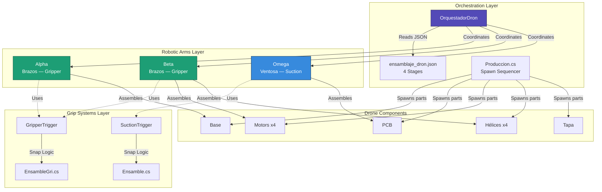
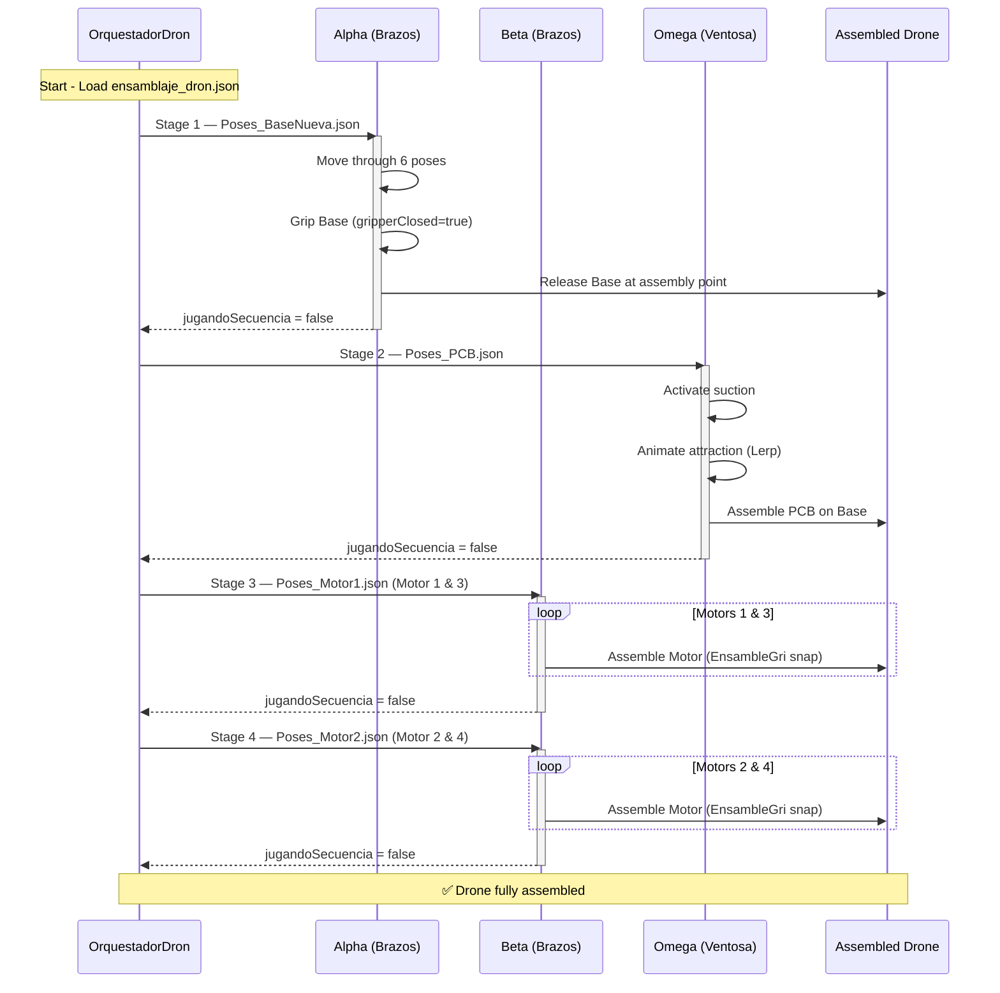
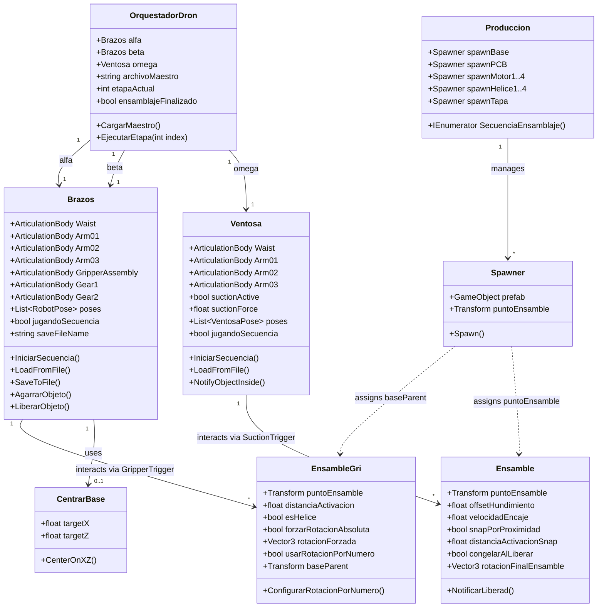
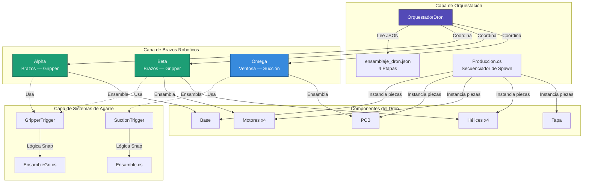
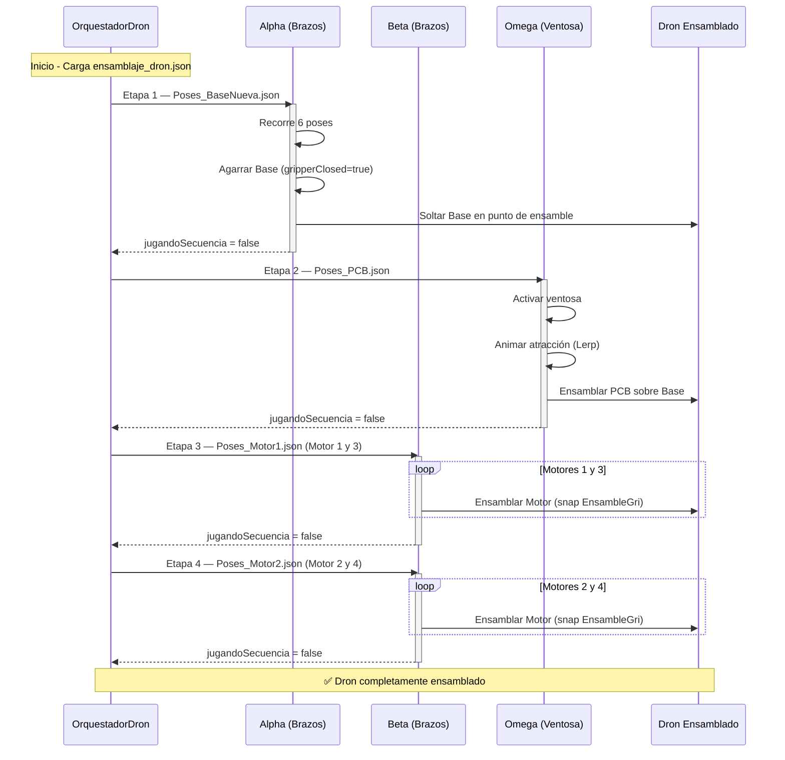
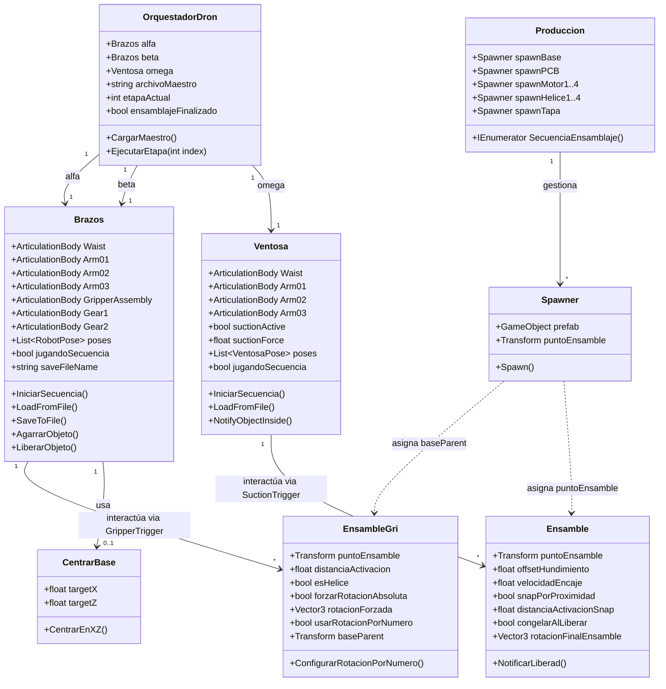

# Drone Packaging Simulation — Unity

<div align="center">


**Industrial Robotic Assembly Cell Simulation**  
Coordinated Articulated Arms · JSON-Driven Motion · Realistic Physics · Festo-Inspired Systems

**English** | [Español](#simulación-de-empaquetado-de-dron--unity)

</div>

---

## Table of Contents

- [Overview](#overview)
- [Technical Stack](#technical-stack)
- [System Architecture](#system-architecture)
- [Implemented Systems](#implemented-systems)
- [Project Structure](#project-structure)
- [Installation](#installation)
- [Resolved Issues](#resolved-issues)
- [Roadmap](#roadmap)
- [Authors](#authors)
- [License](#license-and-rights)

---

## Overview

This project is a **Unity-based industrial simulation** of a robotic drone assembly cell. It reproduces an automated production process in which three articulated robotic arms collaborate to assemble a drone through physically realistic interactions, coordinated motion sequences, and differentiated gripping mechanisms.

The simulation is intended for **virtual process validation** in industrial and academic contexts, drawing inspiration from systems similar to those found in **Festo-type** automation platforms.

### Key Features

- 🦾 **Three coordinated robotic arms** (Alpha, Beta, Omega) with ArticulationBody physics
- 🔄 **4-stage assembly orchestration** with JSON-driven sequences
- ⚙️ **Dual end effectors**: Gripper (`Brazos.cs`) and Suction Cup (`Ventosa.cs`)
- 🎯 **Proximity-based snap system** for component assembly
- 📊 **Coroutine-based asynchronous execution** with dependency management
- 🔧 **World-space preservation** to prevent rotation artifacts
- 🏭 **Production spawner** with staggered coroutine-based part instantiation

---

## Technical Stack

### Unity 2021.3.45f1 LTS

| Criterion | Justification |
|-----------|---------------|
| **LTS (Long-Term Support)** | Stability guaranteed through 2024, ideal for industrial simulation projects |
| **Mature ArticulationBody** | Introduced in 2020.1, fully stable in 2021.3 for precise robotic simulation |
| **Deterministic Physics** | Configurable solver iterations, essential for robotics |
| **C# 10.0** | Modern language features: records, pattern matching, global usings |
| **Native JSON Support** | Optimized `JsonUtility` for pose serialization/deserialization |
| **Performance** | DOTS preview available for future scalability |

### Core Unity Components

```csharp
ArticulationBody      // Robotic joint system (superior to standard Rigidbody)
ArticulationDrive     // Motor control (target, stiffness, damping)
ArticulationJointType // Revolute (rotation) and Prismatic (linear)
Coroutines            // Asynchronous sequences
JsonUtility           // Data serialization (RobotPose / VentosaPose)
Physics.IgnoreCollision // Dynamic collision control
```

### Package Dependencies (`manifest.json`)

| Package | Version | Purpose |
|---------|---------|---------|
| `com.unity.formats.fbx` | 4.1.3 | Asset export for external workflows |
| `com.unity.textmeshpro` | 3.0.6 | UI text rendering |
| `com.unity.timeline` | 1.6.5 | Animation timeline support |
| `com.unity.visualscripting` | 1.9.4 | Visual scripting support |
| `com.unity.collab-proxy` | 2.5.2 | Version control integration |
| `com.unity.test-framework` | 1.1.33 | Unit testing |

---

## System Architecture

### Component Diagram



### Arm Configuration

| Arm | Class | End Effector | Role | Components Handled |
|-----|-------|-------------|------|-------------------|
| **Alpha** | `Brazos.cs` | Gripper (pinza) | Large component handling | Base |
| **Beta** | `Brazos.cs` | Gripper (pinza) | Mechanical component handling | Motors x4, Hélices x4 |
| **Omega** | `Ventosa.cs` | Suction Cup (ventosa) | Delicate component handling | PCB, Tapa |

### Assembly Sequence Flow



### Script Interaction Diagram



---

## Implemented Systems

### 1. Gripper System (`Brazos.cs`)

**Challenge**: When using `SetParent`, the object's rotation and position would change unexpectedly.

**Solution**: Preserve offsets in world-space before re-parenting:

```csharp
// Save offsets in world space
Vector3 worldPos = grippedObject.transform.position;
Quaternion worldRot = grippedObject.transform.rotation;

grippedObject.transform.SetParent(gripPoint);

// Restore in world space
grippedObject.transform.position = worldPos;
grippedObject.transform.rotation = worldRot;
```

**Critical bug fixed**: Removed `localRotation = Quaternion.identity` which was causing unexpected flips.

**Configuration**:
- ✅ Local offsets: `grabLocalOffset`, `grabLocalRotOffset`
- ✅ Fixed rotations per prefab in Inspector
- ❌ **Never** use `localRotation = Quaternion.identity` after `SetParent`

**Articulations controlled**:
```csharp
public ArticulationBody Waist;           // X Drive
public ArticulationBody Arm01;           // Z Drive
public ArticulationBody Arm02;           // Z Drive
public ArticulationBody Arm03;           // X Drive
public ArticulationBody GripperAssembly; // Z Drive
public ArticulationBody Gear1;           // X Drive (open/close)
public ArticulationBody Gear2;           // X Drive (mirror of Gear1)
```

---

### 2. Suction Cup System (`Ventosa.cs`)

**Behavior**: Magnetic attraction animation before attachment. Omega is the arm that handles the PCB and Tapa (lid).

**Implementation**:
```csharp
// Suction control fields
public bool suctionActive = false;
public float suctionForce = 10f;
public Vector3 rotacionFijaAlAgarrar = new Vector3(90f, 0f, 0f);
public float alturaLiberacion = 0.02f;
```

**Trigger detection** via `SuctionTrigger.cs`:
```csharp
void OnTriggerEnter(Collider other) {
    if (other.CompareTag("Pickable"))
        mainScript.NotifyObjectInside(other.gameObject);
}
```

**Advantages**:
- Clear visual feedback for the user
- Fixed rotation on grab via `rotacionFijaAlAgarrar`
- Smooth transition without teleportation

---

### 3. JSON Motion Sequencer

Each arm's movement is defined in external JSON files under `Assets/JSON_Generados/` and loaded at runtime from `StreamingAssets/`. Each file stores a list of `RobotPose` objects with full joint targets.

**Real pose data structure** (`RobotPose`):
```json
{
  "poses": [
    {
      "waist": 180.0,
      "arm01": 35.0,
      "arm02": 0.0,
      "arm03": 0.0,
      "gripperAssembly": 0.0,
      "gripperClosed": true,
      "gripperOpenAngle": -20.0,
      "gripperClosedAngle": -15.0,
      "delay": 0.0
    }
  ]
}
```

**Available JSON files** (12 total):

| File | Arm | Description |
|------|-----|-------------|
| `Poses_BaseNueva.json` | Alpha | Place drone base (6 poses) |
| `Poses_PCB.json` | Omega | Place PCB with suction |
| `Poses_Motor1.json` | Beta | Motors 1 & 3 simultaneous (6 poses) |
| `Poses_Motor2.json` | Beta | Motors 2 & 4 simultaneous (6 poses) |
| `Poses_Motor3.json` | Beta | Motor 3 sequence |
| `Poses_Motor4.json` | Beta | Motor 4 sequence |
| `Poses_Tapa.json` | Omega | Place lid (final closure) |
| `Poses_Alpha.json` | Alpha | Alpha alternate sequence |
| `Poses_Beta.json` | Beta | Beta alternate sequence |
| `Poses_Omega.json` | Omega | Omega alternate sequence |
| `Poses_Palet.json` | — | Pallet movement sequence |
| `poses2_cubo.json` | — | Test/debug sequence |

---

### 4. Multi-Arm Orchestrator (`OrquestadorDron.cs`)

`OrquestadorDron.cs` is the central coordination MonoBehaviour. It reads the master assembly sequence (`ensamblaje_dron.json`) from `StreamingAssets`, triggers each arm by name (`Alpha`, `Beta`, `Omega`), and polls `jugandoSecuencia` flags in `Update()` before advancing.

**Real master JSON** (`ensamblaje_dron.json`):
```json
{
  "etapas": [
    { "nombre": "Colocar base",                    "brazos": [{"brazo":"Alpha","archivo":"Poses_BaseNueva.json"}, ...] },
    { "nombre": "Colocar PCB",                     "brazos": [{"brazo":"Omega","archivo":"Poses_PCB.json"}, ...] },
    { "nombre": "Motor 1 y Motor 3 simultaneos",   "brazos": [{"brazo":"Beta","archivo":"Poses_Motor1.json"}, ...] },
    { "nombre": "Motor 2 y Motor 4 simultaneos",   "brazos": [{"brazo":"Beta","archivo":"Poses_Motor2.json"}, ...] }
  ]
}
```

**Orchestration pattern** (poll-based, not coroutine):
```csharp
void Update() {
    bool alfaListo  = !alfaActivo  || !alfa.jugandoSecuencia;
    bool betaListo  = !betaActivo  || !beta.jugandoSecuencia;
    bool omegaListo = !omegaActivo || !omega.jugandoSecuencia;

    if (alfaListo && betaListo && omegaListo) {
        etapaActual++;
        if (etapaActual < maestro.etapas.Count)
            EjecutarEtapa(etapaActual);
        else {
            ensamblajeFinalizado = true;
            Debug.Log("✅ Ensamblaje del dron COMPLETADO.");
        }
    }
}
```

---

### 5. Snap Mechanics

**Two approaches** depending on piece type:

| Method | Script | Trigger | Used For |
|--------|--------|---------|----------|
| **Proximity** | `Ensamble.cs` | `snapPorProximidad` + distance check | PCB, Tapa |
| **Trigger collision** | `EnsambleGri.cs` | `distanciaActivacion` | Motors, Hélices |

**Snap Animation** (Ensamble.cs):
```csharp
Vector3 startPos = piece.transform.position;
Vector3 finalPos = puntoEnsamble.position + 
                   puntoEnsamble.up * offsetHundimiento;

float t = 0f;
while (t < 1f) {
    t += Time.deltaTime * velocidadEncaje;
    piece.transform.position = Vector3.Lerp(startPos, finalPos, t);
    yield return null;
}

piece.transform.SetParent(basePrefab.transform);
piece.GetComponent<Rigidbody>().isKinematic = true;
```

**Final assembly rotation** is configurable per piece:
```csharp
public Vector3 rotacionFinalEnsamble = new Vector3(-90f, 0f, 180f); // Ensamble.cs
public Vector3 rotacionForzada       = new Vector3(-90f, 0f, 0f);   // EnsambleGri.cs
```

---

### 6. Race Condition Prevention

**Problem**: `PlaySequence()` and `ReleaseInSequence()` ran in parallel.

**Solution: Boolean Semaphore** (in `Brazos.cs`):
```csharp
private bool liberandoObjeto = false;

IEnumerator LiberarEnSecuencia() {
    liberandoObjeto = true;
    yield return new WaitForSeconds(tiempoPreSoltar);
    // ... release object
    yield return new WaitForSeconds(tiempoPostSoltar);
    liberandoObjeto = false;
}

IEnumerator ReproducirSecuencia() {
    if (liberandoObjeto) {
        yield return new WaitUntil(() => !liberandoObjeto);
    }
    // ... execute pose
}
```

---

### 7. Production Spawner (`Produccion.cs`)

Parts are not pre-placed in the scene — they are instantiated at runtime by `Produccion.cs` using individual `Spawner` components, with staggered 2-second delays.

```csharp
IEnumerator SecuenciaEnsamblaje() {
    spawnBase.Spawn();
    yield return new WaitForSeconds(2);
    spawnPCB.Spawn();
    yield return new WaitForSeconds(2);
    spawnMotor1.Spawn(); spawnMotor2.Spawn();
    yield return new WaitForSeconds(2);
    spawnMotor3.Spawn(); spawnMotor4.Spawn();
    yield return new WaitForSeconds(2);
    spawnHelice1.Spawn(); spawnHelice2.Spawn();
    yield return new WaitForSeconds(2);
    spawnHelice3.Spawn(); spawnHelice4.Spawn();
    yield return new WaitForSeconds(2);
    spawnTapa.Spawn();
}
```

Each `Spawner` also auto-assigns `puntoEnsamble` (for `Ensamble`) and `baseParent` (for `EnsambleGri`) on the instantiated prefab.

---

## Project Structure

```
drone-packaging-simulation-unity/
├── Assets/
│   ├── Brazos.cs                    # Gripper arm — ArticulationBody + pose sequencer
│   ├── Ventosa.cs                   # Suction arm — ArticulationBody + suction logic
│   ├── OrquestadorDron.cs           # Master coordinator — reads JSON, polls arms
│   ├── Ensamble.cs                  # Snap logic for PCB / Tapa (ventosa pieces)
│   ├── EnsambleGri.cs               # Snap logic for Motors / Hélices (gripper pieces)
│   ├── Spawner.cs                   # Instantiates prefabs and assigns assembly refs
│   ├── Produccion.cs                # Staggered coroutine spawn sequencer
│   ├── Angulos.cs                   # Manual joint angle controller (debug/test)
│   ├── CentrarBase.cs               # Centers Base on XZ after placement
│   ├── GripperTrigger.cs            # OnTriggerEnter → Brazos.NotifyObjectInside()
│   ├── SuctionTrigger.cs            # OnTriggerEnter → Ventosa.NotifyObjectInside()
│   ├── MoverCajon.cs                # Moves conveyor/drawer between waypoints
│   ├── Cian.mat                     # Material asset
│   ├── CV_1.renderTexture           # Render texture (camera view 1)
│   ├── CV_5.renderTexture           # Render texture (camera view 5)
│   ├── New Animator Controller.*    # Animator assets
│   ├── StreamingAssets/
│   │   └── ensamblaje_dron.json     # Master JSON — 4 assembly stages
│   ├── JSON_Generados/              # 12 pose JSON files (Alpha, Beta, Omega, Motors…)
│   └── Scenes/
│       └── SampleScene.unity        # Main simulation scene
├── Packages/
│   └── manifest.json               # Unity package dependencies
└── ProjectSettings/                # Unity project configuration
```

---

## Installation

### Prerequisites

- **Unity Hub** 3.x or higher
- **Unity 2021.3.45f1 LTS** (installable from Unity Hub)
- **Git** (to clone the repository)
- **OS**: Windows 10/11, macOS 10.15+, or Ubuntu 20.04+

### Installation Steps

1. **Clone the repository**
   ```bash
   git clone https://github.com/jorgefajardom-coder/drone-packaging-simulation-unity.git
   cd drone-packaging-simulation-unity
   ```

2. **Open in Unity Hub**
   - Open Unity Hub
   - Click "Add" → Select the project folder
   - Verify version is **2021.3.45f1 LTS**
   - If not installed, Unity Hub will download it automatically

3. **First Run**
   - Open `Assets/Scenes/SampleScene.unity`
   - Wait for initial script compilation (1-2 min)
   - Press **Play** ▶️

4. **JSON Configuration**
   - Verify paths in `OrquestadorDron` Inspector
   - Master JSON: `Assets/StreamingAssets/ensamblaje_dron.json`
   - Individual pose JSONs: `Assets/JSON_Generados/Poses_*.json`
   - Arm name field: must match exactly `"Alpha"`, `"Beta"`, or `"Omega"`

---

## Resolved Issues

### Issue #1: Rotation Flips on Grip

**Symptoms**:
- Object rotates 180° unexpectedly when `SetParent` is called
- Incorrect orientation after gripping

**Root Cause**:
```csharp
// ❌ INCORRECT
grippedObject.transform.SetParent(gripPoint);
grippedObject.transform.localRotation = Quaternion.identity; // <-- BUG
```

**Solution**:
```csharp
// ✅ CORRECT
Vector3 worldPos = grippedObject.transform.position;
Quaternion worldRot = grippedObject.transform.rotation;

grippedObject.transform.SetParent(gripPoint);

grippedObject.transform.position = worldPos;
grippedObject.transform.rotation = worldRot;
// DO NOT touch localRotation
```

**Lesson**: Preserve **world-space** before and after `SetParent`.

---

### Issue #2: Lid Penetrating Components

**Symptoms**:
- Lid falls through assembled PCB/motors
- Reaches table and "jumps" upward

**Root Cause**:
- Abrupt repositioning with active gravity
- Incorrect collision layers

**Solution**:
```csharp
bool isPieceToFreeze = assembleScript != null && 
                       assembleScript.freezeOnRelease;

if (!isPieceToFreeze) {
    PositionOnBand(); // Only for PCB
}

// For Lid:
// snapByProximity = true
// freezeOnRelease = true
// isKinematic = true BEFORE releasing
```

**Collision Matrix Configuration**:
```
✅ Lid vs WorkTable: Enabled
✅ Lid vs AssemblablePart: Enabled
❌ Lid vs AssemblyPoint: Disabled (trigger only)
```

---

### Issue #3: Sequence Race Condition

**Symptoms**:
- Objects hit during release
- Deviated trajectories
- Non-deterministic behavior

**Root Cause**:
- `ReleaseInSequence()` and `PlaySequence()` ran in parallel
- No synchronization between coroutines

**Solution: Semaphore Flag**
```csharp
private bool releasingObject = false;

IEnumerator ReleaseInSequence() {
    releasingObject = true;
    yield return new WaitForSeconds(preReleaseTime);
    // ... release object
    yield return new WaitForSeconds(postReleaseTime);
    releasingObject = false;
}

IEnumerator PlaySequence() {
    if (releasingObject) {
        yield return new WaitUntil(() => !releasingObject);
    }
    // ... execute pose
}
```

---

### Issue #4: Incorrect Propeller Rotation

**Symptoms**:
- Propellers 2 and 4 visually "upside down"
- Erratic rotations: `(270, 90, 0)`, `(270, 270, 0)`

**Root Cause**:
- Arms gripped from different angles
- Spawner generated inconsistent orientations
- Script forced absolute rotation without considering grip offset

**Solution**:
```csharp
// In EnsambleGri.cs
if (esHelice && forzarRotacionAbsoluta) {
    Quaternion rotacionObjetivo = Quaternion.identity;
    
    switch (numeroHelice) {
        case 1: rotacionObjetivo = Quaternion.Euler(-90, 0, 0); break;
        case 2: rotacionObjetivo = Quaternion.Euler(-90, 90, 0); break;
        case 3: rotacionObjetivo = Quaternion.Euler(-90, 180, 0); break;
        case 4: rotacionObjetivo = Quaternion.Euler(-90, 270, 0); break;
    }
    
    transform.rotation = rotacionObjetivo;
}
```

**Inspector Configuration**:
- `Es Helice`: ✅
- `Forzar Rotacion Absoluta`: ✅
- `Numero Helice`: 1-4 (assigned by spawner)

---

### Issue #5: Movement Stuttering

**Symptoms**:
- Jerky arm movement
- Micro-stops during Lerp
- Inconsistent velocity

**Root Cause**:
```csharp
// ❌ INCORRECT: t not accumulated correctly
Vector3.Lerp(posInicial, posFinal, Time.deltaTime / duracion);
```

**Solution**:
```csharp
// ✅ CORRECT: Accumulate t explicitly
float t = 0f;
while (t < 1f) {
    t += Time.deltaTime / duracion;
    transform.position = Vector3.Lerp(posInicial, posFinal, t);
    yield return null;
}
```

**Rule**: All physics logic should be in `FixedUpdate` for movements with `Rigidbody`.

---

### Issue #6: Inconsistent Heights After Snap

**Symptoms**:
- Components at different heights after snap
- Visual gaps or overlaps

**Root Cause**:
- **Incorrect pivots in exported prefabs**
- Model origin doesn't match actual contact point
- Generic sink offset without considering geometry

**Solution**:
1. **Correction in modeling software** (Blender/Fusion 360):
   - Place pivot at lower contact point
   - Export with "Apply Transform"

2. **Compensation in Unity** (temporary):
   ```csharp
   // In Ensamble.cs - offsets per piece type
   if (gameObject.name.Contains("Motor")) {
       offsetHundimiento = -0.02f;
   } else if (gameObject.name.Contains("PCB")) {
       offsetHundimiento = -0.005f;
   }
   ```

**Status**: ⚠️ Definitive correction pending in CAD prefabs.

---

## Bug Summary Table

| # | Issue | Severity | Status | Solution |
|---|-------|----------|--------|----------|
| 1 | Rotation flips on grip | 🔴 Critical | ✅ Resolved | Preserve world-space |
| 2 | Lid penetrates components | 🔴 Critical | ✅ Resolved | Kinematic + collision layers |
| 3 | Sequence race condition | 🟡 High | ✅ Resolved | Semaphore flag |
| 4 | Propeller rotation | 🟡 High | ✅ Resolved | Absolute rotation by number |
| 5 | Movement stuttering | 🟢 Medium | ✅ Resolved | Correct t accumulation |
| 6 | Inconsistent heights | 🟡 High | ⚠️ Mitigated | Pending: CAD pivot correction |

---

## Robotic Arm Hierarchy

```
BrazoBase (fixed)
└── Waist (Revolute — X Drive)
    └── Arm01 (Revolute — Z Drive)
        └── Arm02 (Revolute — Z Drive)
            └── Arm03 (Revolute — X Drive)
                └── GripperAssembly (Revolute — Z Drive)
                    ├── Gear1 (Prismatic — X Drive, open/close)
                    └── Gear2 (Prismatic — X Drive, mirror)
```

---

## Physics Configuration

### ArticulationBody Setup

```csharp
// Typical revolute joint configuration
ArticulationBody body = GetComponent<ArticulationBody>();
body.jointType = ArticulationJointType.RevoluteJoint;
body.anchorRotation = Quaternion.Euler(0, 90, 0);

ArticulationDrive drive = body.xDrive;
drive.stiffness = 10000f;  // Rigidity
drive.damping = 100f;      // Damping
drive.forceLimit = 1000f;  // Force limit
drive.target = 45f;        // Target position (degrees)
body.xDrive = drive;
```

### Drive Parameters

| Parameter | Purpose |
|-----------|---------|
| **stiffness** | Joint rigidity — higher values produce firmer response |
| **damping** | Oscillation attenuation |
| **forceLimit** | Maximum applicable force |
| **target** | Target position or rotation value |

### Tags

```
"Pickable" — All graspable drone parts (Base, PCB, Motors, Hélices, Tapa)
"PCB"      — PCB-specific tag for specialized handling
```

---

## Roadmap

### Phase 1: Core (Completed)

- [x] Arm system with ArticulationBody (Brazos + Ventosa)
- [x] Functional gripper and suction cup
- [x] JSON pose sequencer (12 JSON files)
- [x] 4-stage orchestrator (ensamblaje_dron.json)
- [x] Snap/assembly mechanics (Ensamble + EnsambleGri)
- [x] World-space preservation
- [x] Race condition fixes
- [x] Production spawner with staggered instantiation

### Phase 2: Optimization (In Progress)

- [ ] CAD prefab pivot correction
- [ ] Performance profiling (stable 60 FPS)
- [ ] Reduce coroutine allocations
- [ ] Object pooling for parts

### Phase 3: Advanced Features

- [ ] **Sequence editor GUI**
  - Visual timeline for poses
  - Drag & drop actions
  - Real-time preview

- [ ] **QA validation system**
  - Collision detection during assembly
  - Precision metrics
  - Cycle time analytics

- [ ] **Data export**
  - CSV metrics per stage
  - Position heatmaps
  - Session replay

### Phase 4: Scalability

- [ ] **Multi-cell systems**
  - Hierarchical orchestrator
  - Inter-cell communication
  - Chain production

- [ ] **ML/RL Integration**
  - Unity ML-Agents
  - Trajectory optimization
  - Anomaly detection

- [ ] **ROS2 Bridge** (optional)
  - ROS2 Humble integration
  - Simulation + real hardware
  - Hybrid control

---

## Authors

**Jorge Andres Fajardo Mora**  
**Laura Vanesa Castro Sierra**

---

## License and Rights

**Copyright © 2025 Jorge Andres Fajardo Mora and Laura Vanesa Castro Sierra. All rights reserved.**

This repository and all its contents — including but not limited to source code, scripts, configuration files, data files, and documentation — are provided for **read-only and reference purposes only**. 

**No permission is granted** to copy, modify, distribute, sublicense, or use any part of this project for commercial or non-commercial purposes without **explicit written authorization** from the authors.

**Unauthorized reproduction or redistribution** of this work, in whole or in part, is **strictly prohibited**.

---
---
---

# Simulación de Empaquetado de Dron — Unity

<div align="center">


**Simulación de Celda de Ensamblaje Robótico Industrial**  
Brazos Articulados Coordinados · Movimiento JSON · Física Realista · Sistemas tipo Festo

[English](#-drone-packaging-simulation--unity) | **Español**

</div>

---

## Tabla de Contenidos

- [Descripción General](#descripción-general)
- [Stack Técnico](#stack-técnico)
- [Arquitectura del Sistema](#arquitectura-del-sistema)
- [Sistemas Implementados](#sistemas-implementados)
- [Estructura del Proyecto](#estructura-del-proyecto)
- [Instalación](#instalación)
- [Problemas Resueltos](#problemas-resueltos)
- [Hoja de Ruta](#hoja-de-ruta)
- [Autores](#autores)
- [Licencia](#licencia-y-derechos)

---

## Descripción General

Este proyecto es una **simulación industrial basada en Unity** que recrea una celda robótica de ensamblaje de drones. Reproduce un proceso de producción automatizado en el que tres brazos robóticos articulados colaboran para ensamblar un dron mediante interacciones físicas realistas, secuencias de movimiento coordinadas y mecanismos de agarre diferenciados.

La simulación está orientada a la **validación virtual de procesos** en contextos industriales y académicos, con una arquitectura inspirada en sistemas de automatización **tipo Festo**.

### Características Clave

- 🦾 **Tres brazos robóticos coordinados** (Alpha, Beta, Omega) con física ArticulationBody
- 🔄 **Orquestación de 4 etapas** con secuencias basadas en JSON
- ⚙️ **Efectores finales duales**: Gripper (`Brazos.cs`) y Ventosa (`Ventosa.cs`)
- 🎯 **Sistema de snap por proximidad** para ensamblaje de componentes
- 📊 **Ejecución asíncrona basada en coroutines** con gestión de dependencias
- 🔧 **Preservación de world-space** para prevenir artefactos de rotación
- 🏭 **Spawner de producción** con instanciación escalonada de piezas

---

## Stack Técnico

### Unity 2021.3.45f1 LTS

| Criterio | Justificación |
|----------|---------------|
| **LTS (Long-Term Support)** | Estabilidad garantizada hasta 2024, ideal para proyectos de simulación industrial |
| **ArticulationBody maduro** | Introducido en 2020.1, completamente estable en 2021.3 para simulación robótica precisa |
| **Física determinista** | Solver iterations configurables, esencial para robótica |
| **C# 10.0** | Características modernas: records, pattern matching, global usings |
| **Soporte JSON nativo** | `JsonUtility` optimizado para serialización/deserialización de poses |
| **Rendimiento** | DOTS preview disponible para escalabilidad futura |

### Componentes Core de Unity

```csharp
ArticulationBody      // Sistema de articulaciones robóticas (superior a Rigidbody estándar)
ArticulationDrive     // Control de motores (target, stiffness, damping)
ArticulationJointType // Revolute (rotación) y Prismatic (lineal)
Coroutines            // Secuencias asíncronas
JsonUtility           // Serialización de datos (RobotPose / VentosaPose)
Physics.IgnoreCollision // Control dinámico de colisiones
```

### Dependencias de Paquetes (`manifest.json`)

| Paquete | Versión | Propósito |
|---------|---------|-----------|
| `com.unity.formats.fbx` | 4.1.3 | Exportación de assets para flujos externos |
| `com.unity.textmeshpro` | 3.0.6 | Renderizado de texto UI |
| `com.unity.timeline` | 1.6.5 | Soporte de timeline de animación |
| `com.unity.visualscripting` | 1.9.4 | Soporte de scripting visual |
| `com.unity.collab-proxy` | 2.5.2 | Integración de control de versiones |
| `com.unity.test-framework` | 1.1.33 | Testing unitario |

---

## Arquitectura del Sistema

### Diagrama de Componentes



### Configuración de Brazos

| Brazo | Clase | Efector Final | Rol | Componentes Manejados |
|-------|-------|--------------|-----|----------------------|
| **Alpha** | `Brazos.cs` | Gripper (pinza) | Manejo de componentes grandes | Base |
| **Beta** | `Brazos.cs` | Gripper (pinza) | Manejo de componentes mecánicos | Motores x4, Hélices x4 |
| **Omega** | `Ventosa.cs` | Ventosa (succión) | Manejo de componentes delicados | PCB, Tapa |

### Flujo de Secuencia de Ensamblaje



### Diagrama de Interacción de Scripts



---

## Sistemas Implementados

### 1. Sistema de Gripper (`Brazos.cs`)

**Desafío**: Al usar `SetParent`, la rotación y posición del objeto cambiaban inesperadamente.

**Solución**: Preservar offsets en world-space antes del re-parenteo:

```csharp
// Guardar offsets en espacio global
Vector3 worldPos = objetoAgarrado.transform.position;
Quaternion worldRot = objetoAgarrado.transform.rotation;

objetoAgarrado.transform.SetParent(puntoAgarre);

// Restaurar en espacio global
objetoAgarrado.transform.position = worldPos;
objetoAgarrado.transform.rotation = worldRot;
```

**Bug crítico corregido**: Eliminado `localRotation = Quaternion.identity` que causaba flips inesperados.

**Configuración**:
- ✅ Offsets locales: `grabLocalOffset`, `grabLocalRotOffset`
- ✅ Rotaciones fijas por prefab en Inspector
- ❌ **Nunca** usar `localRotation = Quaternion.identity` después de `SetParent`

**Articulaciones controladas**:
```csharp
public ArticulationBody Waist;           // X Drive
public ArticulationBody Arm01;           // Z Drive
public ArticulationBody Arm02;           // Z Drive
public ArticulationBody Arm03;           // X Drive
public ArticulationBody GripperAssembly; // Z Drive
public ArticulationBody Gear1;           // X Drive (apertura/cierre)
public ArticulationBody Gear2;           // X Drive (espejo de Gear1)
```

---

### 2. Sistema de Ventosa (`Ventosa.cs`)

**Comportamiento**: Animación visual de atracción magnética antes de la fijación. Omega maneja el PCB y la Tapa.

**Implementación**:
```csharp
// Campos de control de succión
public bool suctionActive = false;
public float suctionForce = 10f;
public Vector3 rotacionFijaAlAgarrar = new Vector3(90f, 0f, 0f);
public float alturaLiberacion = 0.02f;
```

**Detección por trigger** vía `SuctionTrigger.cs`:
```csharp
void OnTriggerEnter(Collider other) {
    if (other.CompareTag("Pickable"))
        mainScript.NotifyObjectInside(other.gameObject);
}
```

**Ventajas**:
- Feedback visual claro para el usuario
- Rotación fija al agarrar configurable (`rotacionFijaAlAgarrar`)
- Transición suave sin teletransporte

---

### 3. Secuenciador JSON

Los movimientos de cada brazo se definen en archivos JSON externos en `Assets/JSON_Generados/` y se cargan en tiempo de ejecución desde `StreamingAssets/`. Cada archivo almacena una lista de objetos `RobotPose` con todos los targets de articulación.

**Estructura de datos real de pose** (`RobotPose`):
```json
{
  "poses": [
    {
      "waist": 180.0,
      "arm01": 35.0,
      "arm02": 0.0,
      "arm03": 0.0,
      "gripperAssembly": 0.0,
      "gripperClosed": true,
      "gripperOpenAngle": -20.0,
      "gripperClosedAngle": -15.0,
      "delay": 0.0
    }
  ]
}
```

**Archivos JSON disponibles** (12 en total):

| Archivo | Brazo | Descripción |
|---------|-------|-------------|
| `Poses_BaseNueva.json` | Alpha | Colocar base del dron (6 poses) |
| `Poses_PCB.json` | Omega | Colocar PCB con ventosa |
| `Poses_Motor1.json` | Beta | Motores 1 y 3 simultáneos (6 poses) |
| `Poses_Motor2.json` | Beta | Motores 2 y 4 simultáneos (6 poses) |
| `Poses_Motor3.json` | Beta | Secuencia Motor 3 |
| `Poses_Motor4.json` | Beta | Secuencia Motor 4 |
| `Poses_Tapa.json` | Omega | Colocar tapa (cierre final) |
| `Poses_Alpha.json` | Alpha | Secuencia alternativa Alpha |
| `Poses_Beta.json` | Beta | Secuencia alternativa Beta |
| `Poses_Omega.json` | Omega | Secuencia alternativa Omega |
| `Poses_Palet.json` | — | Secuencia de movimiento de palet |
| `poses2_cubo.json` | — | Secuencia de prueba/debug |

---

### 4. Orquestador Multi-Brazo (`OrquestadorDron.cs`)

`OrquestadorDron.cs` es el MonoBehaviour central de coordinación. Lee la secuencia de ensamble maestra (`ensamblaje_dron.json`) desde `StreamingAssets`, activa cada brazo por nombre (`Alpha`, `Beta`, `Omega`) y sondea los flags `jugandoSecuencia` en `Update()` antes de avanzar.

**JSON maestro real** (`ensamblaje_dron.json`):
```json
{
  "etapas": [
    { "nombre": "Colocar base",                    "brazos": [{"brazo":"Alpha","archivo":"Poses_BaseNueva.json"}, ...] },
    { "nombre": "Colocar PCB",                     "brazos": [{"brazo":"Omega","archivo":"Poses_PCB.json"}, ...] },
    { "nombre": "Motor 1 y Motor 3 simultaneos",   "brazos": [{"brazo":"Beta","archivo":"Poses_Motor1.json"}, ...] },
    { "nombre": "Motor 2 y Motor 4 simultaneos",   "brazos": [{"brazo":"Beta","archivo":"Poses_Motor2.json"}, ...] }
  ]
}
```

**Patrón de orquestación** (basado en polling, no en coroutine):
```csharp
void Update() {
    bool alfaListo  = !alfaActivo  || !alfa.jugandoSecuencia;
    bool betaListo  = !betaActivo  || !beta.jugandoSecuencia;
    bool omegaListo = !omegaActivo || !omega.jugandoSecuencia;

    if (alfaListo && betaListo && omegaListo) {
        etapaActual++;
        if (etapaActual < maestro.etapas.Count)
            EjecutarEtapa(etapaActual);
        else {
            ensamblajeFinalizado = true;
            Debug.Log("✅ Ensamblaje del dron COMPLETADO.");
        }
    }
}
```

---

### 5. Mecánicas de Snap

**Dos enfoques** según el tipo de pieza:

| Método | Script | Trigger | Usado para |
|--------|--------|---------|-----------|
| **Proximidad** | `Ensamble.cs` | `snapPorProximidad` + verificación de distancia | PCB, Tapa |
| **Colisión Trigger** | `EnsambleGri.cs` | `distanciaActivacion` | Motores, Hélices |

**Animación de Snap** (Ensamble.cs):
```csharp
Vector3 posInicial = pieza.transform.position;
Vector3 posFinal = puntoEnsamble.position + 
                   puntoEnsamble.up * offsetHundimiento;

float t = 0f;
while (t < 1f) {
    t += Time.deltaTime * velocidadEncaje;
    pieza.transform.position = Vector3.Lerp(posInicial, posFinal, t);
    yield return null;
}

pieza.transform.SetParent(basePrefab.transform);
pieza.GetComponent<Rigidbody>().isKinematic = true;
```

**La rotación final del ensamble** es configurable por pieza:
```csharp
public Vector3 rotacionFinalEnsamble = new Vector3(-90f, 0f, 180f); // Ensamble.cs
public Vector3 rotacionForzada       = new Vector3(-90f, 0f, 0f);   // EnsambleGri.cs
```

---

### 6. Prevención de Race Conditions

**Problema**: `ReproducirSecuencia()` y `LiberarEnSecuencia()` corrían en paralelo.

**Solución: Semáforo Booleano** (en `Brazos.cs`):
```csharp
private bool liberandoObjeto = false;

IEnumerator LiberarEnSecuencia() {
    liberandoObjeto = true;
    yield return new WaitForSeconds(tiempoPreSoltar);
    // ... soltar objeto
    yield return new WaitForSeconds(tiempoPostSoltar);
    liberandoObjeto = false;
}

IEnumerator ReproducirSecuencia() {
    if (liberandoObjeto) {
        yield return new WaitUntil(() => !liberandoObjeto);
    }
    // ... ejecutar pose
}
```

---

### 7. Spawner de Producción (`Produccion.cs`)

Las piezas no se pre-colocan en la escena — se instancian en tiempo de ejecución por `Produccion.cs` usando componentes `Spawner` individuales, con retrasos escalonados de 2 segundos.

```csharp
IEnumerator SecuenciaEnsamblaje() {
    spawnBase.Spawn();
    yield return new WaitForSeconds(2);
    spawnPCB.Spawn();
    yield return new WaitForSeconds(2);
    spawnMotor1.Spawn(); spawnMotor2.Spawn();
    yield return new WaitForSeconds(2);
    spawnMotor3.Spawn(); spawnMotor4.Spawn();
    yield return new WaitForSeconds(2);
    spawnHelice1.Spawn(); spawnHelice2.Spawn();
    yield return new WaitForSeconds(2);
    spawnHelice3.Spawn(); spawnHelice4.Spawn();
    yield return new WaitForSeconds(2);
    spawnTapa.Spawn();
}
```

Cada `Spawner` también asigna automáticamente `puntoEnsamble` (para `Ensamble`) y `baseParent` (para `EnsambleGri`) en el prefab instanciado.

---

## Estructura del Proyecto

```
drone-packaging-simulation-unity/
├── Assets/
│   ├── Brazos.cs                    # Brazo gripper — ArticulationBody + secuenciador de poses
│   ├── Ventosa.cs                   # Brazo ventosa — ArticulationBody + lógica de succión
│   ├── OrquestadorDron.cs           # Coordinador maestro — lee JSON, sondea brazos
│   ├── Ensamble.cs                  # Lógica snap para PCB / Tapa (piezas de ventosa)
│   ├── EnsambleGri.cs               # Lógica snap para Motores / Hélices (piezas de gripper)
│   ├── Spawner.cs                   # Instancia prefabs y asigna refs de ensamble
│   ├── Produccion.cs                # Secuenciador de spawn con coroutine escalonado
│   ├── Angulos.cs                   # Controlador manual de ángulos de articulaciones
│   ├── CentrarBase.cs               # Centra la Base en XZ después de la colocación
│   ├── GripperTrigger.cs            # OnTriggerEnter → Brazos.NotifyObjectInside()
│   ├── SuctionTrigger.cs            # OnTriggerEnter → Ventosa.NotifyObjectInside()
│   ├── MoverCajon.cs                # Mueve la cinta/cajón entre waypoints
│   ├── Cian.mat                     # Material asset
│   ├── CV_1.renderTexture           # Textura de renderizado (vista de cámara 1)
│   ├── CV_5.renderTexture           # Textura de renderizado (vista de cámara 5)
│   ├── New Animator Controller.*    # Assets de animador
│   ├── StreamingAssets/
│   │   └── ensamblaje_dron.json     # JSON maestro — 4 etapas de ensamblaje
│   ├── JSON_Generados/              # 12 archivos JSON de poses (Alpha, Beta, Omega, Motores…)
│   └── Scenes/
│       └── SampleScene.unity        # Escena principal de simulación
├── Packages/
│   └── manifest.json               # Dependencias de paquetes Unity
└── ProjectSettings/                # Configuración del proyecto Unity
```

---

## Instalación

### Requisitos Previos

- **Unity Hub** 3.x o superior
- **Unity 2021.3.45f1 LTS** (instalable desde Unity Hub)
- **Git** (para clonar el repositorio)
- **SO**: Windows 10/11, macOS 10.15+, o Ubuntu 20.04+

### Pasos de Instalación

1. **Clonar el repositorio**
   ```bash
   git clone https://github.com/jorgefajardom-coder/drone-packaging-simulation-unity.git
   cd drone-packaging-simulation-unity
   ```

2. **Abrir en Unity Hub**
   - Abrir Unity Hub
   - Click en "Add" → Seleccionar la carpeta del proyecto
   - Verificar que la versión sea **2021.3.45f1 LTS**
   - Si no está instalada, Unity Hub la descargará automáticamente

3. **Primera Ejecución**
   - Abrir `Assets/Scenes/SampleScene.unity`
   - Esperar compilación inicial de scripts (1-2 min)
   - Presionar **Play** ▶️

4. **Configuración de JSON**
   - Verificar rutas en el Inspector de `OrquestadorDron`
   - JSON maestro: `Assets/StreamingAssets/ensamblaje_dron.json`
   - JSONs individuales de poses: `Assets/JSON_Generados/Poses_*.json`
   - El campo de nombre del brazo debe coincidir exactamente: `"Alpha"`, `"Beta"` o `"Omega"`

---

## Problemas Resueltos

### Problema #1: Flips de Rotación al Agarrar

**Síntomas**:
- Objeto rota 180° inesperadamente al hacer `SetParent`
- Orientación incorrecta después del agarre

**Causa Raíz**:
```csharp
// ❌ INCORRECTO
objetoAgarrado.transform.SetParent(puntoAgarre);
objetoAgarrado.transform.localRotation = Quaternion.identity; // <-- BUG
```

**Solución**:
```csharp
// ✅ CORRECTO
Vector3 worldPos = objetoAgarrado.transform.position;
Quaternion worldRot = objetoAgarrado.transform.rotation;

objetoAgarrado.transform.SetParent(puntoAgarre);

objetoAgarrado.transform.position = worldPos;
objetoAgarrado.transform.rotation = worldRot;
// NO tocar localRotation
```

**Lección**: Preservar **world-space** antes y después de `SetParent`.

---

### Problema #2: Tapa Atraviesa Componentes

**Síntomas**:
- La tapa cae a través de PCB/motores ya ensamblados
- Llega a la mesa y "salta" hacia arriba

**Causa Raíz**:
- Reposicionamiento brusco con gravedad activa
- Collision layers incorrectos

**Solución**:
```csharp
bool esPiezaQueSeCongela = ensambleScript != null && 
                           ensambleScript.congelarAlLiberar;

if (!esPiezaQueSeCongela) {
    PosicionarSobreBanda(); // Solo para PCB
}

// Para Tapa:
// snapPorProximidad = true
// congelarAlLiberar = true
// isKinematic = true ANTES de soltar
```

**Configuración Collision Matrix**:
```
✅ Tapa vs MesaTrabajo: Habilitado
✅ Tapa vs ParteEnsamblable: Habilitado
❌ Tapa vs PuntoEnsamble: Deshabilitado (solo trigger)
```

---

### Problema #3: Race Condition en Secuencias

**Síntomas**:
- Objetos golpeados durante liberación
- Trayectorias desviadas
- Comportamiento no determinista

**Causa Raíz**:
- `LiberarEnSecuencia()` y `ReproducirSecuencia()` corrían en paralelo
- Sin sincronización entre coroutines

**Solución: Flag Semáforo**
```csharp
private bool liberandoObjeto = false;

IEnumerator LiberarEnSecuencia() {
    liberandoObjeto = true;
    yield return new WaitForSeconds(tiempoPreSoltar);
    // ... soltar objeto
    yield return new WaitForSeconds(tiempoPostSoltar);
    liberandoObjeto = false;
}

IEnumerator ReproducirSecuencia() {
    if (liberandoObjeto) {
        yield return new WaitUntil(() => !liberandoObjeto);
    }
    // ... ejecutar pose
}
```

---

### Problema #4: Rotación Incorrecta de Hélices

**Síntomas**:
- Hélices 2 y 4 visualmente "al revés"
- Rotaciones erráticas: `(270, 90, 0)`, `(270, 270, 0)`

**Causa Raíz**:
- Brazos agarraban desde diferentes ángulos
- Spawner generaba orientaciones inconsistentes
- Script forzaba rotación absoluta sin considerar offset de agarre

**Solución**:
```csharp
// En EnsambleGri.cs
if (esHelice && forzarRotacionAbsoluta) {
    Quaternion rotacionObjetivo = Quaternion.identity;
    
    switch (numeroHelice) {
        case 1: rotacionObjetivo = Quaternion.Euler(-90, 0, 0); break;
        case 2: rotacionObjetivo = Quaternion.Euler(-90, 90, 0); break;
        case 3: rotacionObjetivo = Quaternion.Euler(-90, 180, 0); break;
        case 4: rotacionObjetivo = Quaternion.Euler(-90, 270, 0); break;
    }
    
    transform.rotation = rotacionObjetivo;
}
```

**Configuración Inspector**:
- `Es Helice`: ✅
- `Forzar Rotacion Absoluta`: ✅
- `Numero Helice`: 1-4 (asignado por spawner)

---

### Problema #5: Stuttering en Movimiento

**Síntomas**:
- Movimiento entrecortado de brazos
- Micro-paradas durante Lerp
- Inconsistencia de velocidad

**Causa Raíz**:
```csharp
// ❌ INCORRECTO: t no se acumula correctamente
Vector3.Lerp(posInicial, posFinal, Time.deltaTime / duracion);
```

**Solución**:
```csharp
// ✅ CORRECTO: Acumular t explícitamente
float t = 0f;
while (t < 1f) {
    t += Time.deltaTime / duracion;
    transform.position = Vector3.Lerp(posInicial, posFinal, t);
    yield return null;
}
```

**Regla**: Toda lógica física debe estar en `FixedUpdate` para movimientos con `Rigidbody`.

---

### Problema #6: Alturas Inconsistentes Post-Snap

**Síntomas**:
- Componentes a diferentes alturas después del snap
- Gaps o superposiciones visuales

**Causa Raíz**:
- **Pivots incorrectos en prefabs exportados**
- Origen del modelo no coincide con punto de contacto real
- Offset de hundimiento genérico sin considerar geometría

**Solución**:
1. **Corrección en software de modelado** (Blender/Fusion 360):
   - Ubicar pivot en el punto de contacto inferior
   - Exportar con "Apply Transform"

2. **Compensación en Unity** (temporal):
   ```csharp
   // En Ensamble.cs - offsets por tipo de pieza
   if (gameObject.name.Contains("Motor")) {
       offsetHundimiento = -0.02f;
   } else if (gameObject.name.Contains("PCB")) {
       offsetHundimiento = -0.005f;
   }
   ```

**Estado**: ⚠️ Corrección definitiva pendiente en prefabs CAD.

---

## Tabla Resumen de Bugs

| # | Bug | Severidad | Estado | Solución |
|---|-----|-----------|--------|----------|
| 1 | Flips de rotación al agarrar | 🔴 Crítico | ✅ Resuelto | Preservar world-space |
| 2 | Tapa atraviesa componentes | 🔴 Crítico | ✅ Resuelto | Kinematic + collision layers |
| 3 | Race condition secuencias | 🟡 Alto | ✅ Resuelto | Flag semáforo |
| 4 | Rotación hélices | 🟡 Alto | ✅ Resuelto | Rotación absoluta por número |
| 5 | Stuttering movimiento | 🟢 Medio | ✅ Resuelto | Acumulación correcta de t |
| 6 | Alturas inconsistentes | 🟡 Alto | ⚠️ Mitigado | Pending: corrección pivots CAD |

---

## Jerarquía del Brazo Robótico

```
BrazoBase (fixed)
└── Waist (Revolute — X Drive)
    └── Arm01 (Revolute — Z Drive)
        └── Arm02 (Revolute — Z Drive)
            └── Arm03 (Revolute — X Drive)
                └── GripperAssembly (Revolute — Z Drive)
                    ├── Gear1 (Prismatic — X Drive, apertura/cierre)
                    └── Gear2 (Prismatic — X Drive, espejo)
```

---

## Configuración de Física

### Configuración de ArticulationBody

```csharp
// Configuración típica de articulación revolute
ArticulationBody body = GetComponent<ArticulationBody>();
body.jointType = ArticulationJointType.RevoluteJoint;
body.anchorRotation = Quaternion.Euler(0, 90, 0);

ArticulationDrive drive = body.xDrive;
drive.stiffness = 10000f;  // Rigidez
drive.damping = 100f;      // Amortiguación
drive.forceLimit = 1000f;  // Límite de fuerza
drive.target = 45f;        // Posición objetivo (grados)
body.xDrive = drive;
```

### Parámetros de Drive

| Parámetro | Función |
|-----------|---------|
| **stiffness** | Rigidez de la articulación — valores altos producen respuesta más firme |
| **damping** | Amortiguación de oscilaciones |
| **forceLimit** | Fuerza máxima aplicable |
| **target** | Valor objetivo de posición o rotación |

### Tags del Proyecto

```
"Pickable" — Todas las piezas agarrables (Base, PCB, Motores, Hélices, Tapa)
"PCB"      — Tag específico del PCB para manejo especializado
```

---

## Hoja de Ruta

### Fase 1: Core (Completado)

- [x] Sistema de brazos con ArticulationBody (Brazos + Ventosa)
- [x] Gripper y ventosa funcionales
- [x] JSON sequencer (12 archivos JSON de poses)
- [x] Orquestador de 4 etapas (ensamblaje_dron.json)
- [x] Mecánica de snap/ensamble (Ensamble + EnsambleGri)
- [x] Preservación de world-space
- [x] Race condition fixes
- [x] Spawner de producción con instanciación escalonada

### Fase 2: Optimización (En Progreso)

- [ ] Corrección de pivots en prefabs CAD
- [ ] Performance profiling (60 FPS estable)
- [ ] Reducir allocations en coroutines
- [ ] Object pooling para piezas

### Fase 3: Features Avanzadas

- [ ] **Editor de secuencias GUI**
  - Timeline visual para poses
  - Drag & drop de acciones
  - Preview en tiempo real

- [ ] **Sistema de validación QA**
  - Detección de colisiones durante ensamble
  - Métricas de precisión
  - Tiempos de ciclo

- [ ] **Exportación de datos**
  - CSV de métricas por etapa
  - Heatmaps de posiciones
  - Replay de sesiones

### Fase 4: Escalabilidad

- [ ] **Multi-celdas**
  - Orquestador jerárquico
  - Comunicación inter-celda
  - Producción en cadena

- [ ] **ML/RL Integration**
  - Unity ML-Agents
  - Optimización de trayectorias
  - Detección de anomalías

- [ ] **ROS2 Bridge** (opcional)
  - Integración con ROS2 Humble
  - Simulación + hardware real
  - Control híbrido

---

## Autores

**Jorge Andres Fajardo Mora**  
**Laura Vanesa Castro Sierra**

---

## Licencia y Derechos

**Copyright © 2025 Jorge Andres Fajardo Mora y Laura Vanesa Castro Sierra. Todos los derechos reservados.**

Este repositorio y la totalidad de su contenido — incluyendo, entre otros, código fuente, scripts, archivos de configuración, archivos de datos y documentación — se proporcionan exclusivamente para **fines de lectura y referencia**. 

**No se otorga ningún permiso** para copiar, modificar, distribuir, sublicenciar ni utilizar ninguna parte de este proyecto con fines comerciales o no comerciales sin **autorización escrita explícita** de los autores.

Queda **estrictamente prohibida** la reproducción o redistribución no autorizada de este trabajo, en todo o en parte.
