# Drone Packaging Simulation  -  Unity

<div align="center">


**Robotic Assembly Cell Simulation**  
Coordinated Articulated Arms · JSON-Driven Motion · Realistic Physics

**English** | [Español](#simulación-de-empaquetado-de-dron--unity)

<br/>

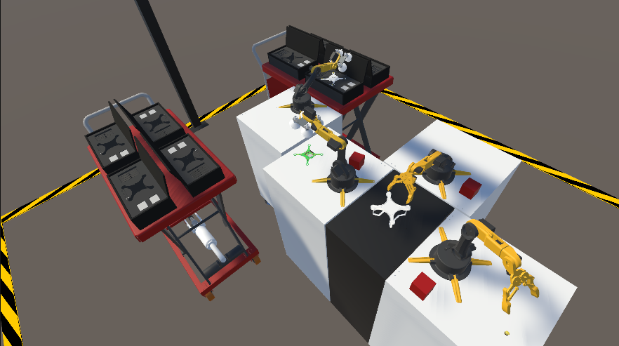
> *Isometric view of the robotic assembly cell  -  4 articulated arms (Alpha, Beta, Omega, Paletizador) with mecanum wheels.*

</div>

---

## Table of Contents

- [Overview](#overview)
- [Technical Stack](#technical-stack)
- [CODESYS & FluidSIM Integration](#codesys--fluidsim-integration)
- [System Architecture](#system-architecture)
- [Implemented Systems](#implemented-systems)
- [Project Structure](#project-structure)
- [Installation](#installation)
- [Resolved Issues](#resolved-issues)
- [Authors](#authors)
- [License](#license-and-rights)

> **14 C# scripts · 1 Python script · 4 JSON pose files (duplicated in StreamingAssets/)**

---

## Overview

This project is a **Unity-based simulation** of a robotic drone assembly and palletizing cell. Four robotic arms collaborate to assemble a drone through physically realistic interactions and JSON-driven motion sequences. The completed drone is then transported and palletized into production carts by a fourth arm that moves autonomously on **mecanum wheels**.

The simulation is intended for **virtual process validation** of industrial robotic cells. It integrates with a **CODESYS PLC project** and a **FluidSim OPC simulation** that model the industrial automation layer.

### Key Features

- 🦾 **Four coordinated robotic arms** (Alpha, Beta, Omega, Paletizador) with ArticulationBody physics
- 🔄 **Decentralized JSON-driven motion**  -  each arm reads its own pose file and executes independently
- ⚙️ **Dual end effectors**: Gripper (`Brazos.cs`) and Suction Cup (`Ventosa.cs`)
- 🎯 **Proximity-based snap system** for component assembly
- 📊 **Coroutine-based asynchronous execution** with dependency management
- 🔧 **World-space preservation** to prevent rotation artifacts
- 🏭 **Production spawner** with staggered coroutine-based part instantiation, including box spawning
- 📦 **Paletizador**  -  mecanum-wheel arm + `CarroPaletizador.cs` navigation system
- 🚁 **DronListo.cs**  -  unifies all drone parts into a single rigidbody unit before pickup
- 🖥️ **CODESYS / FluidSim integration**  -  PLC and OPC simulation files included in the repository
- 📡 **Real-time HMI** (`HmiManager.cs`)  -  in-Unity dashboard with TextMeshPro; arm states, LED panel, TCP log, cycle timer
- 📷 **Safety vision system** (`Auxiliar System.py`)  -  ESP32-CAM stream over WebSocket, MediaPipe hand detection, alerts via voice/email/Telegram

---

## Technical Stack

### Unity 2021.3.45f1 LTS

| Criterion | Justification |
|-----------|---------------|
| **LTS (Long-Term Support)** | Stability guaranteed through 2024, ideal for simulation projects |
| **Mature ArticulationBody** | Introduced in 2020.1, fully stable in 2021.3 for precise robotic simulation |
| **Deterministic Physics** | Configurable solver iterations, essential for robotics |
| **C# 10.0** | Modern language features: records, pattern matching, global usings |
| **Native JSON Support** | Optimized `JsonUtility` for pose serialization/deserialization |
| **Performance** | DOTS preview available for future scalability |

### Core Unity Components

```csharp
ArticulationBody      // Robotic joint system (superior to standard Rigidbody)
ArticulationDrive     // Motor control (target, stiffness, damping)
ArticulationJointType // Revolute (rotation) and Prismatic (linear)
Coroutines            // Asynchronous sequences
JsonUtility           // Data serialization (RobotPose / VentosaPose)
Physics.IgnoreCollision // Dynamic collision control
```

### Package Dependencies (`manifest.json`)

| Package | Version | Purpose |
|---------|---------|---------| 
| `com.unity.formats.fbx` | 4.1.3 | Asset export for external workflows |
| `com.unity.textmeshpro` | 3.0.6 | UI text rendering |
| `com.unity.timeline` | 1.6.5 | Animation timeline support |
| `com.unity.visualscripting` | 1.9.4 | Visual scripting support |
| `com.unity.collab-proxy` | 2.5.2 | Version control integration |
| `com.unity.test-framework` | 1.1.33 | Unit testing |
| `com.unity.feature.development` | 1.0.1 | Development tools bundle |
| `com.unity.ide.rider` | 3.0.31 | Rider IDE integration |
| `com.unity.ide.visualstudio` | 2.0.22 | Visual Studio integration |
| `com.unity.ide.vscode` | 1.2.5 | VS Code integration |
| `com.unity.ugui` | 1.0.0 | Legacy UI system |

---

## CODESYS & FluidSIM Integration

### Tool Versions

| Tool | Version | Vendor |
|------|---------|--------|
| **CODESYS** | 3.5.15.40 | 3S-Smart Software Solutions GmbH |
| **FluidSIM** | 4.2p / 1.67 Pneumatics (19.02.2010) | Festo Didactic GmbH & Co. KG |

#### Required CODESYS Libraries

| Library | Version | Purpose |
|---------|---------|---------|
| **SysSocket** | 3.5.15.0 | TCP socket communication (Unity ↔ CODESYS) |
| **SysSocket Interfaces** | 3.5.15.0 | Interface definitions for SysSocket |
| **SysTypes2 Interfaces** | 3.5.15.0 | Primitive type definitions used by Sys libraries |

To add these libraries in CODESYS, go to **Tools → Library Manager → Add Library** and search for each one. The steps below show how to locate **SysTypes2 Interfaces** and confirm **SysSocket** libraries are correctly installed:

<div align="center">


</div>

---

### Communication Architecture

The three layers communicate over two protocols: **TCP** (Unity ↔ CODESYS) and **OPC** (CODESYS ↔ FluidSIM).

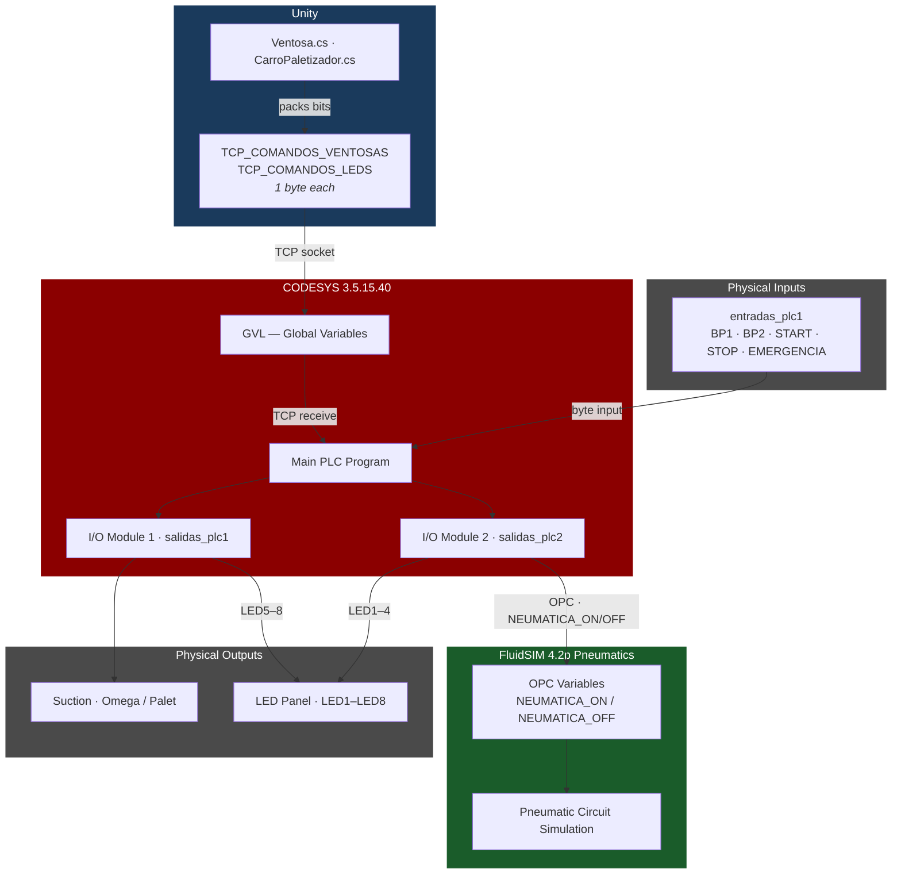

---

### Variable Map

#### TCP Variables (Unity → CODESYS)

| Variable | Type | Bits | Description |
|----------|------|------|-------------|
| `TCP_COMANDOS_VENTOSAS` | `BYTE` | Bit 0 = Omega · Bit 1 = Paletizador | Suction cup on/off commands sent from Unity over TCP |
| `TCP_COMANDOS_LEDS` | `BYTE` | Bits 0–7 = LED1–LED8 | LED panel state sent from Unity over TCP |

#### Physical Inputs (`entradas_plc1` byte  -  bit mask)

| Bit | Mask | Variable | Description |
|-----|------|----------|-------------|
| 0 | `16#01` | `BP1` | Pushbutton 1 |
| 1 | `16#02` | `BP2` | Pushbutton 2 |
| 2 | `16#04` | `START` | Start command |
| 3 | `16#08` | `STOP` | Stop command (NC  -  must be HIGH to run) |
| 4 | `16#10` | `EMERGENCIA` | Emergency stop (NC  -  must be HIGH to run) |

#### Output Module 1 (`salidas_plc1` byte)

| Bit | Mask | Signal | Description |
|-----|------|--------|-------------|
| 0 | `16#01` | `VENTOSA_OMEGA_ON` | Activate Omega suction |
| 1 | `16#02` | `VENTOSA_OMEGA_OFF` | Deactivate Omega suction |
| 2 | `16#04` | `VENTOSA_PALETIZADOR_ON` | Activate Palletizer suction |
| 3 | `16#08` | `VENTOSA_PALETIZADOR_OFF` | Deactivate Palletizer suction |
| 4 | `16#10` | `LED7` | LED 7 |
| 5 | `16#20` | `LED8` | LED 8 |
| 6 | `16#40` | `LED5` | LED 5 |
| 7 | `16#80` | `LED6` | LED 6 |

#### Output Module 2 (`salidas_plc2` byte)

| Bit | Mask | Signal | Description |
|-----|------|--------|-------------|
| 0 | `16#01` | `LED2` | LED 2 |
| 1 | `16#02` | `LED1` | LED 1 |
| 2 | `16#04` | `LED4` | LED 4 |
| 3 | `16#08` | `LED3` | LED 3 |
| 4 | `16#10` | `NEUMATICA_OFF` | Pneumatics off → FluidSIM via OPC |
| 5 | `16#20` | `NEUMATICA_ON` | Pneumatics on → FluidSIM via OPC |

#### FluidSIM I/O Module Mapping

The three FluidSIM modules bridge CODESYS bytes to the physical circuit elements simulated in FluidSIM 4.2p. "FluidSIM In" means CODESYS **writes** to FluidSIM (actuator commands); "FluidSIM Out" means FluidSIM **sends** to CODESYS (sensor feedback).

| Module | Port | Direction | CODESYS Variable | Physical Elements |
|--------|------|-----------|-----------------|-------------------|
| **Module 1** | Port 1 | FluidSIM In  -  CODESYS → FluidSIM | `salidas_plc1` (8 bits) | Solenoids 1M1/1M2 (Omega) · 2M1/2M2 (Paletizador) · Cart 2 LEDs (LED5–8) |
| **Module 2** | Port 1 | FluidSIM Out  -  FluidSIM → CODESYS | `entradas_plc1` (8 bits) | Push-buttons BP1 · BP2 · START · STOP · EMERGENCIA |
| **Module 3** | Port 1 | FluidSIM In  -  CODESYS → FluidSIM | `salidas_plc2` (8 bits) | Main valve 3M1/3M2 (pneumatics) · Cart 1 LEDs (LED1–4) |

---

### Safety & Control Logic

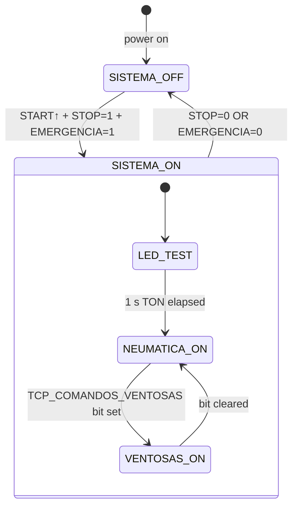

| Condition | Effect |
|-----------|--------|
| `START` rising edge + `STOP` + `EMERGENCIA` = HIGH | `SISTEMA_ON := TRUE` + 1 s LED test |
| `STOP` = LOW **or** `EMERGENCIA` = LOW | `SISTEMA_ON := FALSE` immediately |
| `SISTEMA_ON` | `NEUMATICA_ON` → FluidSIM activates pneumatic circuit |
| `TCP_COMANDOS_VENTOSAS` bit 0 | `VENTOSA_OMEGA_ON` → Module 1 bit 0 |
| `TCP_COMANDOS_VENTOSAS` bit 1 | `VENTOSA_PALETIZADOR_ON` → Module 1 bit 2 |
| `TCP_COMANDOS_LEDS` bits 0–7 | `LED1–LED8` → Modules 1 & 2 |

---

### FluidSIM Pneumatic Simulation

FluidSIM 4.2p (Festo Didactic, build 19.02.2010) simulates the full pneumatic circuit for the cell. It receives actuator commands from CODESYS through the **OPC DA server** and feeds sensor feedback (push-button states, pressure confirmations) back via the FluidSIM Out module.

**Pneumatic components in the circuit:**

| Element | Type | Function |
|---------|------|----------|
| `1M1` / `1M2` | 5/2 solenoid valve | Omega suction cup (activate / deactivate) |
| `2M1` / `2M2` | 5/2 solenoid valve | Paletizador suction cup (activate / deactivate) |
| `3M1` / `3M2` | 5/2 solenoid valve | Main pneumatic supply (system ON / OFF) |
| `1BP1` | Pressure/proximity sensor | Omega cup grip confirmation → `BP1` bit |
| `1BP2` | Pressure/proximity sensor | Paletizador cup grip confirmation → `BP2` bit |
| Cart 1 LED panel | Indicator | 4 LEDs driven by `LED1–LED4` (salidas_plc2) |
| Cart 2 LED panel | Indicator | 4 LEDs driven by `LED5–LED8` (salidas_plc1) |

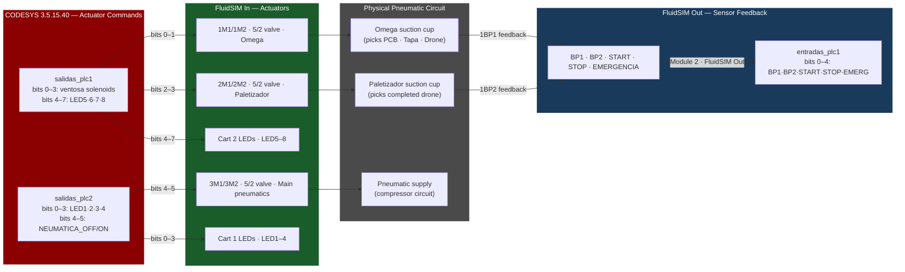

---

## System Architecture

### Component Diagram

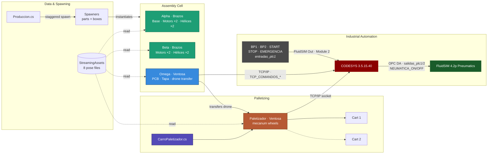

### Arm Configuration

| Arm | Class | End Effector | Status | Components Handled |
|-----|-------|-------------|--------|-------------------|
| **Alpha** | `Brazos.cs` | Gripper (pinza) | ✅ Implemented | Base, Motors ×2, Hélices ×2 |
| **Beta** | `Brazos.cs` | Gripper (pinza) | ✅ Implemented | Motors ×2, Hélices ×2 |
| **Omega** | `Ventosa.cs` | Suction Cup (ventosa) | ✅ Implemented | PCB, Tapa, drone transfer |
| **Paletizador** | `Ventosa.cs` + mecanum wheels | Suction Cup (ventosa) | ✅ Implemented | Completed drones → Cart 1 / Cart 2 |

### Assembly Sequence Flow

```mermaid
sequenceDiagram
    participant P as Produccion
    participant A as Alpha (Brazos)
    participant B as Beta (Brazos)
    participant W as Omega (Ventosa)
    participant PAL as Paletizador
    participant D as Drone

    rect rgb(30, 80, 60)
        Note over P,D: Phase 1  -  Spawning
        Note over P: Boxes pre-spawned in Start() before assembly begins
        P->>D: spawn Base → 1s → PCB → 1s → Motors 1+2 → 1s → Motors 3+4 → 1s → Hélices 1+2 → 2s → Hélices 3+4 → 2s → Tapa
    end

    rect rgb(25, 60, 90)
        Note over A,D: Phase 2  -  Assembly (arms start concurrently, each reads its own JSON)
        A->>D: grip Base → CentrarBase.IniciarCentrado()
        W->>D: suction + snap PCB

        par Alpha assembles motors and hélices
            A->>D: snap Motor 1, Motor 2, Hélice 1, Hélice 2
        and Beta assembles motors and hélices
            B->>D: snap Motor 3, Motor 4, Hélice 3, Hélice 4
        end

        W->>D: suction + snap Tapa
        Note over D: DronListo auto-detects piezasEsperadas=10 reached → seals drone
        W->>PAL: transfer sealed drone to staging zone
    end

    rect rgb(120, 60, 20)
        Note over PAL: Phase 3  -  Palletizing (EjecutarSecuencia loop)
        loop For each MovimientoPaletizado in movimientos list
            PAL->>D: pick drone (ventosa.TieneObjeto)
            PAL->>PAL: TrasladarA(zonaGiro) → GirarCarroSobrePunto(anguloGiro)
            PAL->>PAL: TrasladarConPivotRotado / TrasladarEnL(puntoDestino)
            PAL->>D: permisoParaSoltar=true → drone deposited in box
            PAL->>PAL: return to zonaGiro → GirarCarroSobrePunto(-anguloGiro)
            PAL->>PAL: TrasladarA(puntoInicio)
        end
    end
```

### Script Interaction Diagram

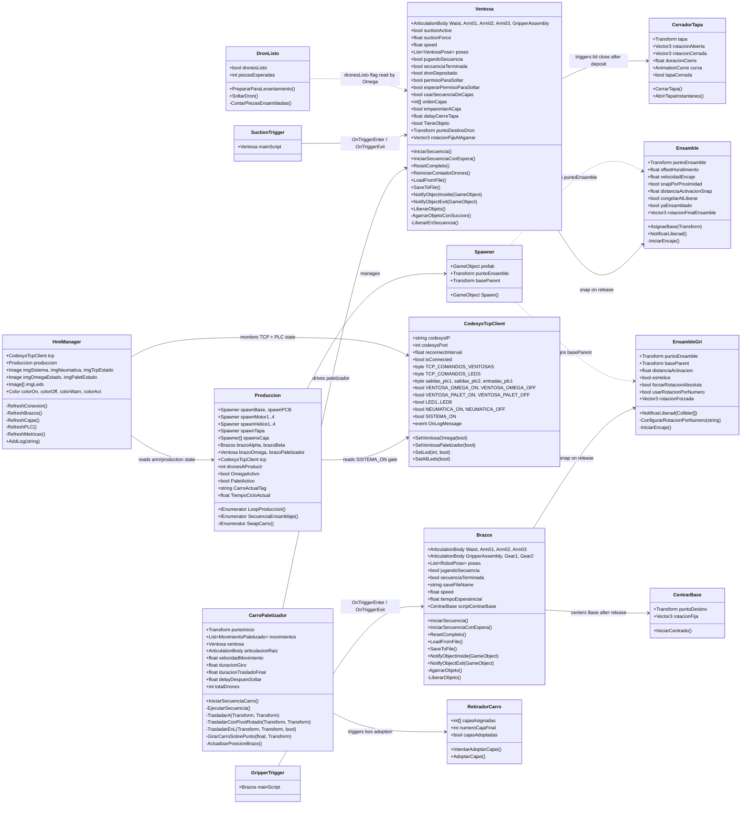

---

## Implemented Systems

### 1. Gripper System (`Brazos.cs`)

**Challenge**: When using `SetParent`, the object's rotation and position would change unexpectedly.

**Solution**: Preserve offsets in world-space before re-parenting:

```csharp
// Save offsets in world space
Vector3 worldPos = grippedObject.transform.position;
Quaternion worldRot = grippedObject.transform.rotation;

grippedObject.transform.SetParent(gripPoint);

// Restore in world space
grippedObject.transform.position = worldPos;
grippedObject.transform.rotation = worldRot;
```

**Critical bug fixed**: Removed `localRotation = Quaternion.identity` which was causing unexpected flips.

**Configuration**:
- ✅ Local offsets: `grabLocalOffset`, `grabLocalRotOffset`
- ✅ Fixed rotations per prefab in Inspector
- ❌ **Never** use `localRotation = Quaternion.identity` after `SetParent`

**Articulations controlled**:
```csharp
public ArticulationBody Waist;           // X Drive
public ArticulationBody Arm01;           // Z Drive
public ArticulationBody Arm02;           // Z Drive
public ArticulationBody Arm03;           // X Drive
public ArticulationBody GripperAssembly; // Z Drive
public ArticulationBody Gear1;           // X Drive (open/close)
public ArticulationBody Gear2;           // X Drive (mirror of Gear1)
```

---

### 2. Suction Cup System (`Ventosa.cs`)

**Behavior**: Magnetic attraction animation before attachment. Omega handles the PCB, Tapa, and full drone transfer to the palletizing zone. The Paletizador uses the same class to pick up and transport completed drones.

**Implementation**:
```csharp
// Suction control fields
public bool suctionActive = false;
public float suctionForce = 10f;
public Vector3 rotacionFijaAlAgarrar = new Vector3(90f, 0f, 0f);
public float alturaLiberacion = 0.02f;
```

**Trigger detection** via `SuctionTrigger.cs`:
```csharp
void OnTriggerEnter(Collider other) {
    if (other.CompareTag("Pickable"))
        mainScript.NotifyObjectInside(other.gameObject);
}
```

**Paletizador-specific fields** (only active when the arm is the Paletizador):

| Field | Type | Description |
|-------|------|-------------|
| `usarSecuenciaDeCajas` | `bool` | Cycles through boxes in `ordenCajas[]` order |
| `ordenCajas` | `int[]` | Box index sequence for drone deposit |
| `emparentarACaja` | `bool` | When true, reparents the drone to the box after deposit |
| `delayCierreTapa` | `float` | Seconds to wait before triggering `CerradorTapa.CerrarTapa()` (default 1 s) |

**Advantages**:
- Clear visual feedback for the user
- Fixed rotation on grab via `rotacionFijaAlAgarrar`
- Smooth transition without teleportation

---

### 3. JSON Motion Sequencer

Each arm's movement is defined in external JSON files under `Assets/JSON_Generados/` and loaded at runtime. Each file stores a list of `RobotPose` objects with full joint targets.

**Real pose data structures**:

`RobotPose` (Brazos - Alpha, Beta):
```json
{
  "poses": [
    {
      "waist": 180.0,
      "arm01": 35.0,
      "arm02": 0.0,
      "arm03": 0.0,
      "gripperAssembly": 0.0,
      "gripperClosed": true,
      "gripperOpenAngle": -20.0,
      "gripperClosedAngle": -15.0,
      "delay": 0.0
    }
  ]
}
```

`VentosaPose` (Ventosa - Omega, Paletizador):
```json
{
  "poses": [
    {
      "waist": 180.0,
      "arm01": 65.0,
      "arm02": -10.0,
      "arm03": 0.0,
      "gripperAssembly": 63.0,
      "suctionActive": false,
      "delay": 0.0
    }
  ]
}
```

**Available JSON files** (4 unique files  -  each arm loads its own consolidated sequence):

| File | Arm | Poses | Description |
|------|-----|-------|-------------|
| `Poses_Alpha.json` | Alpha | 29 | Full Alpha sequence: base placement, motors 1 & 2, hélices 1 & 2 |
| `Poses_Beta.json` | Beta | 24 | Full Beta sequence: motors 3 & 4, hélices 3 & 4 |
| `Poses_Omega.json` | Omega | 18 | Full Omega sequence: PCB, tapa, and drone transfer to palletizing zone |
| `Poses_Palet.json` | Paletizador | 7 | Paletizador grip and deposit sequence |

> Files are located in both `Assets/JSON_Generados/` (editor) and `Assets/StreamingAssets/` (runtime).

---

### 4. Decentralized Motion Architecture

Motion coordination is fully decentralized: each arm reads and executes its own JSON pose file independently via `LoadFromFile()` on `Awake` and `IniciarSecuencia()` on `Start` or external trigger. The four arms operate in sequence by design of their respective JSON files.

**Motion flow per arm**:
```
Arm's own JSON file (Poses_*.json)
    → LoadFromFile() on Awake
        → IniciarSecuencia() on Start / trigger
            → SmoothX / SmoothZ per frame
                → ArticulationDrive.target updated
```

**Active JSON files and their arms**:

| File | Arm | Poses | Description |
|------|-----|-------|-------------|
| `Poses_Alpha.json` | Alpha | 29 | Full Alpha sequence: base placement, motors 1 & 2, hélices 1 & 2 |
| `Poses_Beta.json` | Beta | 24 | Full Beta sequence: motors 3 & 4, hélices 3 & 4 |
| `Poses_Omega.json` | Omega | 18 | Full Omega sequence: PCB, tapa, and drone transfer |
| `Poses_Palet.json` | Paletizador | 7 | Grip and deposit sequence |

---

### 5. Drone Unification (`DronListo.cs`)

Before Omega lifts the completed drone, all assembled parts must behave as a single rigid unit. `DronListo.cs` is attached to `BasePrefab` and handles this transition. It **auto-detects** assembly completion by counting child `Rigidbody` components against the configurable `piezasEsperadas` threshold (default 10 = PCB + 4 motors + 4 hélices + tapa), sealing the drone automatically without requiring external triggers.

```csharp
// Auto-detection in Update()
void Update() {
    if (!yaSellado && !dronesListo) {
        int piezasActuales = ContarPiezasEnsambladas();
        if (piezasActuales >= piezasEsperadas)
            PrepararParaLevantamiento();
    }
}

public void PrepararParaLevantamiento() {
    if (yaSellado) return;
    yaSellado = true;
    dronesListo = true;
    foreach (Rigidbody rb in GetComponentsInChildren<Rigidbody>()) {
        if (rb.gameObject == this.gameObject) continue;
        rb.isKinematic = true;
        rb.useGravity = false;
    }
}

public void SoltarDron() {
    dronesListo = false;
    yaSellado = false;
    foreach (Rigidbody rb in GetComponentsInChildren<Rigidbody>()) {
        if (rb.gameObject == this.gameObject) continue;
        rb.isKinematic = false;
        rb.useGravity = true;
    }
}
```

---

### 6. Palletizer Navigation (`CarroPaletizador.cs`)

`CarroPaletizador.cs` manages the Paletizador's floor movement. The Paletizador arm (`Ventosa`) is a **child** of the cart GameObject, so the entire unit  -  arm + cart  -  moves together. Navigation moves in XZ only (Y stays fixed). The cart rotates on the Y axis by pivoting around configurable `zonaGiro` points.

**Movement configuration**  -  Inspector-defined `List<MovimientoPaletizado>`, one entry per drone. Each entry specifies:

| Field | Type | Description |
|-------|------|-------------|
| `nombre` | `string` | Descriptive label (e.g. "Dron 1 → Punto1_1") |
| `zonaGiro` | `Transform` | Pivot point  -  cart rotates around this position |
| `anguloGiro` | `float` | Rotation angle on Y (-90° or +90°) |
| `puntoDestino` | `Transform` | Final deposit position |
| `patron` | `PatronMovimiento` | `Directo` (straight) or `EnL_XLuegoZ` (L-shaped path) |

**Palletizing sequence per drone** (coroutine `EjecutarSecuencia`):
```
1. Wait until arm holds drone       (ventosa.TieneObjeto)
2. TrasladarA(zonaGiro)              -  translate to pivot zone
3. GirarCarroSobrePunto(anguloGiro)  -  rotate around pivot on Y axis
4. TrasladarConPivotRotado / TrasladarEnL(puntoDestino)  -  move to deposit
5. permisoParaSoltar = true          -  grant arm permission to release
6. Wait until arm releases drone    (!ventosa.TieneObjeto)
7. TrasladarConPivotRotado / TrasladarEnL(zonaGiro)  -  return to pivot
8. GirarCarroSobrePunto(-anguloGiro) -  un-rotate
9. TrasladarA(puntoInicio)           -  return home
```

**Movement patterns**:

| Pattern | Description |
|---------|-------------|
| `Directo` | Smooth Lerp directly to target (diagonal if X and Z differ) |
| `EnL_XLuegoZ` | L-shaped: moves X axis first, then Z axis |

**Key fields**:
```csharp
public Transform puntoInicio;                  // Home position
public List<MovimientoPaletizado> movimientos; // One entry per drone
public Ventosa ventosa;                        // Reference to arm script
public float velocidadMovimiento = 1f;         // Translation speed (m/s)
public float duracionGiro = 0.5f;              // Rotation duration (s)
public float duracionTrasladoFinal = 0.5f;     // Translation duration (s)
public int totalDrones = 0;                    // Synced from Produccion.cs
```

---

### 7. Snap Mechanics

**Two approaches** depending on piece type:

| Method | Script | Trigger | Used For |
|--------|--------|---------|----------|
| **Proximity** | `Ensamble.cs` | `snapPorProximidad` + distance check | PCB, Tapa |
| **Trigger collision** | `EnsambleGri.cs` | `distanciaActivacion` | Motors, Hélices |

**Snap Animation** (Ensamble.cs):
```csharp
// Exponential smoothing in Update() — runs until distance < 0.001f
transform.position = Vector3.Lerp(
    transform.position,
    posicionFinal,
    Time.deltaTime * velocidadEncaje
);

transform.rotation = Quaternion.Lerp(
    transform.rotation,
    Quaternion.Euler(rotacionFinalEnsamble),
    Time.deltaTime * velocidadEncaje
);

if (Vector3.Distance(transform.position, posicionFinal) < 0.001f)
{
    transform.position = posicionFinal;
    transform.rotation = Quaternion.Euler(rotacionFinalEnsamble);
    // snap complete -> reparent + mark assembled
}
```

**Final assembly rotation** is configurable per piece:
```csharp
public Vector3 rotacionFinalEnsamble = new Vector3(-90f, 0f, 180f); // Ensamble.cs
public Vector3 rotacionForzada       = new Vector3(-90f, 0f, 0f);   // EnsambleGri.cs
```

---

### 8. Race Condition Prevention

**Problem**: `PlaySequence()` and `ReleaseInSequence()` ran in parallel.

**Solution: Boolean Semaphore** (in `Ventosa.cs`):
```csharp
private bool liberandoObjeto = false;

IEnumerator LiberarEnSecuencia() {
    liberandoObjeto = true;
    // ... lower to band or freeze animation
    LiberarObjeto();
    liberandoObjeto = false;
}

void ReproducirSecuencia() {
    if (liberandoObjeto) return; // block sequence until release completes
    // ... execute pose
}
```

---

### 9. Production Spawner (`Produccion.cs`)

Parts are not pre-placed in the scene  -  they are instantiated at runtime by `Produccion.cs` using individual `Spawner` components. **Boxes** (`spawnsCaja`) are spawned once in `Start()` before any assembly begins, naming them `CajaPrefab(Clone1)` through `CajaPrefab(Clone8)`. **Assembly parts** are spawned per-drone via `SecuenciaEnsamblaje()` with staggered delays (1 s for base/PCB/motor pairs, 2 s for hélice pairs and tapa).

```csharp
// Boxes are spawned once at Start(), before assembly begins
void Start() {
    for (int i = 0; i < spawnsCaja.Length; i++) {
        GameObject caja = spawnsCaja[i].Spawn();
        caja.name = "CajaPrefab(Clone" + (i + 1) + ")";
    }
    StartCoroutine(LoopProduccion());
}

// Per-drone assembly spawn sequence
IEnumerator SecuenciaEnsamblaje() {
    baseActual = spawnBase.Spawn();
    yield return new WaitForSeconds(1);
    spawnPCB.Spawn();
    yield return new WaitForSeconds(1);
    spawnMotor1.Spawn(); spawnMotor2.Spawn();
    yield return new WaitForSeconds(1);
    spawnMotor3.Spawn(); spawnMotor4.Spawn();
    yield return new WaitForSeconds(1);
    spawnHelice1.Spawn(); spawnHelice2.Spawn();
    yield return new WaitForSeconds(2);
    spawnHelice3.Spawn(); spawnHelice4.Spawn();
    yield return new WaitForSeconds(2);
    spawnTapa.Spawn();
    yield return new WaitForSeconds(2);
}
```

Each `Spawner` also auto-assigns `puntoEnsamble` (for `Ensamble`) and `baseParent` (for `EnsambleGri`) on the instantiated prefab. For box prefabs, it additionally wires the `HingeJoint.connectedBody` to the box's own `Rigidbody`, enabling the lid hinge to function correctly.

---

### 10. Box Lid Closure and Cart Retirement

Two scripts handle the final packaging step after drones are deposited into boxes.

**`CerradorTapa.cs`**  -  Animates the box lid from an open pose (`rotacionAbierta = Vector3(80,0,0)`) to a closed pose (`rotacionCerrada = Vector3.zero`) using a configurable `AnimationCurve` (ease in/out by default). Exposes a `tapaCerrada` flag that other scripts can poll. Also provides `AbrirTapaInstantaneo()` to reset the lid instantly.

```csharp
[ContextMenu("Cerrar tapa (animación)")]
public void CerrarTapa() {
    StartCoroutine(AnimarCierre());
}

private IEnumerator AnimarCierre() {
    float tiempo = 0f;
    while (tiempo < duracionCierre) {
        float tCurva = curva.Evaluate(tiempo / duracionCierre);
        tapa.localRotation = Quaternion.Slerp(rotInicio, rotFin, tCurva);
        tiempo += Time.deltaTime;
        yield return null;
    }
    tapaCerrada = true;
}
```

**`RetiradorCarro.cs`**  -  Once a cart is ready to leave the palletizing zone, this script reparents all assigned box GameObjects as children of the cart so they move with it. It waits (via coroutine) until `CerradorTapa.tapaCerrada` is `true` on the last box before adopting.

```csharp
public void IntentarAdoptarCajas() {
    CerradorTapa cerrador = cajaFinal.GetComponent<CerradorTapa>();
    if (!cerrador.tapaCerrada) {
        StartCoroutine(EsperarYAdoptar(cerrador));
        return;
    }
    AdoptarCajas();
}
```

After the drone is deposited, `CerradorTapa` closes the lid and then destroys the `BasePrefab(Clone)` inside the box to free memory. `RetiradorCarro` polls until the last box lid is closed before reparenting the boxes to the cart.

| Script | Trigger | Key Output |
|--------|---------|-----------|
| `CerradorTapa.cs` | `CerrarTapa()` call | `tapaCerrada = true`, drone GameObject destroyed |
| `RetiradorCarro.cs` | `IntentarAdoptarCajas()` call | boxes reparented to cart |

---

### 11. HMI Dashboard (`HmiManager.cs` + `CodesysTcpClient.cs`)

<div align="center">


</div>

`HmiManager.cs` provides a real-time HMI panel inside Unity using **TextMeshPro**. It auto-discovers the `CodesysTcpClient` and `Produccion` components on scene start and refreshes every frame.

**HMI panels:**

| Panel | Source | Description |
|-------|--------|-------------|
| TCP status indicator | `CodesysTcpClient.isConnected` | Green = connected, orange = disconnected |
| SISTEMA ON / OFF | `entradas_plc1 bit 2` (START latch) | System state from PLC |
| NEUMATICA ON / OFF | `salidas_plc2 bit 5` | Pneumatics state from FluidSIM |
| Omega arm state | `Produccion.OmegaActivo` | ACTIVE / IDLE / MOVING |
| Paletizador arm state | `Produccion.PaletActivo` | HOLDING / IDLE / MOVING |
| LED panel (8 LEDs) | `salidas_plc1` + `salidas_plc2` | Box count 1–8 |
| Cycle timer | `Time.time − tiempoInicioDronActual` | MM:SS for current drone |
| TCP log | `CodesysTcpClient.OnLogMessage` | Rolling 10-line log |

**TCP protocol** (`CodesysTcpClient.cs`):
```
TX → CODESYS  [0xAA, TCP_COMANDOS_VENTOSAS, TCP_COMANDOS_LEDS]    -  3 bytes, 50 ms interval
RX ← CODESYS  [0xBB, salidas_plc1, salidas_plc2, entradas_plc1]  -  4 bytes
```

The `CodesysTcpClient` runs dedicated send and receive background threads with automatic reconnect every `reconnectInterval` seconds (default 3 s).

---

### 12. Safety Vision System (`ESP32 CAM WEBSOCKET/ESP32CAM/Auxiliar System.py`)

An auxiliary Python script that receives a live MJPEG stream from an **ESP32-CAM** over WebSocket and runs **MediaPipe** hand detection on every frame. When a hand is detected inside the work area, it triggers a multi-channel safety alert.

> For a detailed breakdown of the code, configuration, and deployment instructions see the dedicated repository:
> **[esp32cam-hand-detection-safety-system](https://github.com/jorgefajardom-coder/esp32cam-hand-detection-safety-system.git)**

**Technology stack:**

| Library | Role |
|---------|------|
| `websockets` | Async WebSocket client to ESP32-CAM (default: `ws://192.168.1.3:81`) |
| `opencv-python` | Frame decode, visual overlay (`STOP` text + red rectangle) |
| `mediapipe` | Real-time hand landmark detection (up to 2 hands, 0.5 confidence) |
| `pyttsx3` | Text-to-speech alert  -  "Retire la mano" (Sabina voice, es-MX) |
| `smtplib` | Email alert via Gmail SMTP (TLS port 587) |
| `requests` | Telegram Bot API alert |
| `python-dotenv` | Credentials loaded from `.env` |

**Alert pipeline** (15-second cooldown between alerts):
```
Hand detected → voice TTS → email (SMTP) → Telegram message
```

**Environment variables** (`.env`):
```
EMAIL_ADDRESS, EMAIL_PASSWORD, TO_EMAIL
TELEGRAM_BOT_TOKEN, TELEGRAM_CHAT_ID
WEBSOCKET_URL  (default: ws://192.168.1.3:81)
```

---

## Project Structure

```
drone-packaging-simulation-unity/
├── docs/
│   └── simulation_overview.png           # Isometric view of the robotic assembly cell
├── CODESYS II/                           # PLC project (CODESYS runtime)
│   ├── CODESYS SIMULATION II.project     # Main CODESYS project file
│   ├── CODESYS SIMULATION II.Device.Application.*.bootinfo
│   ├── CODESYS SIMULATION II.Device.Application.*.compileinfo
│   ├── CODESYS SIMULATION II.Device.Application.xml
│   └── CODESYS SIMULATION II-*.opt       # User/machine options
├── Fluidsim/                             # OPC simulation for FluidSim
│   └── OPC SIMULATION FLUIDSIM.ct
├── Assets/
│   ├── Brazos.cs                    # Gripper arm  -  Alpha, Beta (643 lines)
│   ├── Ventosa.cs                   # Suction arm  -  Omega, Paletizador (857 lines)
│   ├── CarroPaletizador.cs          # Paletizador floor navigation  -  configurable movement list (317 lines)
│   ├── DronListo.cs                 # Unifies drone parts as single rigidbody, auto-detects completion (70 lines)
│   ├── Ensamble.cs                  # Snap logic for PCB / Tapa (157 lines)
│   ├── EnsambleGri.cs               # Snap logic for Motors / Hélices (150 lines)
│   ├── Spawner.cs                   # Instantiates prefabs and assigns assembly refs (40 lines)
│   ├── Produccion.cs                # Production loop  -  staggered spawner + cart swap (371 lines)
│   ├── CentrarBase.cs               # Centers Base via rb.MovePosition in FixedUpdate, stops on collision (91 lines)
│   ├── RetiradorCarro.cs            # Adopts boxes as children when cart retires (91 lines)
│   ├── CerradorTapa.cs              # Animated box lid closure with AnimationCurve (94 lines)
│   ├── GripperTrigger.cs            # OnTriggerEnter / OnTriggerExit → Brazos.NotifyObjectInside/Exit()
│   ├── SuctionTrigger.cs            # OnTriggerEnter / OnTriggerExit → Ventosa.NotifyObjectInside/Exit()
│   ├── CodesysTcpClient.cs          # TCP client  -  Unity ↔ CODESYS 3.5.15.40 (port 8888)
│   ├── HmiManager.cs                # HMI dashboard  -  TextMeshPro, arm states, LED indicators
│   ├── CV_1.renderTexture
│   ├── CV_5.renderTexture
│   ├── JSON_Generados/              # 4 pose JSON files  -  each arm reads its own
│   │   ├── Poses_Alpha.json
│   │   ├── Poses_Beta.json
│   │   ├── Poses_Omega.json
│   │   └── Poses_Palet.json
│   ├── StreamingAssets/             # Runtime copies of the 4 JSON files
│   │   ├── Poses_Alpha.json
│   │   ├── Poses_Beta.json
│   │   ├── Poses_Omega.json
│   │   └── Poses_Palet.json
│   ├── Materials/
│   │   ├── SafetyStripes.shader
│   │   └── SafetyStripesMat.mat
│   └── Scenes/
│       └── SampleScene.unity
├── ESP32 CAM WEBSOCKET/
│   └── ESP32CAM/
│       └── Auxiliar System.py       # Hand-detection safety system (MediaPipe + WebSocket)
├── Packages/
│   └── manifest.json
└── ProjectSettings/
```

---

## Installation

### Prerequisites

- **Unity Hub** 3.x or higher
- **Unity 2021.3.45f1 LTS** (installable from Unity Hub)
- **Git** (to clone the repository)
- **OS**: Windows 10/11, macOS 10.15+, or Ubuntu 20.04+
- **CODESYS** (optional)  -  to run the PLC simulation layer

### Installation Steps

1. **Clone the repository**
   ```bash
   git clone https://github.com/jorgefajardom-coder/drone-packaging-simulation-unity.git
   cd drone-packaging-simulation-unity
   ```

2. **Open in Unity Hub**
   - Open Unity Hub
   - Click "Add" → Select the project folder
   - Verify version is **2021.3.45f1 LTS**
   - If not installed, Unity Hub will download it automatically

3. **First Run**
   - Open `Assets/Scenes/SampleScene.unity`
   - Wait for initial script compilation (1-2 min)
   - Press **Play** ▶️

4. **JSON Configuration**
   - Each arm loads its own JSON file automatically from `Assets/JSON_Generados/`
   - The file for each arm is assigned in the Inspector of the `Brazos` or `Ventosa` component via the `saveFileName` field
   - Paletizador waypoints are assigned in the `CarroPaletizador` Inspector

5. **CODESYS / FluidSim** (optional)
   - Open `CODESYS II/CODESYS SIMULATION II.project` with **CODESYS 3.5.15.40**
   - The OPC simulation file for FluidSim is located at `Fluidsim/OPC SIMULATION FLUIDSIM.ct`
   - Unity connects to CODESYS via TCP on `127.0.0.1:8888` (configurable in `CodesysTcpClient` Inspector)

---

## Resolved Issues

### Issue #1: Rotation Flips on Grip

**Symptoms**:
- Object rotates 180° unexpectedly when `SetParent` is called
- Incorrect orientation after gripping

**Root Cause**:
```csharp
// ❌ INCORRECT
grippedObject.transform.SetParent(gripPoint);
grippedObject.transform.localRotation = Quaternion.identity; // <-- BUG
```

**Solution**:
```csharp
// ✅ CORRECT
Vector3 worldPos = grippedObject.transform.position;
Quaternion worldRot = grippedObject.transform.rotation;

grippedObject.transform.SetParent(gripPoint);

grippedObject.transform.position = worldPos;
grippedObject.transform.rotation = worldRot;
// DO NOT touch localRotation
```

**Lesson**: Preserve **world-space** before and after `SetParent`.

---

### Issue #2: Lid Penetrating Components

**Symptoms**:
- Lid falls through assembled PCB/motors
- Reaches table and "jumps" upward

**Root Cause**:
- Abrupt repositioning with active gravity
- Incorrect collision layers

**Solution**:
```csharp
bool isPieceToFreeze = ensambleScript != null && 
                       ensambleScript.congelarAlLiberar;

if (!isPieceToFreeze) {
    PosicionarSobreBanda(); // Only for PCB
}

// For Lid:
// snapPorProximidad = true
// congelarAlLiberar = true
// isKinematic = true BEFORE releasing
```

**Collision Matrix Configuration**:
```
✅ Lid vs WorkTable: Enabled
✅ Lid vs AssemblablePart: Enabled
❌ Lid vs AssemblyPoint: Disabled (trigger only)
```

---

### Issue #3: Sequence Race Condition

**Symptoms**:
- Objects hit during release
- Deviated trajectories
- Non-deterministic behavior

**Root Cause**:
- `ReleaseInSequence()` and `PlaySequence()` ran in parallel
- No synchronization between coroutines

**Solution: Semaphore Flag**
```csharp
private bool releasingObject = false;

IEnumerator ReleaseInSequence() {
    releasingObject = true;
    yield return new WaitForSeconds(preReleaseTime);
    // ... release object
    yield return new WaitForSeconds(postReleaseTime);
    releasingObject = false;
}

IEnumerator PlaySequence() {
    if (releasingObject) {
        yield return new WaitUntil(() => !releasingObject);
    }
    // ... execute pose
}
```

---

### Issue #4: Incorrect Propeller Rotation

**Symptoms**:
- Propellers 2 and 4 visually "upside down"
- Erratic rotations: `(270, 90, 0)`, `(270, 270, 0)`

**Root Cause**:
- Arms gripped from different angles
- Spawner generated inconsistent orientations
- Script forced absolute rotation without considering grip offset

**Solution**:
```csharp
// In EnsambleGri.cs  -  uses object name matching via ConfigurarRotacionPorNumero()
if (esHelice && usarRotacionPorNumero) {
    if (nombreLimpio.Contains("Helice1")) {
        rotacionForzada = new Vector3(90f, 0f, 0f);
    } else if (nombreLimpio.Contains("Helice2")) {
        rotacionForzada = new Vector3(-90f, 90f, 0f);
    } else if (nombreLimpio.Contains("Helice3")) {
        rotacionForzada = new Vector3(-90f, 180f, 0f);
    } else if (nombreLimpio.Contains("Helice4")) {
        rotacionForzada = new Vector3(90f, 270f, 0f);
    }
}
```

**Inspector Configuration**:
- `Es Helice`: ✅
- `Forzar Rotacion Absoluta`: ✅
- `Usar Rotacion Por Numero`: ✅ (auto-detects hélice number from prefab name)

---

### Issue #5: Movement Stuttering

**Symptoms**:
- Jerky arm movement
- Micro-stops during Lerp
- Inconsistent velocity

**Root Cause**:
```csharp
// ❌ INCORRECT: t not accumulated correctly
Vector3.Lerp(posInicial, posFinal, Time.deltaTime / duracion);
```

**Solution**:
```csharp
// ✅ CORRECT: Accumulate t explicitly
float t = 0f;
while (t < 1f) {
    t += Time.deltaTime / duracion;
    transform.position = Vector3.Lerp(posInicial, posFinal, t);
    yield return null;
}
```

**Rule**: All physics logic should be in `FixedUpdate` for movements with `Rigidbody`.

---

## Bug Summary Table

| # | Issue | Severity | Status | Solution |
|---|-------|----------|--------|----------|
| 1 | Rotation flips on grip | 🔴 Critical | ✅ Resolved | Preserve world-space |
| 2 | Lid penetrates components | 🔴 Critical | ✅ Resolved | Kinematic + collision layers |
| 3 | Sequence race condition | 🟡 High | ✅ Resolved | Semaphore flag |
| 4 | Propeller rotation | 🟡 High | ✅ Resolved | Absolute rotation by number |
| 5 | Movement stuttering | 🟢 Medium | ✅ Resolved | Correct t accumulation |

---

## Robotic Arm Hierarchy

```
BrazoBase (fixed)
└── Waist (Revolute  -  X Drive)
    └── Arm01 (Revolute  -  Z Drive)
        └── Arm02 (Revolute  -  Z Drive)
            └── Arm03 (Revolute  -  X Drive)
                └── GripperAssembly (Revolute  -  Z Drive)
                    ├── Gear1 (Prismatic  -  X Drive, open/close)
                    └── Gear2 (Prismatic  -  X Drive, mirror)
```

---

## Physics Configuration

### ArticulationBody Setup

```csharp
// Typical revolute joint configuration
ArticulationBody body = GetComponent<ArticulationBody>();
body.jointType = ArticulationJointType.RevoluteJoint;
body.anchorRotation = Quaternion.Euler(0, 90, 0);

ArticulationDrive drive = body.xDrive;
drive.stiffness = 10000f;  // Rigidity
drive.damping = 100f;      // Damping
drive.forceLimit = 1000f;  // Force limit
drive.target = 45f;        // Target position (degrees)
body.xDrive = drive;
```

### Drive Parameters

| Parameter | Purpose |
|-----------|---------|
| **stiffness** | Joint rigidity  -  higher values produce firmer response |
| **damping** | Oscillation attenuation |
| **forceLimit** | Maximum applicable force |
| **target** | Target position or rotation value |

### Tags

```
"Pickable"  -  All graspable drone parts (Base, PCB, Motors, Hélices, Tapa)
```

> **Note**: All graspable parts share the single `"Pickable"` tag. The scripts differentiate piece types by their attached component (`Ensamble` for suction pieces, `EnsambleGri` for gripper pieces) and by prefab name matching.

---

## Authors

**Jorge Andres Fajardo Mora**  
**Laura Vanesa Castro Sierra**

---

## License and Rights

**Copyright © 2025 Jorge Andres Fajardo Mora and Laura Vanesa Castro Sierra. All rights reserved.**

This repository and all its contents  -  including but not limited to source code, scripts, configuration files, data files, and documentation  -  are provided for **read-only and reference purposes only**.

**No permission is granted** to copy, modify, distribute, sublicense, or use any part of this project for commercial or non-commercial purposes without **explicit written authorization** from the authors.

**Unauthorized reproduction or redistribution** of this work, in whole or in part, is **strictly prohibited**.

---
---
---

# Simulación de Empaquetado de Dron  -  Unity

<div align="center">


**Simulación de Celda de Ensamblaje Robótico**  
Brazos Articulados Coordinados · Movimiento JSON · Física Realista

[English](#drone-packaging-simulation--unity) | **Español**

<br/>


> *Vista isométrica de la celda robótica de ensamblaje  -  4 brazos articulados (Alpha, Beta, Omega, Paletizador) con ruedas mecanum.*

</div>

---

## Tabla de Contenidos

- [Descripción General](#descripción-general)
- [Stack Técnico](#stack-técnico)
- [Integración CODESYS & FluidSIM](#integración-codesys--fluidsim)
- [Arquitectura del Sistema](#arquitectura-del-sistema)
- [Sistemas Implementados](#sistemas-implementados)
- [Estructura del Proyecto](#estructura-del-proyecto)
- [Instalación](#instalación)
- [Problemas Resueltos](#problemas-resueltos)
- [Autores](#autores)
- [Licencia](#licencia-y-derechos)

> **14 scripts C# · 1 script Python · 4 archivos JSON de poses (duplicados en StreamingAssets/)**

---

## Descripción General

Este proyecto es una **simulación basada en Unity** de una celda robótica de ensamblaje y paletizado de drones. Cuatro brazos robóticos colaboran para ensamblar un dron mediante interacciones físicas realistas y secuencias de movimiento impulsadas por JSON. El dron completado es luego transportado y paletizado en carros de producción por un cuarto brazo que se desplaza autónomamente con **ruedas mecanum**.

La simulación está orientada a la **validación virtual de procesos** de celdas robóticas industriales. Se integra con un **proyecto PLC de CODESYS** y una **simulación OPC de FluidSim** que modelan la capa de automatización industrial.

### Características Clave

- 🦾 **Cuatro brazos robóticos coordinados** (Alpha, Beta, Omega, Paletizador) con física ArticulationBody
- 🔄 **Movimiento descentralizado impulsado por JSON**  -  cada brazo lee su propio archivo de poses y se ejecuta de forma independiente
- ⚙️ **Efectores finales duales**: Gripper (`Brazos.cs`) y Ventosa (`Ventosa.cs`)
- 🎯 **Sistema de snap por proximidad** para ensamblaje de componentes
- 📊 **Ejecución asíncrona basada en coroutines** con gestión de dependencias
- 🔧 **Preservación de world-space** para prevenir artefactos de rotación
- 🏭 **Spawner de producción** con instanciación escalonada de piezas y cajas
- 📦 **Paletizador**  -  brazo con ruedas mecanum + sistema de navegación `CarroPaletizador.cs`
- 🚁 **DronListo.cs**  -  unifica todas las piezas del dron en una sola unidad rígida antes del levantamiento
- 🖥️ **Integración CODESYS / FluidSim**  -  archivos de simulación PLC y OPC incluidos en el repositorio
- 📡 **HMI en tiempo real** (`HmiManager.cs`)  -  panel interno en Unity con TextMeshPro; estados de brazos, panel LED, log TCP, cronómetro de ciclo
- 📷 **Sistema de visión de seguridad** (`Auxiliar System.py`)  -  stream ESP32-CAM por WebSocket, detección de manos con MediaPipe, alertas por voz/correo/Telegram

---

## Stack Técnico

### Unity 2021.3.45f1 LTS

| Criterio | Justificación |
|----------|---------------|
| **LTS (Long-Term Support)** | Estabilidad garantizada hasta 2024, ideal para proyectos de simulación |
| **ArticulationBody maduro** | Introducido en 2020.1, completamente estable en 2021.3 para simulación robótica precisa |
| **Física determinista** | Solver iterations configurables, esencial para robótica |
| **C# 10.0** | Características modernas: records, pattern matching, global usings |
| **Soporte JSON nativo** | `JsonUtility` optimizado para serialización/deserialización de poses |
| **Rendimiento** | DOTS preview disponible para escalabilidad futura |

### Componentes Core de Unity

```csharp
ArticulationBody      // Sistema de articulaciones robóticas (superior a Rigidbody estándar)
ArticulationDrive     // Control de motores (target, stiffness, damping)
ArticulationJointType // Revolute (rotación) y Prismatic (lineal)
Coroutines            // Secuencias asíncronas
JsonUtility           // Serialización de datos (RobotPose / VentosaPose)
Physics.IgnoreCollision // Control dinámico de colisiones
```

### Dependencias de Paquetes (`manifest.json`)

| Paquete | Versión | Propósito |
|---------|---------|-----------|
| `com.unity.formats.fbx` | 4.1.3 | Exportación de assets para flujos externos |
| `com.unity.textmeshpro` | 3.0.6 | Renderizado de texto UI |
| `com.unity.timeline` | 1.6.5 | Soporte de timeline de animación |
| `com.unity.visualscripting` | 1.9.4 | Soporte de scripting visual |
| `com.unity.collab-proxy` | 2.5.2 | Integración de control de versiones |
| `com.unity.test-framework` | 1.1.33 | Testing unitario |
| `com.unity.feature.development` | 1.0.1 | Paquete de herramientas de desarrollo |
| `com.unity.ide.rider` | 3.0.31 | Integración con Rider IDE |
| `com.unity.ide.visualstudio` | 2.0.22 | Integración con Visual Studio |
| `com.unity.ide.vscode` | 1.2.5 | Integración con VS Code |
| `com.unity.ugui` | 1.0.0 | Sistema de UI legacy |

---

## Integración CODESYS & FluidSIM

### Versiones de Herramientas

| Herramienta | Versión | Fabricante |
|-------------|---------|-----------|
| **CODESYS** | 3.5.15.40 | 3S-Smart Software Solutions GmbH |
| **FluidSIM** | 4.2p / 1.67 Neumática (19.02.2010) | Festo Didactic GmbH & Co. KG |

#### Librerías CODESYS Requeridas

| Librería | Versión | Propósito |
|----------|---------|-----------|
| **SysSocket** | 3.5.15.0 | Comunicación TCP por socket (Unity ↔ CODESYS) |
| **SysSocket Interfaces** | 3.5.15.0 | Definiciones de interfaz para SysSocket |
| **SysTypes2 Interfaces** | 3.5.15.0 | Definiciones de tipos primitivos usadas por las librerías Sys |

Para agregar estas librerías en CODESYS, ir a **Herramientas → Library Manager → Agregar librería** y buscar cada una. A continuación se muestra cómo localizar **SysTypes2 Interfaces** y confirmar que las librerías **SysSocket** están correctamente instaladas:

<div align="center">


</div>

---

### Arquitectura de Comunicación

Las tres capas se comunican mediante dos protocolos: **TCP/IP** (Unity ↔ CODESYS) y **OPC DA** (CODESYS ↔ FluidSIM).

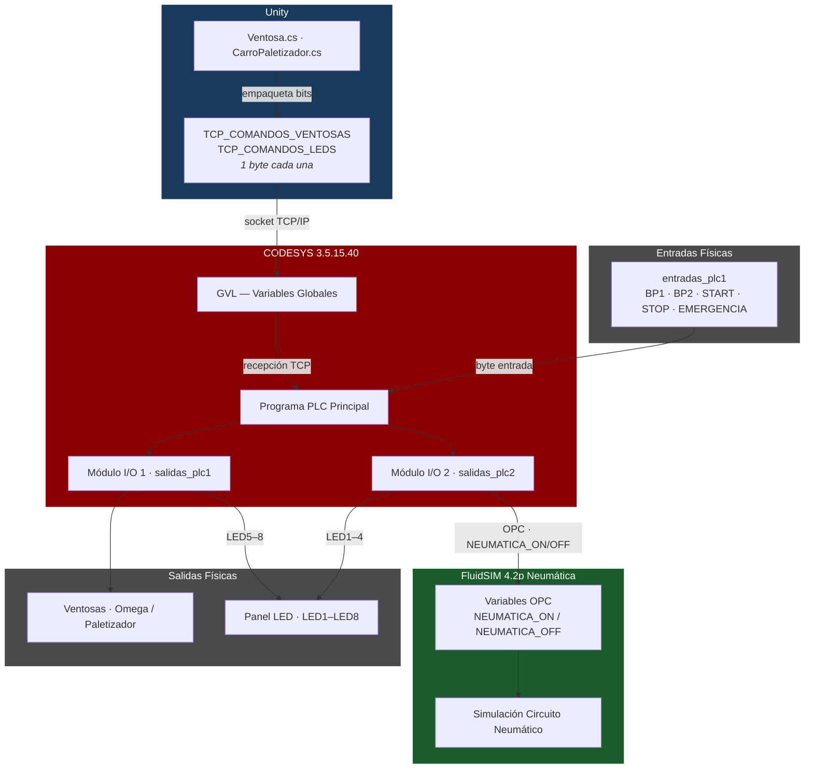

---

### Mapa de Variables

#### Variables TCP (Unity → CODESYS)

| Variable | Tipo | Bits | Descripción |
|----------|------|------|-------------|
| `TCP_COMANDOS_VENTOSAS` | `BYTE` | Bit 0 = Omega · Bit 1 = Paletizador | Comandos ON/OFF de ventosas enviados desde Unity por TCP |
| `TCP_COMANDOS_LEDS` | `BYTE` | Bits 0–7 = LED1–LED8 | Estado del panel LED enviado desde Unity por TCP |

#### Entradas Físicas (`entradas_plc1` byte  -  máscara de bits)

| Bit | Máscara | Variable | Descripción |
|-----|---------|----------|-------------|
| 0 | `16#01` | `BP1` | Pulsador 1 (confirmación ventosa Omega) |
| 1 | `16#02` | `BP2` | Pulsador 2 (confirmación ventosa Paletizador) |
| 2 | `16#04` | `START` | Comando de inicio (flanco ascendente) |
| 3 | `16#08` | `STOP` | Parada (NC  -  debe estar en HIGH para funcionar) |
| 4 | `16#10` | `EMERGENCIA` | Parada de emergencia (NC  -  debe estar en HIGH para funcionar) |

#### Módulo de Salida 1 (`salidas_plc1` byte)

| Bit | Máscara | Señal | Descripción |
|-----|---------|-------|-------------|
| 0 | `16#01` | `VENTOSA_OMEGA_ON` | Activar succión Omega |
| 1 | `16#02` | `VENTOSA_OMEGA_OFF` | Desactivar succión Omega |
| 2 | `16#04` | `VENTOSA_PALETIZADOR_ON` | Activar succión Paletizador |
| 3 | `16#08` | `VENTOSA_PALETIZADOR_OFF` | Desactivar succión Paletizador |
| 4 | `16#10` | `LED7` | LED 7 |
| 5 | `16#20` | `LED8` | LED 8 |
| 6 | `16#40` | `LED5` | LED 5 |
| 7 | `16#80` | `LED6` | LED 6 |

#### Módulo de Salida 2 (`salidas_plc2` byte)

| Bit | Máscara | Señal | Descripción |
|-----|---------|-------|-------------|
| 0 | `16#01` | `LED2` | LED 2 |
| 1 | `16#02` | `LED1` | LED 1 |
| 2 | `16#04` | `LED4` | LED 4 |
| 3 | `16#08` | `LED3` | LED 3 |
| 4 | `16#10` | `NEUMATICA_OFF` | Neumática apagada → FluidSIM vía OPC |
| 5 | `16#20` | `NEUMATICA_ON` | Neumática encendida → FluidSIM vía OPC |

#### Mapeo de Módulos I/O FluidSIM

"FluidSIM In" significa que CODESYS **escribe** hacia FluidSIM (comandos de actuadores); "FluidSIM Out" significa que FluidSIM **envía** a CODESYS (retroalimentación de sensores).

| Módulo | Puerto | Dirección | Variable CODESYS | Elementos Físicos |
|--------|--------|-----------|-----------------|-------------------|
| **Módulo 1** | Port 1 | FluidSIM In  -  CODESYS → FluidSIM | `salidas_plc1` (8 bits) | Solenoides 1M1/1M2 (Omega) · 2M1/2M2 (Paletizador) · LEDs Carro 2 (LED5–8) |
| **Módulo 2** | Port 1 | FluidSIM Out  -  FluidSIM → CODESYS | `entradas_plc1` (8 bits) | Pulsadores BP1 · BP2 · START · STOP · EMERGENCIA |
| **Módulo 3** | Port 1 | FluidSIM In  -  CODESYS → FluidSIM | `salidas_plc2` (8 bits) | Válvula principal 3M1/3M2 (neumática) · LEDs Carro 1 (LED1–4) |

---

### Lógica de Seguridad y Control

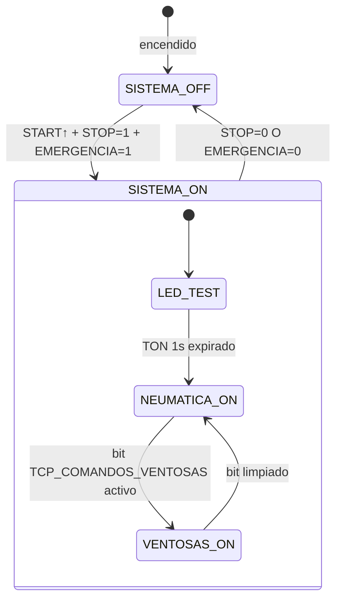

| Condición | Efecto |
|-----------|--------|
| Flanco `START` + `STOP` + `EMERGENCIA` = HIGH | `SISTEMA_ON := TRUE` + test LED de 1 s |
| `STOP` = LOW **o** `EMERGENCIA` = LOW | `SISTEMA_ON := FALSE` inmediatamente |
| `SISTEMA_ON` | `NEUMATICA_ON` → FluidSIM activa el circuito neumático |
| Bit 0 de `TCP_COMANDOS_VENTOSAS` | `VENTOSA_OMEGA_ON` → Módulo 1 bit 0 |
| Bit 1 de `TCP_COMANDOS_VENTOSAS` | `VENTOSA_PALETIZADOR_ON` → Módulo 1 bit 2 |
| Bits 0–7 de `TCP_COMANDOS_LEDS` | `LED1–LED8` → Módulos 1 y 2 |

---

### Simulación Neumática FluidSIM

FluidSIM 4.2p (Festo Didactic, build 19.02.2010) simula el circuito neumático completo de la celda. Recibe comandos de actuadores de CODESYS a través del **servidor OPC DA** y devuelve retroalimentación de sensores (estados de pulsadores, confirmaciones de presión) a través del módulo FluidSIM Out.

**Componentes neumáticos del circuito:**

| Elemento | Tipo | Función |
|----------|------|---------|
| `1M1` / `1M2` | Válvula solenoide 5/2 | Ventosa Omega (activar / desactivar) |
| `2M1` / `2M2` | Válvula solenoide 5/2 | Ventosa Paletizador (activar / desactivar) |
| `3M1` / `3M2` | Válvula solenoide 5/2 | Suministro neumático principal (sistema ON / OFF) |
| `1BP1` | Sensor de presión/proximidad | Confirmación agarre ventosa Omega → bit `BP1` |
| `1BP2` | Sensor de presión/proximidad | Confirmación agarre ventosa Paletizador → bit `BP2` |
| Panel LED Carro 1 | Indicador | 4 LEDs controlados por `LED1–LED4` (salidas_plc2) |
| Panel LED Carro 2 | Indicador | 4 LEDs controlados por `LED5–LED8` (salidas_plc1) |

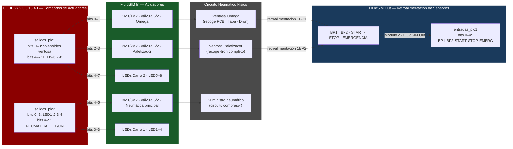

---

## Arquitectura del Sistema

### Diagrama de Componentes

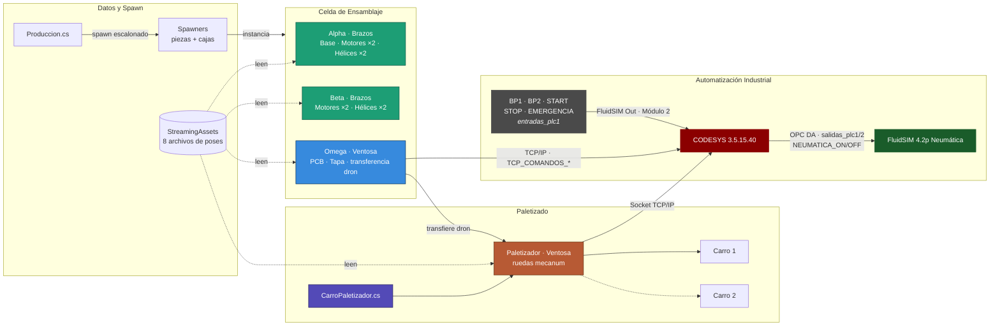

### Configuración de Brazos

| Brazo | Clase | Efector Final | Estado | Componentes Manejados |
|-------|-------|--------------|--------|----------------------|
| **Alpha** | `Brazos.cs` | Gripper (pinza) | ✅ Implementado | Base, Motores ×2, Hélices ×2 |
| **Beta** | `Brazos.cs` | Gripper (pinza) | ✅ Implementado | Motores ×2, Hélices ×2 |
| **Omega** | `Ventosa.cs` | Ventosa (succión) | ✅ Implementado | PCB, Tapa, transferencia del dron |
| **Paletizador** | `Ventosa.cs` + ruedas mecanum | Ventosa (succión) | ✅ Implementado | Drones completados → Carro 1 / Carro 2 |

### Flujo de Secuencia de Ensamblaje

```mermaid
sequenceDiagram
    participant P as Produccion
    participant A as Alpha (Brazos)
    participant B as Beta (Brazos)
    participant W as Omega (Ventosa)
    participant PAL as Paletizador
    participant D as Dron

    rect rgb(30, 80, 60)
        Note over P,D: Fase 1  -  Spawn
        Note over P: Cajas pre-spawneadas en Start() antes del ensamblaje
        P->>D: Base → 1s → PCB → 1s → Motores 1+2 → 1s → Motores 3+4 → 1s → Hélices 1+2 → 2s → Hélices 3+4 → 2s → Tapa
    end

    rect rgb(25, 60, 90)
        Note over A,D: Fase 2  -  Ensamblaje (brazos arrancan concurrentemente, cada uno lee su JSON)
        A->>D: agarre Base → CentrarBase.IniciarCentrado()
        W->>D: ventosa + snap PCB

        par Alpha ensambla motores y hélices
            A->>D: snap Motor 1, Motor 2, Hélice 1, Hélice 2
        and Beta ensambla motores y hélices
            B->>D: snap Motor 3, Motor 4, Hélice 3, Hélice 4
        end

        W->>D: ventosa + snap Tapa
        Note over D: DronListo auto-detecta piezasEsperadas=10 → sella el dron
        W->>PAL: transfiere dron sellado a zona de paletizado
    end

    rect rgb(120, 60, 20)
        Note over PAL: Fase 3  -  Paletizado (bucle EjecutarSecuencia)
        loop Para cada MovimientoPaletizado en la lista movimientos
            PAL->>D: recoge dron (ventosa.TieneObjeto)
            PAL->>PAL: TrasladarA(zonaGiro) → GirarCarroSobrePunto(anguloGiro)
            PAL->>PAL: TrasladarConPivotRotado / TrasladarEnL(puntoDestino)
            PAL->>D: permisoParaSoltar=true → dron depositado en caja
            PAL->>PAL: regresa a zonaGiro → GirarCarroSobrePunto(-anguloGiro)
            PAL->>PAL: TrasladarA(puntoInicio)
        end
    end
```

### Diagrama de Interacción de Scripts

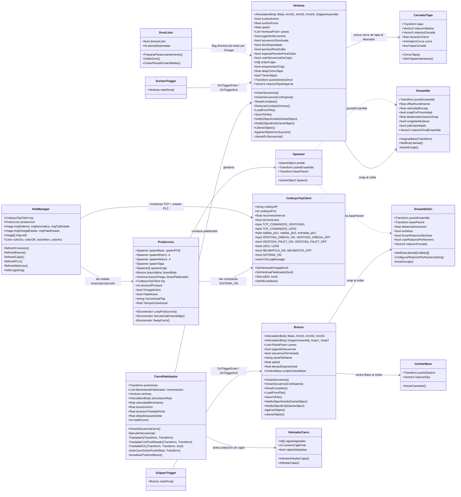

---

## Sistemas Implementados

### 1. Sistema de Gripper (`Brazos.cs`)

**Desafío**: Al usar `SetParent`, la rotación y posición del objeto cambiaban inesperadamente.

**Solución**: Preservar offsets en world-space antes del re-parenteo:

```csharp
// Guardar offsets en espacio global
Vector3 worldPos = objetoAgarrado.transform.position;
Quaternion worldRot = objetoAgarrado.transform.rotation;

objetoAgarrado.transform.SetParent(puntoAgarre);

// Restaurar en espacio global
objetoAgarrado.transform.position = worldPos;
objetoAgarrado.transform.rotation = worldRot;
```

**Bug crítico corregido**: Eliminado `localRotation = Quaternion.identity` que causaba flips inesperados.

**Configuración**:
- ✅ Offsets locales: `grabLocalOffset`, `grabLocalRotOffset`
- ✅ Rotaciones fijas por prefab en Inspector
- ❌ **Nunca** usar `localRotation = Quaternion.identity` después de `SetParent`

**Articulaciones controladas**:
```csharp
public ArticulationBody Waist;           // X Drive
public ArticulationBody Arm01;           // Z Drive
public ArticulationBody Arm02;           // Z Drive
public ArticulationBody Arm03;           // X Drive
public ArticulationBody GripperAssembly; // Z Drive
public ArticulationBody Gear1;           // X Drive (apertura/cierre)
public ArticulationBody Gear2;           // X Drive (espejo de Gear1)
```

---

### 2. Sistema de Ventosa (`Ventosa.cs`)

**Comportamiento**: Animación visual de atracción magnética antes de la fijación. Omega maneja el PCB, la Tapa y la transferencia del dron completo. El Paletizador usa la misma clase para recoger el dron y desplazarlo hasta los carros.

**Implementación**:
```csharp
// Campos de control de succión
public bool suctionActive = false;
public float suctionForce = 10f;
public Vector3 rotacionFijaAlAgarrar = new Vector3(90f, 0f, 0f);
public float alturaLiberacion = 0.02f;
```

**Detección por trigger** vía `SuctionTrigger.cs`:
```csharp
void OnTriggerEnter(Collider other) {
    if (other.CompareTag("Pickable"))
        mainScript.NotifyObjectInside(other.gameObject);
}
```

**Campos específicos del Paletizador** (solo activos cuando el brazo es el Paletizador):

| Campo | Tipo | Descripción |
|-------|------|-------------|
| `usarSecuenciaDeCajas` | `bool` | Recorre las cajas en el orden de `ordenCajas[]` |
| `ordenCajas` | `int[]` | Secuencia de índices de caja para el depósito de drones |
| `emparentarACaja` | `bool` | Si es true, reparentea el dron a la caja tras el depósito |
| `delayCierreTapa` | `float` | Segundos de espera antes de llamar a `CerradorTapa.CerrarTapa()` (por defecto 1 s) |

**Ventajas**:
- Feedback visual claro para el usuario
- Rotación fija al agarrar configurable (`rotacionFijaAlAgarrar`)
- Transición suave sin teletransporte

---

### 3. Secuenciador JSON

Los movimientos de cada brazo se definen en archivos JSON externos en `Assets/JSON_Generados/` y se cargan en tiempo de ejecución. Cada archivo almacena una lista de objetos `RobotPose` con todos los targets de articulación.

**Estructuras de datos reales de pose**:

`RobotPose` (Brazos - Alpha, Beta):
```json
{
  "poses": [
    {
      "waist": 180.0,
      "arm01": 35.0,
      "arm02": 0.0,
      "arm03": 0.0,
      "gripperAssembly": 0.0,
      "gripperClosed": true,
      "gripperOpenAngle": -20.0,
      "gripperClosedAngle": -15.0,
      "delay": 0.0
    }
  ]
}
```

`VentosaPose` (Ventosa - Omega, Paletizador):
```json
{
  "poses": [
    {
      "waist": 180.0,
      "arm01": 65.0,
      "arm02": -10.0,
      "arm03": 0.0,
      "gripperAssembly": 63.0,
      "suctionActive": false,
      "delay": 0.0
    }
  ]
}
```

**Archivos JSON disponibles** (4 archivos únicos  -  cada brazo carga su secuencia consolidada):

| Archivo | Brazo | Poses | Descripción |
|---------|-------|-------|-------------|
| `Poses_Alpha.json` | Alpha | 29 | Secuencia completa Alpha: base, motores 1 y 2, hélices 1 y 2 |
| `Poses_Beta.json` | Beta | 24 | Secuencia completa Beta: motores 3 y 4, hélices 3 y 4 |
| `Poses_Omega.json` | Omega | 18 | Secuencia completa Omega: PCB, tapa y transferencia del dron |
| `Poses_Palet.json` | Paletizador | 7 | Secuencia de agarre y depósito del Paletizador |

> Archivos ubicados en `Assets/JSON_Generados/` (editor) y `Assets/StreamingAssets/` (runtime).

---

### 4. Arquitectura de Movimiento Descentralizada

La coordinación de movimiento es completamente descentralizada: cada brazo lee y ejecuta su propio archivo JSON de poses de forma independiente mediante `LoadFromFile()` en `Awake` e `IniciarSecuencia()` en `Start` o trigger externo. Los cuatro brazos operan en secuencia por diseño de sus respectivos archivos JSON.

**Flujo de movimiento por brazo**:
```
Archivo JSON propio (Poses_*.json)
    → LoadFromFile() en Awake
        → IniciarSecuencia() en Start / trigger
            → SmoothX / SmoothZ por frame
                → ArticulationDrive.target actualizado
```

**Archivos JSON activos y sus brazos**:

| Archivo | Brazo | Poses | Descripción |
|---------|-------|-------|-------------|
| `Poses_Alpha.json` | Alpha | 29 | Secuencia completa Alpha: base, motores 1 y 2, hélices 1 y 2 |
| `Poses_Beta.json` | Beta | 24 | Secuencia completa Beta: motores 3 y 4, hélices 3 y 4 |
| `Poses_Omega.json` | Omega | 18 | Secuencia completa Omega: PCB, tapa y transferencia del dron |
| `Poses_Palet.json` | Paletizador | 7 | Secuencia de agarre y depósito del Paletizador |

---

### 5. Unificación del Dron (`DronListo.cs`)

Antes de que Omega levante el dron completo, todas las piezas ensambladas deben comportarse como una sola unidad rígida. `DronListo.cs` se adjunta a `BasePrefab` y gestiona esta transición. **Auto-detecta** el ensamblaje completo contando componentes `Rigidbody` hijos y comparándolos contra el umbral configurable `piezasEsperadas` (por defecto 10 = PCB + 4 motores + 4 hélices + tapa), sellando el dron automáticamente sin necesidad de triggers externos.

```csharp
// Auto-detección en Update()
void Update() {
    if (!yaSellado && !dronesListo) {
        int piezasActuales = ContarPiezasEnsambladas();
        if (piezasActuales >= piezasEsperadas)
            PrepararParaLevantamiento();
    }
}

public void PrepararParaLevantamiento() {
    if (yaSellado) return;
    yaSellado = true;
    dronesListo = true;
    foreach (Rigidbody rb in GetComponentsInChildren<Rigidbody>()) {
        if (rb.gameObject == this.gameObject) continue;
        rb.isKinematic = true;
        rb.useGravity = false;
    }
}

public void SoltarDron() {
    dronesListo = false;
    yaSellado = false;
    foreach (Rigidbody rb in GetComponentsInChildren<Rigidbody>()) {
        if (rb.gameObject == this.gameObject) continue;
        rb.isKinematic = false;
        rb.useGravity = true;
    }
}
```

---

### 6. Navegación del Paletizador (`CarroPaletizador.cs`)

`CarroPaletizador.cs` gestiona el movimiento del Paletizador por el suelo. El brazo Paletizador (`Ventosa`) es un **hijo** del GameObject del carro, por lo que toda la unidad  -  brazo + carro  -  se desplaza junta. La navegación se realiza solo en XZ (Y permanece fijo). El carro rota en el eje Y pivotando alrededor de puntos `zonaGiro` configurables.

**Configuración de movimientos**  -  `List<MovimientoPaletizado>` definida en el Inspector, una entrada por dron. Cada entrada especifica:

| Campo | Tipo | Descripción |
|-------|------|-------------|
| `nombre` | `string` | Etiqueta descriptiva (ej: "Dron 1 → Punto1_1") |
| `zonaGiro` | `Transform` | Punto pivote  -  el carro gira alrededor de esta posición |
| `anguloGiro` | `float` | Ángulo de rotación en Y (-90° o +90°) |
| `puntoDestino` | `Transform` | Posición final de depósito |
| `patron` | `PatronMovimiento` | `Directo` (recto) o `EnL_XLuegoZ` (trayectoria en L) |

**Secuencia de paletizado por dron** (coroutine `EjecutarSecuencia`):
```
1. Esperar a que el brazo agarre el dron  (ventosa.TieneObjeto)
2. TrasladarA(zonaGiro)                    -  trasladarse al pivote
3. GirarCarroSobrePunto(anguloGiro)        -  rotar en Y alrededor del pivote
4. TrasladarConPivotRotado / TrasladarEnL(puntoDestino)   -  ir al depósito
5. permisoParaSoltar = true                -  habilitar al brazo para soltar
6. Esperar hasta que el brazo suelte      (!ventosa.TieneObjeto)
7. TrasladarConPivotRotado / TrasladarEnL(zonaGiro)   -  regresar al pivote
8. GirarCarroSobrePunto(-anguloGiro)       -  desgirar
9. TrasladarA(puntoInicio)                -  regresar al home
```

**Patrones de movimiento**:

| Patrón | Descripción |
|--------|-------------|
| `Directo` | Lerp suave directo al objetivo (diagonal si X y Z difieren) |
| `EnL_XLuegoZ` | En L: mueve primero el eje X, luego el eje Z |

**Campos clave**:
```csharp
public Transform puntoInicio;                  // Posición home
public List<MovimientoPaletizado> movimientos; // Una entrada por dron
public Ventosa ventosa;                        // Referencia al script del brazo
public float velocidadMovimiento = 1f;         // Velocidad de traslación (m/s)
public float duracionGiro = 0.5f;              // Duración de rotación (s)
public float duracionTrasladoFinal = 0.5f;     // Duración de traslado (s)
public int totalDrones = 0;                    // Sincronizado desde Produccion.cs
```

---

### 7. Mecánicas de Snap

**Dos enfoques** según el tipo de pieza:

| Método | Script | Trigger | Usado para |
|--------|--------|---------|-----------|
| **Proximidad** | `Ensamble.cs` | `snapPorProximidad` + verificación de distancia | PCB, Tapa |
| **Colisión Trigger** | `EnsambleGri.cs` | `distanciaActivacion` | Motores, Hélices |

**Animación de Snap** (Ensamble.cs):
```csharp
// Suavizado exponencial en Update() — se ejecuta hasta distancia < 0.001f
transform.position = Vector3.Lerp(
    transform.position,
    posicionFinal,
    Time.deltaTime * velocidadEncaje
);

transform.rotation = Quaternion.Lerp(
    transform.rotation,
    Quaternion.Euler(rotacionFinalEnsamble),
    Time.deltaTime * velocidadEncaje
);

if (Vector3.Distance(transform.position, posicionFinal) < 0.001f)
{
    transform.position = posicionFinal;
    transform.rotation = Quaternion.Euler(rotacionFinalEnsamble);
    // snap completo -> re-parenteo + marcar ensamblado
}
```

**La rotación final del ensamble** es configurable por pieza:
```csharp
public Vector3 rotacionFinalEnsamble = new Vector3(-90f, 0f, 180f); // Ensamble.cs
public Vector3 rotacionForzada       = new Vector3(-90f, 0f, 0f);   // EnsambleGri.cs
```

---

### 8. Prevención de Race Conditions

**Problema**: `ReproducirSecuencia()` y `LiberarEnSecuencia()` corrían en paralelo.

**Solución: Semáforo Booleano** (en `Ventosa.cs`):
```csharp
private bool liberandoObjeto = false;

IEnumerator LiberarEnSecuencia() {
    liberandoObjeto = true;
    // ... animación de bajada a banda o congelado
    LiberarObjeto();
    liberandoObjeto = false;
}

void ReproducirSecuencia() {
    if (liberandoObjeto) return; // bloquea la secuencia hasta que la liberación termine
    // ... ejecutar pose
}
```

---

### 9. Spawner de Producción (`Produccion.cs`)

Las piezas no se pre-colocan en la escena  -  se instancian en tiempo de ejecución por `Produccion.cs` usando componentes `Spawner` individuales. Las **cajas** (`spawnsCaja`) se instancian una sola vez en `Start()` antes de que comience el ensamblaje, nombrándolas `CajaPrefab(Clone1)` hasta `CajaPrefab(Clone8)`. Las **piezas de ensamblaje** se instancian por dron en `SecuenciaEnsamblaje()` con retrasos escalonados (1 s para base/PCB/pares de motores, 2 s para pares de hélices y tapa).

```csharp
// Las cajas se instancian una vez en Start(), antes del ensamblaje
void Start() {
    for (int i = 0; i < spawnsCaja.Length; i++) {
        GameObject caja = spawnsCaja[i].Spawn();
        caja.name = "CajaPrefab(Clone" + (i + 1) + ")";
    }
    StartCoroutine(LoopProduccion());
}

// Secuencia de spawn por dron
IEnumerator SecuenciaEnsamblaje() {
    baseActual = spawnBase.Spawn();
    yield return new WaitForSeconds(1);
    spawnPCB.Spawn();
    yield return new WaitForSeconds(1);
    spawnMotor1.Spawn(); spawnMotor2.Spawn();
    yield return new WaitForSeconds(1);
    spawnMotor3.Spawn(); spawnMotor4.Spawn();
    yield return new WaitForSeconds(1);
    spawnHelice1.Spawn(); spawnHelice2.Spawn();
    yield return new WaitForSeconds(2);
    spawnHelice3.Spawn(); spawnHelice4.Spawn();
    yield return new WaitForSeconds(2);
    spawnTapa.Spawn();
    yield return new WaitForSeconds(2);
}
```

Cada `Spawner` también asigna automáticamente `puntoEnsamble` (para `Ensamble`) y `baseParent` (para `EnsambleGri`) en el prefab instanciado. Para prefabs de cajas, además conecta el `HingeJoint.connectedBody` al propio `Rigidbody` de la caja, permitiendo que la bisagra de la tapa funcione correctamente.

---

### 10. Cierre de Tapa y Retiro de Carro

Dos scripts gestionan el paso final de empaquetado después de que los drones son depositados en las cajas.

**`CerradorTapa.cs`**  -  Anima la tapa de la caja desde una pose abierta (`rotacionAbierta = Vector3(80,0,0)`) hasta una pose cerrada (`rotacionCerrada = Vector3.zero`) usando una `AnimationCurve` configurable (ease in/out por defecto). Expone un flag `tapaCerrada` que otros scripts pueden consultar. También provee `AbrirTapaInstantaneo()` para resetear la tapa de forma instantánea.

```csharp
[ContextMenu("Cerrar tapa (animación)")]
public void CerrarTapa() {
    StartCoroutine(AnimarCierre());
}

private IEnumerator AnimarCierre() {
    float tiempo = 0f;
    while (tiempo < duracionCierre) {
        float tCurva = curva.Evaluate(tiempo / duracionCierre);
        tapa.localRotation = Quaternion.Slerp(rotInicio, rotFin, tCurva);
        tiempo += Time.deltaTime;
        yield return null;
    }
    tapaCerrada = true;
}
```

**`RetiradorCarro.cs`**  -  Una vez que el carro está listo para abandonar la zona de paletizado, este script reparenta todos los GameObjects de cajas asignados como hijos del carro para que se muevan con él. Espera (vía coroutine) hasta que `CerradorTapa.tapaCerrada` sea `true` en la última caja antes de adoptar.

```csharp
public void IntentarAdoptarCajas() {
    CerradorTapa cerrador = cajaFinal.GetComponent<CerradorTapa>();
    if (!cerrador.tapaCerrada) {
        StartCoroutine(EsperarYAdoptar(cerrador));
        return;
    }
    AdoptarCajas();
}
```

Tras depositar el dron, `CerradorTapa` cierra la tapa y luego destruye el GameObject `BasePrefab(Clone)` dentro de la caja para liberar memoria. `RetiradorCarro` espera hasta que la tapa de la última caja esté cerrada antes de reparentear las cajas al carro.

| Script | Trigger | Salida Clave |
|--------|---------|-------------|
| `CerradorTapa.cs` | Llamada a `CerrarTapa()` | `tapaCerrada = true`, GameObject del dron destruido |
| `RetiradorCarro.cs` | Llamada a `IntentarAdoptarCajas()` | cajas reparentadas al carro |

---

### 11. Panel HMI (`HmiManager.cs` + `CodesysTcpClient.cs`)

<div align="center">


</div>

`HmiManager.cs` proporciona un panel HMI en tiempo real dentro de Unity usando **TextMeshPro**. Auto-descubre los componentes `CodesysTcpClient` y `Produccion` al iniciar la escena y se refresca cada frame.

**Paneles del HMI:**

| Panel | Fuente | Descripción |
|-------|--------|-------------|
| Indicador TCP | `CodesysTcpClient.isConnected` | Verde = conectado, naranja = desconectado |
| SISTEMA ON / OFF | `entradas_plc1 bit 2` (START enclavado) | Estado del sistema desde el PLC |
| NEUMÁTICA ON / OFF | `salidas_plc2 bit 5` | Estado neumática desde FluidSIM |
| Estado brazo Omega | `Produccion.OmegaActivo` | ACTIVO / IDLE / MOVING |
| Estado Paletizador | `Produccion.PaletActivo` | HOLDING / IDLE / MOVING |
| Panel LED (8 LEDs) | `salidas_plc1` + `salidas_plc2` | Conteo de cajas 1–8 |
| Cronómetro ciclo | `Time.time − tiempoInicioDronActual` | MM:SS del dron actual |
| Log TCP | `CodesysTcpClient.OnLogMessage` | Log rodante de 10 líneas |

**Protocolo TCP** (`CodesysTcpClient.cs`):
```
TX → CODESYS  [0xAA, TCP_COMANDOS_VENTOSAS, TCP_COMANDOS_LEDS]    -  3 bytes, intervalo 50 ms
RX ← CODESYS  [0xBB, salidas_plc1, salidas_plc2, entradas_plc1]  -  4 bytes
```

El `CodesysTcpClient` ejecuta hilos dedicados de envío y recepción en segundo plano con reconexión automática cada `reconnectInterval` segundos (por defecto 3 s).

---

### 12. Sistema de Visión de Seguridad (`ESP32 CAM WEBSOCKET/ESP32CAM/Auxiliar System.py`)

Script Python auxiliar que recibe el stream en vivo de una **ESP32-CAM** por WebSocket y ejecuta detección de manos con **MediaPipe** en cada frame. Al detectar una mano en el área de trabajo, dispara una alerta de seguridad multicanal.

> Para un desglose detallado del código, configuración e instrucciones de despliegue consulta el repositorio dedicado:
> **[esp32cam-hand-detection-safety-system](https://github.com/jorgefajardom-coder/esp32cam-hand-detection-safety-system.git)**

**Stack tecnológico:**

| Librería | Rol |
|----------|-----|
| `websockets` | Cliente WebSocket asíncrono a la ESP32-CAM (por defecto: `ws://192.168.1.3:81`) |
| `opencv-python` | Decodificación de frames, overlay visual (texto `STOP` + rectángulo rojo) |
| `mediapipe` | Detección de landmarks de mano en tiempo real (hasta 2 manos, confianza 0.5) |
| `pyttsx3` | Alerta TTS  -  "Retire la mano" (voz Sabina, es-MX) |
| `smtplib` | Alerta por correo vía Gmail SMTP (TLS puerto 587) |
| `requests` | Alerta por Telegram Bot API |
| `python-dotenv` | Credenciales cargadas desde `.env` |

**Pipeline de alertas** (cooldown de 15 segundos entre alertas):
```
Mano detectada → TTS voz → correo (SMTP) → mensaje Telegram
```

**Variables de entorno** (`.env`):
```
EMAIL_ADDRESS, EMAIL_PASSWORD, TO_EMAIL
TELEGRAM_BOT_TOKEN, TELEGRAM_CHAT_ID
WEBSOCKET_URL  (por defecto: ws://192.168.1.3:81)
```

---

## Estructura del Proyecto

```
drone-packaging-simulation-unity/
├── docs/
│   └── simulation_overview.png           # Vista isométrica de la celda robótica de ensamblaje
├── CODESYS II/                           # Proyecto PLC (runtime CODESYS)
│   ├── CODESYS SIMULATION II.project     # Archivo principal del proyecto CODESYS
│   ├── CODESYS SIMULATION II.Device.Application.*.bootinfo
│   ├── CODESYS SIMULATION II.Device.Application.*.compileinfo
│   ├── CODESYS SIMULATION II.Device.Application.xml
│   └── CODESYS SIMULATION II-*.opt       # Opciones de usuario/máquina
├── Fluidsim/                             # Simulación OPC para FluidSim
│   └── OPC SIMULATION FLUIDSIM.ct
├── Assets/
│   ├── Brazos.cs                    # Brazo gripper  -  Alpha, Beta (643 líneas)
│   ├── Ventosa.cs                   # Brazo ventosa  -  Omega, Paletizador (857 líneas)
│   ├── CarroPaletizador.cs          # Navegación del Paletizador  -  lista de movimientos configurable (317 líneas)
│   ├── DronListo.cs                 # Unifica piezas, auto-detecta ensamblaje completo (70 líneas)
│   ├── Ensamble.cs                  # Lógica snap para PCB / Tapa (157 líneas)
│   ├── EnsambleGri.cs               # Lógica snap para Motores / Hélices (150 líneas)
│   ├── Spawner.cs                   # Instancia prefabs y asigna refs de ensamble (40 líneas)
│   ├── Produccion.cs                # Bucle de producción  -  spawn escalonado + swap de carros (371 líneas)
│   ├── CentrarBase.cs               # Centra la Base vía rb.MovePosition en FixedUpdate, para al colisionar (91 líneas)
│   ├── RetiradorCarro.cs            # Adopta cajas como hijos cuando el carro se retira (91 líneas)
│   ├── CerradorTapa.cs              # Cierre animado de tapa de caja con AnimationCurve (94 líneas)
│   ├── GripperTrigger.cs            # OnTriggerEnter / OnTriggerExit → Brazos.NotifyObjectInside/Exit()
│   ├── SuctionTrigger.cs            # OnTriggerEnter / OnTriggerExit → Ventosa.NotifyObjectInside/Exit()
│   ├── CodesysTcpClient.cs          # Cliente TCP  -  Unity ↔ CODESYS 3.5.15.40 (puerto 8888)
│   ├── HmiManager.cs                # Panel HMI  -  TextMeshPro, estados de brazos, indicadores LED
│   ├── CV_1.renderTexture
│   ├── CV_5.renderTexture
│   ├── JSON_Generados/              # 4 archivos JSON de poses  -  cada brazo lee el suyo
│   │   ├── Poses_Alpha.json
│   │   ├── Poses_Beta.json
│   │   ├── Poses_Omega.json
│   │   └── Poses_Palet.json
│   ├── StreamingAssets/             # Copias runtime de los 4 archivos JSON
│   │   ├── Poses_Alpha.json
│   │   ├── Poses_Beta.json
│   │   ├── Poses_Omega.json
│   │   └── Poses_Palet.json
│   ├── Materials/
│   │   ├── SafetyStripes.shader
│   │   └── SafetyStripesMat.mat
│   └── Scenes/
│       └── SampleScene.unity
├── ESP32 CAM WEBSOCKET/
│   └── ESP32CAM/
│       └── Auxiliar System.py       # Sistema de seguridad con visión (MediaPipe + WebSocket)
├── Packages/
│   └── manifest.json
└── ProjectSettings/
```

---

## Instalación

### Requisitos Previos

- **Unity Hub** 3.x o superior
- **Unity 2021.3.45f1 LTS** (instalable desde Unity Hub)
- **Git** (para clonar el repositorio)
- **SO**: Windows 10/11, macOS 10.15+, o Ubuntu 20.04+
- **CODESYS** (opcional)  -  para ejecutar la capa de simulación PLC

### Pasos de Instalación

1. **Clonar el repositorio**
   ```bash
   git clone https://github.com/jorgefajardom-coder/drone-packaging-simulation-unity.git
   cd drone-packaging-simulation-unity
   ```

2. **Abrir en Unity Hub**
   - Abrir Unity Hub
   - Click en "Add" → Seleccionar la carpeta del proyecto
   - Verificar que la versión sea **2021.3.45f1 LTS**
   - Si no está instalada, Unity Hub la descargará automáticamente

3. **Primera Ejecución**
   - Abrir `Assets/Scenes/SampleScene.unity`
   - Esperar compilación inicial de scripts (1-2 min)
   - Presionar **Play** ▶️

4. **Configuración de JSON**
   - Cada brazo carga su propio archivo JSON automáticamente desde `Assets/JSON_Generados/`
   - El archivo de cada brazo se asigna en el Inspector del componente `Brazos` o `Ventosa` mediante el campo `saveFileName`
   - Los waypoints del Paletizador se asignan en el Inspector de `CarroPaletizador`

5. **CODESYS / FluidSim** (opcional)
   - Abrir `CODESYS II/CODESYS SIMULATION II.project` con **CODESYS 3.5.15.40**
   - El archivo de simulación OPC para FluidSim está en `Fluidsim/OPC SIMULATION FLUIDSIM.ct`
   - Unity se conecta a CODESYS por TCP en `127.0.0.1:8888` (configurable en el Inspector de `CodesysTcpClient`)

---

## Problemas Resueltos

### Problema #1: Flips de Rotación al Agarrar

**Síntomas**:
- Objeto rota 180° inesperadamente al hacer `SetParent`
- Orientación incorrecta después del agarre

**Causa Raíz**:
```csharp
// ❌ INCORRECTO
objetoAgarrado.transform.SetParent(puntoAgarre);
objetoAgarrado.transform.localRotation = Quaternion.identity; // <-- BUG
```

**Solución**:
```csharp
// ✅ CORRECTO
Vector3 worldPos = objetoAgarrado.transform.position;
Quaternion worldRot = objetoAgarrado.transform.rotation;

objetoAgarrado.transform.SetParent(puntoAgarre);

objetoAgarrado.transform.position = worldPos;
objetoAgarrado.transform.rotation = worldRot;
// NO tocar localRotation
```

**Lección**: Preservar **world-space** antes y después de `SetParent`.

---

### Problema #2: Tapa Atraviesa Componentes

**Síntomas**:
- La tapa cae a través de PCB/motores ya ensamblados
- Llega a la mesa y "salta" hacia arriba

**Causa Raíz**:
- Reposicionamiento brusco con gravedad activa
- Collision layers incorrectos

**Solución**:
```csharp
bool esPiezaQueSeCongela = ensambleScript != null && 
                           ensambleScript.congelarAlLiberar;

if (!esPiezaQueSeCongela) {
    PosicionarSobreBanda(); // Solo para PCB
}

// Para Tapa:
// snapPorProximidad = true
// congelarAlLiberar = true
// isKinematic = true ANTES de soltar
```

**Configuración Collision Matrix**:
```
✅ Tapa vs MesaTrabajo: Habilitado
✅ Tapa vs ParteEnsamblable: Habilitado
❌ Tapa vs PuntoEnsamble: Deshabilitado (solo trigger)
```

---

### Problema #3: Race Condition en Secuencias

**Síntomas**:
- Objetos golpeados durante liberación
- Trayectorias desviadas
- Comportamiento no determinista

**Causa Raíz**:
- `LiberarEnSecuencia()` y `ReproducirSecuencia()` corrían en paralelo
- Sin sincronización entre coroutines

**Solución: Flag Semáforo**
```csharp
private bool liberandoObjeto = false;

IEnumerator LiberarEnSecuencia() {
    liberandoObjeto = true;
    yield return new WaitForSeconds(tiempoPreSoltar);
    // ... soltar objeto
    yield return new WaitForSeconds(tiempoPostSoltar);
    liberandoObjeto = false;
}

IEnumerator ReproducirSecuencia() {
    if (liberandoObjeto) {
        yield return new WaitUntil(() => !liberandoObjeto);
    }
    // ... ejecutar pose
}
```

---

### Problema #4: Rotación Incorrecta de Hélices

**Síntomas**:
- Hélices 2 y 4 visualmente "al revés"
- Rotaciones erráticas: `(270, 90, 0)`, `(270, 270, 0)`

**Causa Raíz**:
- Brazos agarraban desde diferentes ángulos
- Spawner generaba orientaciones inconsistentes
- Script forzaba rotación absoluta sin considerar offset de agarre

**Solución**:
```csharp
// En EnsambleGri.cs  -  usa coincidencia de nombre vía ConfigurarRotacionPorNumero()
if (esHelice && usarRotacionPorNumero) {
    if (nombreLimpio.Contains("Helice1")) {
        rotacionForzada = new Vector3(90f, 0f, 0f);
    } else if (nombreLimpio.Contains("Helice2")) {
        rotacionForzada = new Vector3(-90f, 90f, 0f);
    } else if (nombreLimpio.Contains("Helice3")) {
        rotacionForzada = new Vector3(-90f, 180f, 0f);
    } else if (nombreLimpio.Contains("Helice4")) {
        rotacionForzada = new Vector3(90f, 270f, 0f);
    }
}
```

**Configuración Inspector**:
- `Es Helice`: ✅
- `Forzar Rotacion Absoluta`: ✅
- `Usar Rotacion Por Numero`: ✅ (detecta automáticamente el número de hélice del nombre del prefab)

---

### Problema #5: Stuttering en Movimiento

**Síntomas**:
- Movimiento entrecortado de brazos
- Micro-paradas durante Lerp
- Inconsistencia de velocidad

**Causa Raíz**:
```csharp
// ❌ INCORRECTO: t no se acumula correctamente
Vector3.Lerp(posInicial, posFinal, Time.deltaTime / duracion);
```

**Solución**:
```csharp
// ✅ CORRECTO: Acumular t explícitamente
float t = 0f;
while (t < 1f) {
    t += Time.deltaTime / duracion;
    transform.position = Vector3.Lerp(posInicial, posFinal, t);
    yield return null;
}
```

**Regla**: Toda lógica física debe estar en `FixedUpdate` para movimientos con `Rigidbody`.

---

## Tabla Resumen de Bugs

| # | Bug | Severidad | Estado | Solución |
|---|-----|-----------|--------|----------|
| 1 | Flips de rotación al agarrar | 🔴 Crítico | ✅ Resuelto | Preservar world-space |
| 2 | Tapa atraviesa componentes | 🔴 Crítico | ✅ Resuelto | Kinematic + collision layers |
| 3 | Race condition secuencias | 🟡 Alto | ✅ Resuelto | Flag semáforo |
| 4 | Rotación hélices | 🟡 Alto | ✅ Resuelto | Rotación absoluta por número |
| 5 | Stuttering movimiento | 🟢 Medio | ✅ Resuelto | Acumulación correcta de t |

---

## Jerarquía del Brazo Robótico

```
BrazoBase (fixed)
└── Waist (Revolute  -  X Drive)
    └── Arm01 (Revolute  -  Z Drive)
        └── Arm02 (Revolute  -  Z Drive)
            └── Arm03 (Revolute  -  X Drive)
                └── GripperAssembly (Revolute  -  Z Drive)
                    ├── Gear1 (Prismatic  -  X Drive, apertura/cierre)
                    └── Gear2 (Prismatic  -  X Drive, espejo)
```

---

## Configuración de Física

### Configuración de ArticulationBody

```csharp
// Configuración típica de articulación revolute
ArticulationBody body = GetComponent<ArticulationBody>();
body.jointType = ArticulationJointType.RevoluteJoint;
body.anchorRotation = Quaternion.Euler(0, 90, 0);

ArticulationDrive drive = body.xDrive;
drive.stiffness = 10000f;  // Rigidez
drive.damping = 100f;      // Amortiguación
drive.forceLimit = 1000f;  // Límite de fuerza
drive.target = 45f;        // Posición objetivo (grados)
body.xDrive = drive;
```

### Parámetros de Drive

| Parámetro | Función |
|-----------|---------|
| **stiffness** | Rigidez de la articulación  -  valores altos producen respuesta más firme |
| **damping** | Amortiguación de oscilaciones |
| **forceLimit** | Fuerza máxima aplicable |
| **target** | Valor objetivo de posición o rotación |

### Tags del Proyecto

```
"Pickable"  -  Todas las piezas agarrables (Base, PCB, Motores, Hélices, Tapa)
```

> **Nota**: Todas las piezas agarrables comparten el único tag `"Pickable"`. Los scripts diferencian tipos de pieza por su componente adjunto (`Ensamble` para piezas de ventosa, `EnsambleGri` para piezas de gripper) y por coincidencia del nombre del prefab.

---

## Autores

**Jorge Andres Fajardo Mora**  
**Laura Vanesa Castro Sierra**

---

## Licencia y Derechos

**Copyright © 2025 Jorge Andres Fajardo Mora y Laura Vanesa Castro Sierra. Todos los derechos reservados.**

Este repositorio y la totalidad de su contenido  -  incluyendo, entre otros, código fuente, scripts, archivos de configuración, archivos de datos y documentación  -  se proporcionan exclusivamente para **fines de lectura y referencia**.

**No se otorga ningún permiso** para copiar, modificar, distribuir, sublicenciar ni utilizar ninguna parte de este proyecto con fines comerciales o no comerciales sin **autorización escrita explícita** de los autores.

Queda **estrictamente prohibida** la reproducción o redistribución no autorizada de este trabajo, en todo o en parte.
