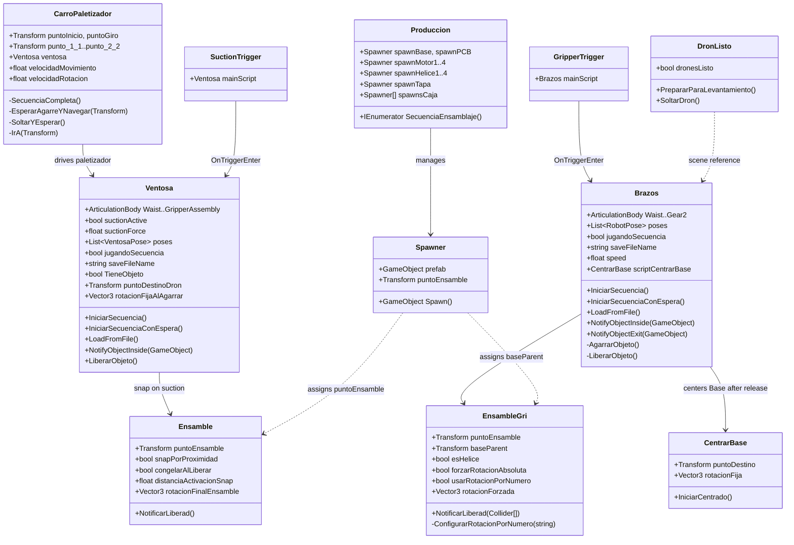
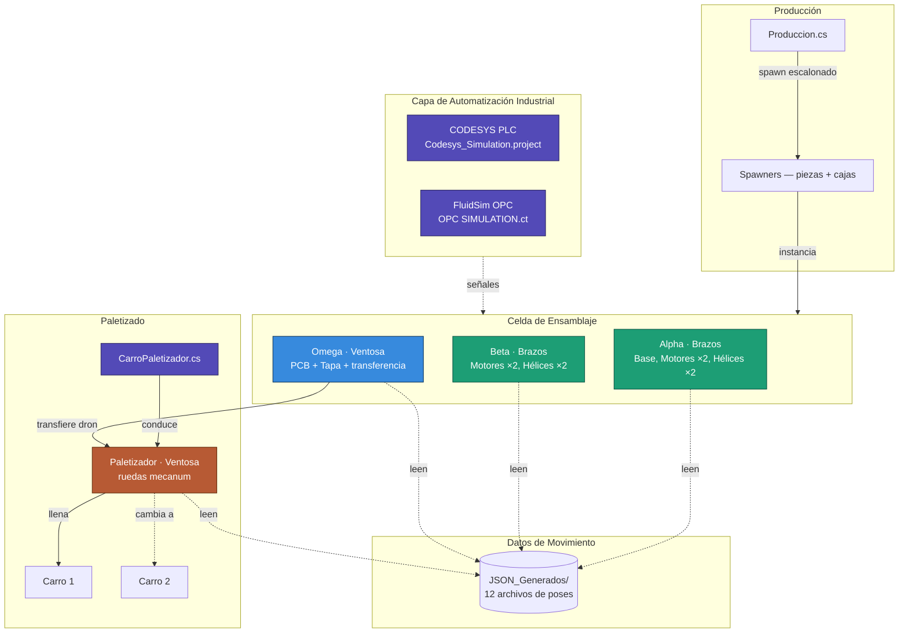
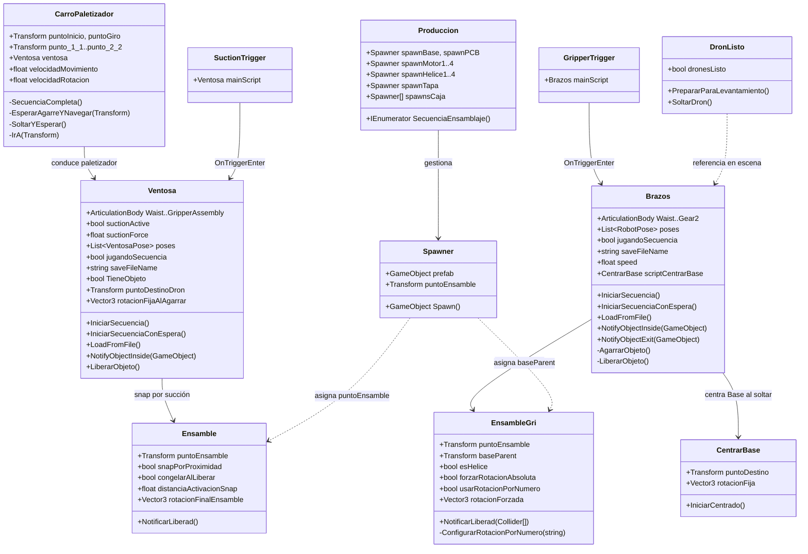

# Drone Packaging Simulation — Unity

<div align="center">


**Robotic Assembly Cell Simulation**  
Coordinated Articulated Arms · JSON-Driven Motion · Realistic Physics

**English** | [Español](#simulación-de-empaquetado-de-dron--unity)

<br/>


> *Isometric view of the robotic assembly cell — 4 articulated arms (Alpha, Beta, Omega, Paletizador) with mecanum wheels.*

</div>

---

## Table of Contents

- [Overview](#overview)
- [Technical Stack](#technical-stack)
- [System Architecture](#system-architecture)
- [Implemented Systems](#implemented-systems)
- [Project Structure](#project-structure)
- [Installation](#installation)
- [Resolved Issues](#resolved-issues)
- [Authors](#authors)
- [License](#license-and-rights)

---

## Overview

This project is a **Unity-based simulation** of a robotic drone assembly and palletizing cell. Four robotic arms collaborate to assemble a drone through physically realistic interactions and JSON-driven motion sequences. The completed drone is then transported and palletized into production carts by a fourth arm that moves autonomously on **mecanum wheels**.

The simulation is intended for **virtual process validation** in technical and academic contexts. It integrates with a **CODESYS PLC project** and a **FluidSim OPC simulation** that model the industrial automation layer.

### Key Features

- 🦾 **Four coordinated robotic arms** (Alpha, Beta, Omega, Paletizador) with ArticulationBody physics
- 🔄 **Decentralized JSON-driven motion** — each arm reads its own pose file and executes independently
- ⚙️ **Dual end effectors**: Gripper (`Brazos.cs`) and Suction Cup (`Ventosa.cs`)
- 🎯 **Proximity-based snap system** for component assembly
- 📊 **Coroutine-based asynchronous execution** with dependency management
- 🔧 **World-space preservation** to prevent rotation artifacts
- 🏭 **Production spawner** with staggered coroutine-based part instantiation, including box spawning
- 📦 **Paletizador** — mecanum-wheel arm + `CarroPaletizador.cs` navigation system
- 🚁 **DronListo.cs** — unifies all drone parts into a single rigidbody unit before pickup
- 🖥️ **CODESYS / FluidSim integration** — PLC and OPC simulation files included in the repository

---

## Technical Stack

### Unity 2021.3.45f1 LTS

| Criterion | Justification |
|-----------|---------------|
| **LTS (Long-Term Support)** | Stability guaranteed through 2024, ideal for simulation projects |
| **Mature ArticulationBody** | Introduced in 2020.1, fully stable in 2021.3 for precise robotic simulation |
| **Deterministic Physics** | Configurable solver iterations, essential for robotics |
| **C# 10.0** | Modern language features: records, pattern matching, global usings |
| **Native JSON Support** | Optimized `JsonUtility` for pose serialization/deserialization |
| **Performance** | DOTS preview available for future scalability |

### Core Unity Components

```csharp
ArticulationBody      // Robotic joint system (superior to standard Rigidbody)
ArticulationDrive     // Motor control (target, stiffness, damping)
ArticulationJointType // Revolute (rotation) and Prismatic (linear)
Coroutines            // Asynchronous sequences
JsonUtility           // Data serialization (RobotPose / VentosaPose)
Physics.IgnoreCollision // Dynamic collision control
```

### Package Dependencies (`manifest.json`)

| Package | Version | Purpose |
|---------|---------|---------| 
| `com.unity.formats.fbx` | 4.1.3 | Asset export for external workflows |
| `com.unity.textmeshpro` | 3.0.6 | UI text rendering |
| `com.unity.timeline` | 1.6.5 | Animation timeline support |
| `com.unity.visualscripting` | 1.9.4 | Visual scripting support |
| `com.unity.collab-proxy` | 2.5.2 | Version control integration |
| `com.unity.test-framework` | 1.1.33 | Unit testing |
| `com.unity.feature.development` | 1.0.1 | Development tools bundle |
| `com.unity.ide.rider` | 3.0.31 | Rider IDE integration |
| `com.unity.ide.visualstudio` | 2.0.22 | Visual Studio integration |
| `com.unity.ide.vscode` | 1.2.5 | VS Code integration |
| `com.unity.ugui` | 1.0.0 | Legacy UI system |

---

## System Architecture

### Component Diagram


### Arm Configuration

| Arm | Class | End Effector | Status | Components Handled |
|-----|-------|-------------|--------|-------------------|
| **Alpha** | `Brazos.cs` | Gripper (pinza) | ✅ Implemented | Base, Motors ×2, Hélices ×2 |
| **Beta** | `Brazos.cs` | Gripper (pinza) | ✅ Implemented | Motors ×2, Hélices ×2 |
| **Omega** | `Ventosa.cs` | Suction Cup (ventosa) | ✅ Implemented | PCB, Tapa, drone transfer |
| **Paletizador** | `Ventosa.cs` + mecanum wheels | Suction Cup (ventosa) | ✅ Implemented | Completed drones → Cart 1 / Cart 2 |

### Assembly Sequence Flow

```mermaid
sequenceDiagram
    participant P as Produccion
    participant A as Alpha (Brazos)
    participant B as Beta (Brazos)
    participant W as Omega (Ventosa)
    participant PAL as Paletizador
    participant D as Drone

    rect rgb(30, 80, 60)
        Note over P,D: Phase 1 — Spawning (staggered 2s delays)
        P->>D: spawn Base → PCB → Motors → Hélices → Tapa → Boxes
    end

    rect rgb(25, 60, 90)
        Note over A,D: Phase 2 — Assembly (each arm reads its own JSON)
        A->>D: grip + place Base
        Note right of A: CentrarBase.IniciarCentrado()
        W->>D: suction + snap PCB

        par Alpha places motors (×2) and hélices (×2)
            A->>D: snap Motor 1
            A->>D: snap Motor 2
            A->>D: snap Hélice 1
            A->>D: snap Hélice 2
        end

        par Beta places motors (×2) and hélices (×2)
            B->>D: snap Motor 3
            B->>D: snap Motor 4
            B->>D: snap Hélice 3
            B->>D: snap Hélice 4
        end

        W->>D: suction + snap Tapa

        Note over D: DronListo.PrepararParaLevantamiento()
        W->>PAL: transfer drone to staging zone
    end

    rect rgb(120, 60, 20)
        Note over PAL: Phase 3 — Palletizing (CarroPaletizador loop)
        loop Cart 1 → Cart 2 (2 slots × 2 drones each)
            PAL->>D: pick from staging zone
            PAL->>PAL: IrA(puntoGiro) → IrA(destino)
            PAL->>PAL: deposit in box
        end
        PAL->>PAL: IrA(puntoInicio)
    end
```



### Script Interaction Diagram



---

## Implemented Systems

### 1. Gripper System (`Brazos.cs`)

**Challenge**: When using `SetParent`, the object's rotation and position would change unexpectedly.

**Solution**: Preserve offsets in world-space before re-parenting:

```csharp
// Save offsets in world space
Vector3 worldPos = grippedObject.transform.position;
Quaternion worldRot = grippedObject.transform.rotation;

grippedObject.transform.SetParent(gripPoint);

// Restore in world space
grippedObject.transform.position = worldPos;
grippedObject.transform.rotation = worldRot;
```

**Critical bug fixed**: Removed `localRotation = Quaternion.identity` which was causing unexpected flips.

**Configuration**:
- ✅ Local offsets: `grabLocalOffset`, `grabLocalRotOffset`
- ✅ Fixed rotations per prefab in Inspector
- ❌ **Never** use `localRotation = Quaternion.identity` after `SetParent`

**Articulations controlled**:
```csharp
public ArticulationBody Waist;           // X Drive
public ArticulationBody Arm01;           // Z Drive
public ArticulationBody Arm02;           // Z Drive
public ArticulationBody Arm03;           // X Drive
public ArticulationBody GripperAssembly; // Z Drive
public ArticulationBody Gear1;           // X Drive (open/close)
public ArticulationBody Gear2;           // X Drive (mirror of Gear1)
```

---

### 2. Suction Cup System (`Ventosa.cs`)

**Behavior**: Magnetic attraction animation before attachment. Omega handles the PCB, Tapa, and full drone transfer to the palletizing zone. The Paletizador uses the same class to pick up and transport completed drones.

**Implementation**:
```csharp
// Suction control fields
public bool suctionActive = false;
public float suctionForce = 10f;
public Vector3 rotacionFijaAlAgarrar = new Vector3(90f, 0f, 0f);
public float alturaLiberacion = 0.02f;
```

**Trigger detection** via `SuctionTrigger.cs`:
```csharp
void OnTriggerEnter(Collider other) {
    if (other.CompareTag("Pickable"))
        mainScript.NotifyObjectInside(other.gameObject);
}
```

**Advantages**:
- Clear visual feedback for the user
- Fixed rotation on grab via `rotacionFijaAlAgarrar`
- Smooth transition without teleportation

---

### 3. JSON Motion Sequencer

Each arm's movement is defined in external JSON files under `Assets/JSON_Generados/` and loaded at runtime. Each file stores a list of `RobotPose` objects with full joint targets.

**Real pose data structure** (`RobotPose`):
```json
{
  "poses": [
    {
      "waist": 180.0,
      "arm01": 35.0,
      "arm02": 0.0,
      "arm03": 0.0,
      "gripperAssembly": 0.0,
      "gripperClosed": true,
      "gripperOpenAngle": -20.0,
      "gripperClosedAngle": -15.0,
      "delay": 0.0
    }
  ]
}
```

**Available JSON files** (12 total):

| File | Arm | Poses | Description |
|------|-----|-------|-------------|
| `Poses_BaseNueva.json` | Alpha | 6 | Place drone base |
| `Poses_PCB.json` | Omega | 7 | Place PCB with suction |
| `Poses_Motor1.json` | Alpha | 6 | Motor 1 |
| `Poses_Motor2.json` | Alpha | 4 | Motor 2 |
| `Poses_Motor3.json` | Beta | 6 | Motor 3 |
| `Poses_Motor4.json` | Beta | 4 | Motor 4 |
| `Poses_Tapa.json` | Omega | 5 | Place lid (final closure) |
| `Poses_Alpha.json` | Alpha | 29 | Full Alpha sequence |
| `Poses_Beta.json` | Beta | 24 | Full Beta sequence |
| `Poses_Omega.json` | Omega | 18 | Full Omega sequence (includes drone transfer) |
| `Poses_Palet.json` | Paletizador | 3 | Paletizador grip sequence |
| `poses2_cubo.json` | — | 1 | Test/debug sequence |

---

### 4. Decentralized Motion Architecture

Motion coordination is fully decentralized: each arm reads and executes its own JSON pose file independently via `LoadFromFile()` on `Awake` and `IniciarSecuencia()` on `Start` or external trigger. The four arms operate in sequence by design of their respective JSON files.

**Motion flow per arm**:
```
Arm's own JSON file (Poses_*.json)
    → LoadFromFile() on Awake
        → IniciarSecuencia() on Start / trigger
            → SmoothX / SmoothZ per frame
                → ArticulationDrive.target updated
```

**Active JSON files and their arms**:

| File | Arm | Poses |
|------|-----|-------|
| `Poses_BaseNueva.json` | Alpha | 6 |
| `Poses_PCB.json` | Omega | 7 |
| `Poses_Motor1.json` | Alpha | 6 |
| `Poses_Motor2.json` | Alpha | 4 |
| `Poses_Motor3.json` | Beta | 6 |
| `Poses_Motor4.json` | Beta | 4 |
| `Poses_Tapa.json` | Omega | 5 |
| `Poses_Omega.json` | Omega | 18 |
| `Poses_Palet.json` | Paletizador | 3 |
| `Poses_Alpha.json` | Alpha | 29 |
| `Poses_Beta.json` | Beta | 24 |
| `poses2_cubo.json` | — | 1 (debug) |

---

### 5. Drone Unification (`DronListo.cs`)

Before Omega lifts the completed drone, all assembled parts must behave as a single rigid unit. `DronListo.cs` is attached to `BasePrefab` and handles this transition.

```csharp
public void PrepararParaLevantamiento() {
    dronesListo = true;
    foreach (Rigidbody rb in GetComponentsInChildren<Rigidbody>()) {
        if (rb.gameObject == this.gameObject) continue;
        rb.isKinematic = true;
        rb.useGravity = false;
    }
}

public void SoltarDron() {
    dronesListo = false;
    foreach (Rigidbody rb in GetComponentsInChildren<Rigidbody>()) {
        if (rb.gameObject == this.gameObject) continue;
        rb.isKinematic = false;
        rb.useGravity = true;
    }
}
```

---

### 6. Palletizer Navigation (`CarroPaletizador.cs`)

`CarroPaletizador.cs` manages the Paletizador's floor movement. The Paletizador arm (`Ventosa`) is a **child** of the cart GameObject, so the entire unit — arm + cart — moves together. Navigation moves in XZ only (Y stays fixed) and rotates on the Y axis toward each waypoint.

**Waypoints** (defined as `Transform` references in the Inspector):

| Point | Purpose |
|-------|---------|
| `puntoInicio` | Starting / home position |
| `puntoGiro` | Rotation waypoint — arm orients before travelling to delivery point |
| `punto_1_1` | Cart 1, slot 1 |
| `punto_1_2` | Cart 1, slot 2 |
| `punto_2_1` | Cart 2, slot 1 |
| `punto_2_2` | Cart 2, slot 2 |

**Palletizing sequence** (coroutine):
```
Cart 1:
  punto_1_1 → deposit drone 1 → deposit drone 2
  punto_1_2 → deposit drone 1 → deposit drone 2
Cart 2:
  punto_2_1 → deposit drone 1 → deposit drone 2
  punto_2_2 → deposit drone 1 → deposit drone 2
Return to puntoInicio
```

**Movement logic** (`IrA` coroutine): translates to XZ target → rotates to face destination on Y axis, both with configurable speed and tolerance.

---

### 7. Snap Mechanics

**Two approaches** depending on piece type:

| Method | Script | Trigger | Used For |
|--------|--------|---------|----------|
| **Proximity** | `Ensamble.cs` | `snapPorProximidad` + distance check | PCB, Tapa |
| **Trigger collision** | `EnsambleGri.cs` | `distanciaActivacion` | Motors, Hélices |

**Snap Animation** (Ensamble.cs):
```csharp
Vector3 startPos = piece.transform.position;
Vector3 finalPos = puntoEnsamble.position + 
                   puntoEnsamble.up * offsetHundimiento;

float t = 0f;
while (t < 1f) {
    t += Time.deltaTime * velocidadEncaje;
    piece.transform.position = Vector3.Lerp(startPos, finalPos, t);
    yield return null;
}

piece.transform.SetParent(basePrefab.transform);
piece.GetComponent<Rigidbody>().isKinematic = true;
```

**Final assembly rotation** is configurable per piece:
```csharp
public Vector3 rotacionFinalEnsamble = new Vector3(-90f, 0f, 180f); // Ensamble.cs
public Vector3 rotacionForzada       = new Vector3(-90f, 0f, 0f);   // EnsambleGri.cs
```

---

### 8. Race Condition Prevention

**Problem**: `PlaySequence()` and `ReleaseInSequence()` ran in parallel.

**Solution: Boolean Semaphore** (in `Brazos.cs`):
```csharp
private bool liberandoObjeto = false;

IEnumerator LiberarEnSecuencia() {
    liberandoObjeto = true;
    yield return new WaitForSeconds(tiempoPreSoltar);
    // ... release object
    yield return new WaitForSeconds(tiempoPostSoltar);
    liberandoObjeto = false;
}

IEnumerator ReproducirSecuencia() {
    if (liberandoObjeto) {
        yield return new WaitUntil(() => !liberandoObjeto);
    }
    // ... execute pose
}
```

---

### 9. Production Spawner (`Produccion.cs`)

Parts are not pre-placed in the scene — they are instantiated at runtime by `Produccion.cs` using individual `Spawner` components. Parts are spawned with staggered 2-second delays; boxes for the palletizer are all spawned simultaneously at the end.

```csharp
IEnumerator SecuenciaEnsamblaje() {
    spawnBase.Spawn();
    yield return new WaitForSeconds(2);
    spawnPCB.Spawn();
    yield return new WaitForSeconds(2);
    spawnMotor1.Spawn(); spawnMotor2.Spawn();
    yield return new WaitForSeconds(2);
    spawnMotor3.Spawn(); spawnMotor4.Spawn();
    yield return new WaitForSeconds(2);
    spawnHelice1.Spawn(); spawnHelice2.Spawn();
    yield return new WaitForSeconds(2);
    spawnHelice3.Spawn(); spawnHelice4.Spawn();
    yield return new WaitForSeconds(2);
    spawnTapa.Spawn();
    yield return new WaitForSeconds(2);
    // All boxes at once
    foreach (Spawner sc in spawnsCaja)
        sc.Spawn();
}
```

Each `Spawner` also auto-assigns `puntoEnsamble` (for `Ensamble`) and `baseParent` (for `EnsambleGri`) on the instantiated prefab. For box prefabs, it additionally wires the `HingeJoint.connectedBody` to the box's own `Rigidbody`, enabling the lid hinge to function correctly.

---

## Project Structure

```
drone-packaging-simulation-unity/
├── docs/
│   └── simulation_overview.png      # Isometric view of the robotic assembly cell
├── CODESYS/                         # PLC project (CODESYS runtime)
│   ├── Codesys_Simulation.project   # Main CODESYS project file
│   ├── Codesys_Simulation.Device.Application.*.bootinfo
│   ├── Codesys_Simulation.Device.Application.*.compileinfo
│   ├── Codesys_Simulation.Device.Application.xml
│   └── Codesys_Simulation-*.opt     # User/machine options
├── Fluidsim/                        # OPC simulation for FluidSim
│   └── OPC SIMULATION FLUIDSIM.ct
├── Assets/
│   ├── Brazos.cs                    # Gripper arm — Alpha, Beta (579 lines)
│   ├── Ventosa.cs                   # Suction arm — Omega, Paletizador (688 lines)
│   ├── CarroPaletizador.cs          # Paletizador floor navigation — mecanum waypoints (163 lines)
│   ├── DronListo.cs                 # Unifies drone parts as single rigidbody before pickup (39 lines)
│   ├── Ensamble.cs                  # Snap logic for PCB / Tapa (144 lines)
│   ├── EnsambleGri.cs               # Snap logic for Motors / Hélices (174 lines)
│   ├── Spawner.cs                   # Instantiates prefabs and assigns assembly refs (32 lines)
│   ├── Produccion.cs                # Staggered coroutine spawn sequencer (56 lines)
│   ├── Angulos.cs                   # Manual joint angle controller (debug/test) (63 lines)
│   ├── CentrarBase.cs               # Centers Base on target Transform after release (91 lines)
│   ├── GripperTrigger.cs            # OnTriggerEnter → Brazos.NotifyObjectInside()
│   ├── SuctionTrigger.cs            # OnTriggerEnter → Ventosa.NotifyObjectInside()
│   ├── MoverCajon.cs                # Moves cart along a waypoint array
│   ├── Cian.mat
│   ├── CV_1.renderTexture
│   ├── CV_5.renderTexture
│   ├── New Animator Controller.*
│   ├── JSON_Generados/              # 12 pose JSON files — each arm reads its own
│   └── Scenes/
│       └── SampleScene.unity
├── Packages/
│   └── manifest.json
└── ProjectSettings/
```

---

## Installation

### Prerequisites

- **Unity Hub** 3.x or higher
- **Unity 2021.3.45f1 LTS** (installable from Unity Hub)
- **Git** (to clone the repository)
- **OS**: Windows 10/11, macOS 10.15+, or Ubuntu 20.04+
- **CODESYS** (optional) — to run the PLC simulation layer

### Installation Steps

1. **Clone the repository**
   ```bash
   git clone https://github.com/jorgefajardom-coder/drone-packaging-simulation-unity.git
   cd drone-packaging-simulation-unity
   ```

2. **Open in Unity Hub**
   - Open Unity Hub
   - Click "Add" → Select the project folder
   - Verify version is **2021.3.45f1 LTS**
   - If not installed, Unity Hub will download it automatically

3. **First Run**
   - Open `Assets/Scenes/SampleScene.unity`
   - Wait for initial script compilation (1-2 min)
   - Press **Play** ▶️

4. **JSON Configuration**
   - Each arm loads its own JSON file automatically from `Assets/JSON_Generados/`
   - The file for each arm is assigned in the Inspector of the `Brazos` or `Ventosa` component via the `saveFileName` field
   - Paletizador waypoints are assigned in the `CarroPaletizador` Inspector

5. **CODESYS / FluidSim** (optional)
   - Open `CODESYS/Codesys_Simulation.project` with CODESYS v3.5+
   - The OPC simulation file for FluidSim is located at `Fluidsim/OPC SIMULATION FLUIDSIM.ct`

---

## Resolved Issues

### Issue #1: Rotation Flips on Grip

**Symptoms**:
- Object rotates 180° unexpectedly when `SetParent` is called
- Incorrect orientation after gripping

**Root Cause**:
```csharp
// ❌ INCORRECT
grippedObject.transform.SetParent(gripPoint);
grippedObject.transform.localRotation = Quaternion.identity; // <-- BUG
```

**Solution**:
```csharp
// ✅ CORRECT
Vector3 worldPos = grippedObject.transform.position;
Quaternion worldRot = grippedObject.transform.rotation;

grippedObject.transform.SetParent(gripPoint);

grippedObject.transform.position = worldPos;
grippedObject.transform.rotation = worldRot;
// DO NOT touch localRotation
```

**Lesson**: Preserve **world-space** before and after `SetParent`.

---

### Issue #2: Lid Penetrating Components

**Symptoms**:
- Lid falls through assembled PCB/motors
- Reaches table and "jumps" upward

**Root Cause**:
- Abrupt repositioning with active gravity
- Incorrect collision layers

**Solution**:
```csharp
bool isPieceToFreeze = assembleScript != null && 
                       assembleScript.freezeOnRelease;

if (!isPieceToFreeze) {
    PositionOnBand(); // Only for PCB
}

// For Lid:
// snapByProximity = true
// freezeOnRelease = true
// isKinematic = true BEFORE releasing
```

**Collision Matrix Configuration**:
```
✅ Lid vs WorkTable: Enabled
✅ Lid vs AssemblablePart: Enabled
❌ Lid vs AssemblyPoint: Disabled (trigger only)
```

---

### Issue #3: Sequence Race Condition

**Symptoms**:
- Objects hit during release
- Deviated trajectories
- Non-deterministic behavior

**Root Cause**:
- `ReleaseInSequence()` and `PlaySequence()` ran in parallel
- No synchronization between coroutines

**Solution: Semaphore Flag**
```csharp
private bool releasingObject = false;

IEnumerator ReleaseInSequence() {
    releasingObject = true;
    yield return new WaitForSeconds(preReleaseTime);
    // ... release object
    yield return new WaitForSeconds(postReleaseTime);
    releasingObject = false;
}

IEnumerator PlaySequence() {
    if (releasingObject) {
        yield return new WaitUntil(() => !releasingObject);
    }
    // ... execute pose
}
```

---

### Issue #4: Incorrect Propeller Rotation

**Symptoms**:
- Propellers 2 and 4 visually "upside down"
- Erratic rotations: `(270, 90, 0)`, `(270, 270, 0)`

**Root Cause**:
- Arms gripped from different angles
- Spawner generated inconsistent orientations
- Script forced absolute rotation without considering grip offset

**Solution**:
```csharp
// In EnsambleGri.cs — uses object name matching via ConfigurarRotacionPorNumero()
if (esHelice && usarRotacionPorNumero) {
    if (nombreLimpio.Contains("Helice1")) {
        rotacionForzada = new Vector3(90f, 0f, 0f);
    } else if (nombreLimpio.Contains("Helice2")) {
        rotacionForzada = new Vector3(-90f, 90f, 0f);
    } else if (nombreLimpio.Contains("Helice3")) {
        rotacionForzada = new Vector3(-90f, 180f, 0f);
    } else if (nombreLimpio.Contains("Helice4")) {
        rotacionForzada = new Vector3(90f, 270f, 0f);
    }
}
```

**Inspector Configuration**:
- `Es Helice`: ✅
- `Forzar Rotacion Absoluta`: ✅
- `Usar Rotacion Por Numero`: ✅ (auto-detects hélice number from prefab name)

---

### Issue #5: Movement Stuttering

**Symptoms**:
- Jerky arm movement
- Micro-stops during Lerp
- Inconsistent velocity

**Root Cause**:
```csharp
// ❌ INCORRECT: t not accumulated correctly
Vector3.Lerp(posInicial, posFinal, Time.deltaTime / duracion);
```

**Solution**:
```csharp
// ✅ CORRECT: Accumulate t explicitly
float t = 0f;
while (t < 1f) {
    t += Time.deltaTime / duracion;
    transform.position = Vector3.Lerp(posInicial, posFinal, t);
    yield return null;
}
```

**Rule**: All physics logic should be in `FixedUpdate` for movements with `Rigidbody`.

---

### Issue #6: Inconsistent Heights After Snap

**Symptoms**:
- Components at different heights after snap
- Visual gaps or overlaps

**Root Cause**:
- **Incorrect pivots in exported prefabs**
- Model origin doesn't match actual contact point
- Generic sink offset without considering geometry

**Solution**:
1. **Correction in modeling software** (Blender/Fusion 360):
   - Place pivot at lower contact point
   - Export with "Apply Transform"

2. **Compensation in Unity** (temporary):
   ```csharp
   // In Ensamble.cs - offsets per piece type
   if (gameObject.name.Contains("Motor")) {
       offsetHundimiento = -0.02f;
   } else if (gameObject.name.Contains("PCB")) {
       offsetHundimiento = -0.005f;
   }
   ```

**Status**: ⚠️ Definitive correction pending in CAD prefabs.

---

## Bug Summary Table

| # | Issue | Severity | Status | Solution |
|---|-------|----------|--------|----------|
| 1 | Rotation flips on grip | 🔴 Critical | ✅ Resolved | Preserve world-space |
| 2 | Lid penetrates components | 🔴 Critical | ✅ Resolved | Kinematic + collision layers |
| 3 | Sequence race condition | 🟡 High | ✅ Resolved | Semaphore flag |
| 4 | Propeller rotation | 🟡 High | ✅ Resolved | Absolute rotation by number |
| 5 | Movement stuttering | 🟢 Medium | ✅ Resolved | Correct t accumulation |
| 6 | Inconsistent heights | 🟡 High | ⚠️ Mitigated | Pending: CAD pivot correction |

---

## Robotic Arm Hierarchy

```
BrazoBase (fixed)
└── Waist (Revolute — X Drive)
    └── Arm01 (Revolute — Z Drive)
        └── Arm02 (Revolute — Z Drive)
            └── Arm03 (Revolute — X Drive)
                └── GripperAssembly (Revolute — Z Drive)
                    ├── Gear1 (Prismatic — X Drive, open/close)
                    └── Gear2 (Prismatic — X Drive, mirror)
```

---

## Physics Configuration

### ArticulationBody Setup

```csharp
// Typical revolute joint configuration
ArticulationBody body = GetComponent<ArticulationBody>();
body.jointType = ArticulationJointType.RevoluteJoint;
body.anchorRotation = Quaternion.Euler(0, 90, 0);

ArticulationDrive drive = body.xDrive;
drive.stiffness = 10000f;  // Rigidity
drive.damping = 100f;      // Damping
drive.forceLimit = 1000f;  // Force limit
drive.target = 45f;        // Target position (degrees)
body.xDrive = drive;
```

### Drive Parameters

| Parameter | Purpose |
|-----------|---------|
| **stiffness** | Joint rigidity — higher values produce firmer response |
| **damping** | Oscillation attenuation |
| **forceLimit** | Maximum applicable force |
| **target** | Target position or rotation value |

### Tags

```
"Pickable" — All graspable drone parts (Base, PCB, Motors, Hélices, Tapa)
```

> **Note**: All graspable parts share the single `"Pickable"` tag. The scripts differentiate piece types by their attached component (`Ensamble` for suction pieces, `EnsambleGri` for gripper pieces) and by prefab name matching.

---

## Authors

**Jorge Andres Fajardo Mora**  
**Laura Vanesa Castro Sierra**

---

## License and Rights

**Copyright © 2025 Jorge Andres Fajardo Mora and Laura Vanesa Castro Sierra. All rights reserved.**

This repository and all its contents — including but not limited to source code, scripts, configuration files, data files, and documentation — are provided for **read-only and reference purposes only**.

**No permission is granted** to copy, modify, distribute, sublicense, or use any part of this project for commercial or non-commercial purposes without **explicit written authorization** from the authors.

**Unauthorized reproduction or redistribution** of this work, in whole or in part, is **strictly prohibited**.

---
---
---

# Simulación de Empaquetado de Dron — Unity

<div align="center">


**Simulación de Celda de Ensamblaje Robótico**  
Brazos Articulados Coordinados · Movimiento JSON · Física Realista

[English](#drone-packaging-simulation--unity) | **Español**

<br/>


> *Vista isométrica de la celda robótica de ensamblaje — 4 brazos articulados (Alpha, Beta, Omega, Paletizador) con ruedas mecanum. Unity 2021.3.45f1 LTS.*

</div>

---

## Tabla de Contenidos

- [Descripción General](#descripción-general)
- [Stack Técnico](#stack-técnico)
- [Arquitectura del Sistema](#arquitectura-del-sistema)
- [Sistemas Implementados](#sistemas-implementados)
- [Estructura del Proyecto](#estructura-del-proyecto)
- [Instalación](#instalación)
- [Problemas Resueltos](#problemas-resueltos)
- [Autores](#autores)
- [Licencia](#licencia-y-derechos)

---

## Descripción General

Este proyecto es una **simulación basada en Unity** de una celda robótica de ensamblaje y paletizado de drones. Cuatro brazos robóticos colaboran para ensamblar un dron mediante interacciones físicas realistas y secuencias de movimiento impulsadas por JSON. El dron completado es luego transportado y paletizado en carros de producción por un cuarto brazo que se desplaza autónomamente con **ruedas mecanum**.

La simulación está orientada a la **validación virtual de procesos** en contextos técnicos y académicos. Se integra con un **proyecto PLC de CODESYS** y una **simulación OPC de FluidSim** que modelan la capa de automatización industrial.

### Características Clave

- 🦾 **Cuatro brazos robóticos coordinados** (Alpha, Beta, Omega, Paletizador) con física ArticulationBody
- 🔄 **Movimiento descentralizado impulsado por JSON** — cada brazo lee su propio archivo de poses y se ejecuta de forma independiente
- ⚙️ **Efectores finales duales**: Gripper (`Brazos.cs`) y Ventosa (`Ventosa.cs`)
- 🎯 **Sistema de snap por proximidad** para ensamblaje de componentes
- 📊 **Ejecución asíncrona basada en coroutines** con gestión de dependencias
- 🔧 **Preservación de world-space** para prevenir artefactos de rotación
- 🏭 **Spawner de producción** con instanciación escalonada de piezas y cajas
- 📦 **Paletizador** — brazo con ruedas mecanum + sistema de navegación `CarroPaletizador.cs`
- 🚁 **DronListo.cs** — unifica todas las piezas del dron en una sola unidad rígida antes del levantamiento
- 🖥️ **Integración CODESYS / FluidSim** — archivos de simulación PLC y OPC incluidos en el repositorio

---

## Stack Técnico

### Unity 2021.3.45f1 LTS

| Criterio | Justificación |
|----------|---------------|
| **LTS (Long-Term Support)** | Estabilidad garantizada hasta 2024, ideal para proyectos de simulación |
| **ArticulationBody maduro** | Introducido en 2020.1, completamente estable en 2021.3 para simulación robótica precisa |
| **Física determinista** | Solver iterations configurables, esencial para robótica |
| **C# 10.0** | Características modernas: records, pattern matching, global usings |
| **Soporte JSON nativo** | `JsonUtility` optimizado para serialización/deserialización de poses |
| **Rendimiento** | DOTS preview disponible para escalabilidad futura |

### Componentes Core de Unity

```csharp
ArticulationBody      // Sistema de articulaciones robóticas (superior a Rigidbody estándar)
ArticulationDrive     // Control de motores (target, stiffness, damping)
ArticulationJointType // Revolute (rotación) y Prismatic (lineal)
Coroutines            // Secuencias asíncronas
JsonUtility           // Serialización de datos (RobotPose / VentosaPose)
Physics.IgnoreCollision // Control dinámico de colisiones
```

### Dependencias de Paquetes (`manifest.json`)

| Paquete | Versión | Propósito |
|---------|---------|-----------|
| `com.unity.formats.fbx` | 4.1.3 | Exportación de assets para flujos externos |
| `com.unity.textmeshpro` | 3.0.6 | Renderizado de texto UI |
| `com.unity.timeline` | 1.6.5 | Soporte de timeline de animación |
| `com.unity.visualscripting` | 1.9.4 | Soporte de scripting visual |
| `com.unity.collab-proxy` | 2.5.2 | Integración de control de versiones |
| `com.unity.test-framework` | 1.1.33 | Testing unitario |
| `com.unity.feature.development` | 1.0.1 | Paquete de herramientas de desarrollo |
| `com.unity.ide.rider` | 3.0.31 | Integración con Rider IDE |
| `com.unity.ide.visualstudio` | 2.0.22 | Integración con Visual Studio |
| `com.unity.ide.vscode` | 1.2.5 | Integración con VS Code |
| `com.unity.ugui` | 1.0.0 | Sistema de UI legacy |

---

## Arquitectura del Sistema

### Diagrama de Componentes



### Configuración de Brazos

| Brazo | Clase | Efector Final | Estado | Componentes Manejados |
|-------|-------|--------------|--------|----------------------|
| **Alpha** | `Brazos.cs` | Gripper (pinza) | ✅ Implementado | Base, Motores ×2, Hélices ×2 (brazos trabajan en conjunto) |
| **Beta** | `Brazos.cs` | Gripper (pinza) | ✅ Implementado | Motores ×2, Hélices ×2 |
| **Omega** | `Ventosa.cs` | Ventosa (succión) | ✅ Implementado | PCB, Tapa, transferencia del dron |
| **Paletizador** | `Ventosa.cs` + ruedas mecanum | Ventosa (succión) | ✅ Implementado | Drones completados → Carro 1 / Carro 2 |

### Flujo de Secuencia de Ensamblaje

```mermaid
sequenceDiagram
    participant P as Produccion
    participant A as Alpha (Brazos)
    participant B as Beta (Brazos)
    participant W as Omega (Ventosa)
    participant PAL as Paletizador
    participant D as Dron

    rect rgb(30, 80, 60)
        Note over P,D: Fase 1 — Spawning (retrasos escalonados de 2s)
        P->>D: spawn Base → PCB → Motores → Hélices → Tapa → Cajas
    end

    rect rgb(25, 60, 90)
        Note over A,D: Fase 2 — Ensamblaje (cada brazo lee su propio JSON)
        A->>D: agarre + colocación Base
        Note right of A: CentrarBase.IniciarCentrado()
        W->>D: ventosa + snap PCB

        par Alpha coloca motores (×2) y hélices (×2)
            A->>D: snap Motor 1
            A->>D: snap Motor 2
            A->>D: snap Hélice 1
            A->>D: snap Hélice 2
        end

        par Beta coloca motores (×2) y hélices (×2)
            B->>D: snap Motor 3
            B->>D: snap Motor 4
            B->>D: snap Hélice 3
            B->>D: snap Hélice 4
        end

        W->>D: ventosa + snap Tapa

        Note over D: DronListo.PrepararParaLevantamiento()
        W->>PAL: transfiere dron a zona de paletizado
    end

    rect rgb(120, 60, 20)
        Note over PAL: Fase 3 — Paletizado (bucle CarroPaletizador)
        loop Carro 1 → Carro 2 (2 slots × 2 drones c/u)
            PAL->>D: recoge de zona de paletizado
            PAL->>PAL: IrA(puntoGiro) → IrA(destino)
            PAL->>PAL: deposita en caja
        end
        PAL->>PAL: IrA(puntoInicio)
    end
```



### Diagrama de Interacción de Scripts



---

## Sistemas Implementados

### 1. Sistema de Gripper (`Brazos.cs`)

**Desafío**: Al usar `SetParent`, la rotación y posición del objeto cambiaban inesperadamente.

**Solución**: Preservar offsets en world-space antes del re-parenteo:

```csharp
// Guardar offsets en espacio global
Vector3 worldPos = objetoAgarrado.transform.position;
Quaternion worldRot = objetoAgarrado.transform.rotation;

objetoAgarrado.transform.SetParent(puntoAgarre);

// Restaurar en espacio global
objetoAgarrado.transform.position = worldPos;
objetoAgarrado.transform.rotation = worldRot;
```

**Bug crítico corregido**: Eliminado `localRotation = Quaternion.identity` que causaba flips inesperados.

**Configuración**:
- ✅ Offsets locales: `grabLocalOffset`, `grabLocalRotOffset`
- ✅ Rotaciones fijas por prefab en Inspector
- ❌ **Nunca** usar `localRotation = Quaternion.identity` después de `SetParent`

**Articulaciones controladas**:
```csharp
public ArticulationBody Waist;           // X Drive
public ArticulationBody Arm01;           // Z Drive
public ArticulationBody Arm02;           // Z Drive
public ArticulationBody Arm03;           // X Drive
public ArticulationBody GripperAssembly; // Z Drive
public ArticulationBody Gear1;           // X Drive (apertura/cierre)
public ArticulationBody Gear2;           // X Drive (espejo de Gear1)
```

---

### 2. Sistema de Ventosa (`Ventosa.cs`)

**Comportamiento**: Animación visual de atracción magnética antes de la fijación. Omega maneja el PCB, la Tapa y la transferencia del dron completo. El Paletizador usa la misma clase para recoger el dron y desplazarlo hasta los carros.

**Implementación**:
```csharp
// Campos de control de succión
public bool suctionActive = false;
public float suctionForce = 10f;
public Vector3 rotacionFijaAlAgarrar = new Vector3(90f, 0f, 0f);
public float alturaLiberacion = 0.02f;
```

**Detección por trigger** vía `SuctionTrigger.cs`:
```csharp
void OnTriggerEnter(Collider other) {
    if (other.CompareTag("Pickable"))
        mainScript.NotifyObjectInside(other.gameObject);
}
```

**Ventajas**:
- Feedback visual claro para el usuario
- Rotación fija al agarrar configurable (`rotacionFijaAlAgarrar`)
- Transición suave sin teletransporte

---

### 3. Secuenciador JSON

Los movimientos de cada brazo se definen en archivos JSON externos en `Assets/JSON_Generados/` y se cargan en tiempo de ejecución. Cada archivo almacena una lista de objetos `RobotPose` con todos los targets de articulación.

**Estructura de datos real de pose** (`RobotPose`):
```json
{
  "poses": [
    {
      "waist": 180.0,
      "arm01": 35.0,
      "arm02": 0.0,
      "arm03": 0.0,
      "gripperAssembly": 0.0,
      "gripperClosed": true,
      "gripperOpenAngle": -20.0,
      "gripperClosedAngle": -15.0,
      "delay": 0.0
    }
  ]
}
```

**Archivos JSON disponibles** (12 en total):

| Archivo | Brazo | Poses | Descripción |
|---------|-------|-------|-------------|
| `Poses_BaseNueva.json` | Alpha | 6 | Colocar base del dron |
| `Poses_PCB.json` | Omega | 7 | Colocar PCB con ventosa |
| `Poses_Motor1.json` | Alpha | 6 | Motor 1 |
| `Poses_Motor2.json` | Alpha | 4 | Motor 2 |
| `Poses_Motor3.json` | Beta | 6 | Motor 3 |
| `Poses_Motor4.json` | Beta | 4 | Motor 4 |
| `Poses_Tapa.json` | Omega | 5 | Colocar tapa (cierre final) |
| `Poses_Alpha.json` | Alpha | 29 | Secuencia completa Alpha |
| `Poses_Beta.json` | Beta | 24 | Secuencia completa Beta |
| `Poses_Omega.json` | Omega | 18 | Secuencia completa Omega (incluye transferencia del dron) |
| `Poses_Palet.json` | Paletizador | 3 | Secuencia de agarre del Paletizador |
| `poses2_cubo.json` | — | 1 | Prueba/debug |

---

### 4. Arquitectura de Movimiento Descentralizada

La coordinación de movimiento es completamente descentralizada: cada brazo lee y ejecuta su propio archivo JSON de poses de forma independiente mediante `LoadFromFile()` en `Awake` e `IniciarSecuencia()` en `Start` o trigger externo. Los cuatro brazos operan en secuencia por diseño de sus respectivos archivos JSON.

**Flujo de movimiento por brazo**:
```
Archivo JSON propio (Poses_*.json)
    → LoadFromFile() en Awake
        → IniciarSecuencia() en Start / trigger
            → SmoothX / SmoothZ por frame
                → ArticulationDrive.target actualizado
```

**Archivos JSON activos y sus brazos**:

| Archivo | Brazo | Poses |
|---------|-------|-------|
| `Poses_BaseNueva.json` | Alpha | 6 |
| `Poses_PCB.json` | Omega | 7 |
| `Poses_Motor1.json` | Alpha | 6 |
| `Poses_Motor2.json` | Alpha | 4 |
| `Poses_Motor3.json` | Beta | 6 |
| `Poses_Motor4.json` | Beta | 4 |
| `Poses_Tapa.json` | Omega | 5 |
| `Poses_Omega.json` | Omega | 18 |
| `Poses_Palet.json` | Paletizador | 3 |
| `Poses_Alpha.json` | Alpha | 29 |
| `Poses_Beta.json` | Beta | 24 |
| `poses2_cubo.json` | — | 1 (debug) |

---

### 5. Unificación del Dron (`DronListo.cs`)

Antes de que Omega levante el dron completo, todas las piezas ensambladas deben comportarse como una sola unidad rígida. `DronListo.cs` se adjunta a `BasePrefab` y gestiona esta transición.

```csharp
public void PrepararParaLevantamiento() {
    dronesListo = true;
    foreach (Rigidbody rb in GetComponentsInChildren<Rigidbody>()) {
        if (rb.gameObject == this.gameObject) continue;
        rb.isKinematic = true;
        rb.useGravity = false;
    }
}

public void SoltarDron() {
    dronesListo = false;
    foreach (Rigidbody rb in GetComponentsInChildren<Rigidbody>()) {
        if (rb.gameObject == this.gameObject) continue;
        rb.isKinematic = false;
        rb.useGravity = true;
    }
}
```

---

### 6. Navegación del Paletizador (`CarroPaletizador.cs`)

`CarroPaletizador.cs` gestiona el movimiento del Paletizador por el suelo. El brazo Paletizador (`Ventosa`) es un **hijo** del GameObject del carro, por lo que toda la unidad — brazo + carro — se desplaza junta. La navegación se realiza solo en XZ (Y permanece fijo) y rota en el eje Y hacia cada waypoint.

**Waypoints** (definidos como referencias `Transform` en el Inspector):

| Punto | Propósito |
|-------|-----------|
| `puntoInicio` | Posición de inicio / home |
| `puntoGiro` | Waypoint de rotación — el brazo se orienta antes de viajar al punto de entrega |
| `punto_1_1` | Carro 1, slot 1 |
| `punto_1_2` | Carro 1, slot 2 |
| `punto_2_1` | Carro 2, slot 1 |
| `punto_2_2` | Carro 2, slot 2 |

**Secuencia de paletizado** (coroutine):
```
Carro 1:
  punto_1_1 → deposita dron 1 → deposita dron 2
  punto_1_2 → deposita dron 1 → deposita dron 2
Carro 2:
  punto_2_1 → deposita dron 1 → deposita dron 2
  punto_2_2 → deposita dron 1 → deposita dron 2
Regresa a puntoInicio
```

**Lógica de movimiento** (coroutine `IrA`): traslada al objetivo XZ → rota para orientarse hacia el destino en el eje Y, ambos con velocidad y tolerancia configurables.

---

### 7. Mecánicas de Snap

**Dos enfoques** según el tipo de pieza:

| Método | Script | Trigger | Usado para |
|--------|--------|---------|-----------|
| **Proximidad** | `Ensamble.cs` | `snapPorProximidad` + verificación de distancia | PCB, Tapa |
| **Colisión Trigger** | `EnsambleGri.cs` | `distanciaActivacion` | Motores, Hélices |

**Animación de Snap** (Ensamble.cs):
```csharp
Vector3 posInicial = pieza.transform.position;
Vector3 posFinal = puntoEnsamble.position + 
                   puntoEnsamble.up * offsetHundimiento;

float t = 0f;
while (t < 1f) {
    t += Time.deltaTime * velocidadEncaje;
    pieza.transform.position = Vector3.Lerp(posInicial, posFinal, t);
    yield return null;
}

pieza.transform.SetParent(basePrefab.transform);
pieza.GetComponent<Rigidbody>().isKinematic = true;
```

**La rotación final del ensamble** es configurable por pieza:
```csharp
public Vector3 rotacionFinalEnsamble = new Vector3(-90f, 0f, 180f); // Ensamble.cs
public Vector3 rotacionForzada       = new Vector3(-90f, 0f, 0f);   // EnsambleGri.cs
```

---

### 8. Prevención de Race Conditions

**Problema**: `ReproducirSecuencia()` y `LiberarEnSecuencia()` corrían en paralelo.

**Solución: Semáforo Booleano** (en `Brazos.cs`):
```csharp
private bool liberandoObjeto = false;

IEnumerator LiberarEnSecuencia() {
    liberandoObjeto = true;
    yield return new WaitForSeconds(tiempoPreSoltar);
    // ... soltar objeto
    yield return new WaitForSeconds(tiempoPostSoltar);
    liberandoObjeto = false;
}

IEnumerator ReproducirSecuencia() {
    if (liberandoObjeto) {
        yield return new WaitUntil(() => !liberandoObjeto);
    }
    // ... ejecutar pose
}
```

---

### 9. Spawner de Producción (`Produccion.cs`)

Las piezas no se pre-colocan en la escena — se instancian en tiempo de ejecución por `Produccion.cs` usando componentes `Spawner` individuales. Las piezas se instancian con retrasos escalonados de 2 segundos; las cajas del paletizador se instancian todas simultáneamente al finalizar.

```csharp
IEnumerator SecuenciaEnsamblaje() {
    spawnBase.Spawn();
    yield return new WaitForSeconds(2);
    spawnPCB.Spawn();
    yield return new WaitForSeconds(2);
    spawnMotor1.Spawn(); spawnMotor2.Spawn();
    yield return new WaitForSeconds(2);
    spawnMotor3.Spawn(); spawnMotor4.Spawn();
    yield return new WaitForSeconds(2);
    spawnHelice1.Spawn(); spawnHelice2.Spawn();
    yield return new WaitForSeconds(2);
    spawnHelice3.Spawn(); spawnHelice4.Spawn();
    yield return new WaitForSeconds(2);
    spawnTapa.Spawn();
    yield return new WaitForSeconds(2);
    // Todas las cajas al mismo tiempo
    foreach (Spawner sc in spawnsCaja)
        sc.Spawn();
}
```

Cada `Spawner` también asigna automáticamente `puntoEnsamble` (para `Ensamble`) y `baseParent` (para `EnsambleGri`) en el prefab instanciado. Para prefabs de cajas, además conecta el `HingeJoint.connectedBody` al propio `Rigidbody` de la caja, permitiendo que la bisagra de la tapa funcione correctamente.

---

## Estructura del Proyecto

```
drone-packaging-simulation-unity/
├── docs/
│   └── simulation_overview.png      # Vista isométrica de la celda robótica de ensamblaje
├── CODESYS/                         # Proyecto PLC (runtime CODESYS)
│   ├── Codesys_Simulation.project   # Archivo principal del proyecto CODESYS
│   ├── Codesys_Simulation.Device.Application.*.bootinfo
│   ├── Codesys_Simulation.Device.Application.*.compileinfo
│   ├── Codesys_Simulation.Device.Application.xml
│   └── Codesys_Simulation-*.opt     # Opciones de usuario/máquina
├── Fluidsim/                        # Simulación OPC para FluidSim
│   └── OPC SIMULATION FLUIDSIM.ct
├── Assets/
│   ├── Brazos.cs                    # Brazo gripper — Alpha, Beta (579 líneas)
│   ├── Ventosa.cs                   # Brazo ventosa — Omega, Paletizador (688 líneas)
│   ├── CarroPaletizador.cs          # Navegación del Paletizador — waypoints mecanum (163 líneas)
│   ├── DronListo.cs                 # Unifica piezas del dron como un solo cuerpo rígido (39 líneas)
│   ├── Ensamble.cs                  # Lógica snap para PCB / Tapa (144 líneas)
│   ├── EnsambleGri.cs               # Lógica snap para Motores / Hélices (174 líneas)
│   ├── Spawner.cs                   # Instancia prefabs y asigna refs de ensamble (32 líneas)
│   ├── Produccion.cs                # Secuenciador de spawn con coroutine escalonado (56 líneas)
│   ├── Angulos.cs                   # Controlador manual de ángulos de articulaciones (63 líneas)
│   ├── CentrarBase.cs               # Centra la Base en el Transform destino al soltar (91 líneas)
│   ├── GripperTrigger.cs            # OnTriggerEnter → Brazos.NotifyObjectInside()
│   ├── SuctionTrigger.cs            # OnTriggerEnter → Ventosa.NotifyObjectInside()
│   ├── MoverCajon.cs                # Mueve el carro a lo largo de un array de waypoints
│   ├── Cian.mat
│   ├── CV_1.renderTexture
│   ├── CV_5.renderTexture
│   ├── New Animator Controller.*
│   ├── JSON_Generados/              # 12 archivos JSON de poses — cada brazo lee el suyo
│   └── Scenes/
│       └── SampleScene.unity
├── Packages/
│   └── manifest.json
└── ProjectSettings/
```

---

## Instalación

### Requisitos Previos

- **Unity Hub** 3.x o superior
- **Unity 2021.3.45f1 LTS** (instalable desde Unity Hub)
- **Git** (para clonar el repositorio)
- **SO**: Windows 10/11, macOS 10.15+, o Ubuntu 20.04+
- **CODESYS** (opcional) — para ejecutar la capa de simulación PLC

### Pasos de Instalación

1. **Clonar el repositorio**
   ```bash
   git clone https://github.com/jorgefajardom-coder/drone-packaging-simulation-unity.git
   cd drone-packaging-simulation-unity
   ```

2. **Abrir en Unity Hub**
   - Abrir Unity Hub
   - Click en "Add" → Seleccionar la carpeta del proyecto
   - Verificar que la versión sea **2021.3.45f1 LTS**
   - Si no está instalada, Unity Hub la descargará automáticamente

3. **Primera Ejecución**
   - Abrir `Assets/Scenes/SampleScene.unity`
   - Esperar compilación inicial de scripts (1-2 min)
   - Presionar **Play** ▶️

4. **Configuración de JSON**
   - Cada brazo carga su propio archivo JSON automáticamente desde `Assets/JSON_Generados/`
   - El archivo de cada brazo se asigna en el Inspector del componente `Brazos` o `Ventosa` mediante el campo `saveFileName`
   - Los waypoints del Paletizador se asignan en el Inspector de `CarroPaletizador`

5. **CODESYS / FluidSim** (opcional)
   - Abrir `CODESYS/Codesys_Simulation.project` con CODESYS v3.5+
   - El archivo de simulación OPC para FluidSim está en `Fluidsim/OPC SIMULATION FLUIDSIM.ct`

---

## Problemas Resueltos

### Problema #1: Flips de Rotación al Agarrar

**Síntomas**:
- Objeto rota 180° inesperadamente al hacer `SetParent`
- Orientación incorrecta después del agarre

**Causa Raíz**:
```csharp
// ❌ INCORRECTO
objetoAgarrado.transform.SetParent(puntoAgarre);
objetoAgarrado.transform.localRotation = Quaternion.identity; // <-- BUG
```

**Solución**:
```csharp
// ✅ CORRECTO
Vector3 worldPos = objetoAgarrado.transform.position;
Quaternion worldRot = objetoAgarrado.transform.rotation;

objetoAgarrado.transform.SetParent(puntoAgarre);

objetoAgarrado.transform.position = worldPos;
objetoAgarrado.transform.rotation = worldRot;
// NO tocar localRotation
```

**Lección**: Preservar **world-space** antes y después de `SetParent`.

---

### Problema #2: Tapa Atraviesa Componentes

**Síntomas**:
- La tapa cae a través de PCB/motores ya ensamblados
- Llega a la mesa y "salta" hacia arriba

**Causa Raíz**:
- Reposicionamiento brusco con gravedad activa
- Collision layers incorrectos

**Solución**:
```csharp
bool esPiezaQueSeCongela = ensambleScript != null && 
                           ensambleScript.congelarAlLiberar;

if (!esPiezaQueSeCongela) {
    PosicionarSobreBanda(); // Solo para PCB
}

// Para Tapa:
// snapPorProximidad = true
// congelarAlLiberar = true
// isKinematic = true ANTES de soltar
```

**Configuración Collision Matrix**:
```
✅ Tapa vs MesaTrabajo: Habilitado
✅ Tapa vs ParteEnsamblable: Habilitado
❌ Tapa vs PuntoEnsamble: Deshabilitado (solo trigger)
```

---

### Problema #3: Race Condition en Secuencias

**Síntomas**:
- Objetos golpeados durante liberación
- Trayectorias desviadas
- Comportamiento no determinista

**Causa Raíz**:
- `LiberarEnSecuencia()` y `ReproducirSecuencia()` corrían en paralelo
- Sin sincronización entre coroutines

**Solución: Flag Semáforo**
```csharp
private bool liberandoObjeto = false;

IEnumerator LiberarEnSecuencia() {
    liberandoObjeto = true;
    yield return new WaitForSeconds(tiempoPreSoltar);
    // ... soltar objeto
    yield return new WaitForSeconds(tiempoPostSoltar);
    liberandoObjeto = false;
}

IEnumerator ReproducirSecuencia() {
    if (liberandoObjeto) {
        yield return new WaitUntil(() => !liberandoObjeto);
    }
    // ... ejecutar pose
}
```

---

### Problema #4: Rotación Incorrecta de Hélices

**Síntomas**:
- Hélices 2 y 4 visualmente "al revés"
- Rotaciones erráticas: `(270, 90, 0)`, `(270, 270, 0)`

**Causa Raíz**:
- Brazos agarraban desde diferentes ángulos
- Spawner generaba orientaciones inconsistentes
- Script forzaba rotación absoluta sin considerar offset de agarre

**Solución**:
```csharp
// En EnsambleGri.cs — usa coincidencia de nombre vía ConfigurarRotacionPorNumero()
if (esHelice && usarRotacionPorNumero) {
    if (nombreLimpio.Contains("Helice1")) {
        rotacionForzada = new Vector3(90f, 0f, 0f);
    } else if (nombreLimpio.Contains("Helice2")) {
        rotacionForzada = new Vector3(-90f, 90f, 0f);
    } else if (nombreLimpio.Contains("Helice3")) {
        rotacionForzada = new Vector3(-90f, 180f, 0f);
    } else if (nombreLimpio.Contains("Helice4")) {
        rotacionForzada = new Vector3(90f, 270f, 0f);
    }
}
```

**Configuración Inspector**:
- `Es Helice`: ✅
- `Forzar Rotacion Absoluta`: ✅
- `Usar Rotacion Por Numero`: ✅ (detecta automáticamente el número de hélice del nombre del prefab)

---

### Problema #5: Stuttering en Movimiento

**Síntomas**:
- Movimiento entrecortado de brazos
- Micro-paradas durante Lerp
- Inconsistencia de velocidad

**Causa Raíz**:
```csharp
// ❌ INCORRECTO: t no se acumula correctamente
Vector3.Lerp(posInicial, posFinal, Time.deltaTime / duracion);
```

**Solución**:
```csharp
// ✅ CORRECTO: Acumular t explícitamente
float t = 0f;
while (t < 1f) {
    t += Time.deltaTime / duracion;
    transform.position = Vector3.Lerp(posInicial, posFinal, t);
    yield return null;
}
```

**Regla**: Toda lógica física debe estar en `FixedUpdate` para movimientos con `Rigidbody`.

---

### Problema #6: Alturas Inconsistentes Post-Snap

**Síntomas**:
- Componentes a diferentes alturas después del snap
- Gaps o superposiciones visuales

**Causa Raíz**:
- **Pivots incorrectos en prefabs exportados**
- Origen del modelo no coincide con punto de contacto real
- Offset de hundimiento genérico sin considerar geometría

**Solución**:
1. **Corrección en software de modelado** (Blender/Fusion 360):
   - Ubicar pivot en el punto de contacto inferior
   - Exportar con "Apply Transform"

2. **Compensación en Unity** (temporal):
   ```csharp
   // En Ensamble.cs - offsets por tipo de pieza
   if (gameObject.name.Contains("Motor")) {
       offsetHundimiento = -0.02f;
   } else if (gameObject.name.Contains("PCB")) {
       offsetHundimiento = -0.005f;
   }
   ```

**Estado**: ⚠️ Corrección definitiva pendiente en prefabs CAD.

---

## Tabla Resumen de Bugs

| # | Bug | Severidad | Estado | Solución |
|---|-----|-----------|--------|----------|
| 1 | Flips de rotación al agarrar | 🔴 Crítico | ✅ Resuelto | Preservar world-space |
| 2 | Tapa atraviesa componentes | 🔴 Crítico | ✅ Resuelto | Kinematic + collision layers |
| 3 | Race condition secuencias | 🟡 Alto | ✅ Resuelto | Flag semáforo |
| 4 | Rotación hélices | 🟡 Alto | ✅ Resuelto | Rotación absoluta por número |
| 5 | Stuttering movimiento | 🟢 Medio | ✅ Resuelto | Acumulación correcta de t |
| 6 | Alturas inconsistentes | 🟡 Alto | ⚠️ Mitigado | Pending: corrección pivots CAD |

---

## Jerarquía del Brazo Robótico

```
BrazoBase (fixed)
└── Waist (Revolute — X Drive)
    └── Arm01 (Revolute — Z Drive)
        └── Arm02 (Revolute — Z Drive)
            └── Arm03 (Revolute — X Drive)
                └── GripperAssembly (Revolute — Z Drive)
                    ├── Gear1 (Prismatic — X Drive, apertura/cierre)
                    └── Gear2 (Prismatic — X Drive, espejo)
```

---

## Configuración de Física

### Configuración de ArticulationBody

```csharp
// Configuración típica de articulación revolute
ArticulationBody body = GetComponent<ArticulationBody>();
body.jointType = ArticulationJointType.RevoluteJoint;
body.anchorRotation = Quaternion.Euler(0, 90, 0);

ArticulationDrive drive = body.xDrive;
drive.stiffness = 10000f;  // Rigidez
drive.damping = 100f;      // Amortiguación
drive.forceLimit = 1000f;  // Límite de fuerza
drive.target = 45f;        // Posición objetivo (grados)
body.xDrive = drive;
```

### Parámetros de Drive

| Parámetro | Función |
|-----------|---------|
| **stiffness** | Rigidez de la articulación — valores altos producen respuesta más firme |
| **damping** | Amortiguación de oscilaciones |
| **forceLimit** | Fuerza máxima aplicable |
| **target** | Valor objetivo de posición o rotación |

### Tags del Proyecto

```
"Pickable" — Todas las piezas agarrables (Base, PCB, Motores, Hélices, Tapa)
```

> **Nota**: Todas las piezas agarrables comparten el único tag `"Pickable"`. Los scripts diferencian tipos de pieza por su componente adjunto (`Ensamble` para piezas de ventosa, `EnsambleGri` para piezas de gripper) y por coincidencia del nombre del prefab.

---

## Autores

**Jorge Andres Fajardo Mora**  
**Laura Vanesa Castro Sierra**

---

## Licencia y Derechos

**Copyright © 2025 Jorge Andres Fajardo Mora y Laura Vanesa Castro Sierra. Todos los derechos reservados.**

Este repositorio y la totalidad de su contenido — incluyendo, entre otros, código fuente, scripts, archivos de configuración, archivos de datos y documentación — se proporcionan exclusivamente para **fines de lectura y referencia**.

**No se otorga ningún permiso** para copiar, modificar, distribuir, sublicenciar ni utilizar ninguna parte de este proyecto con fines comerciales o no comerciales sin **autorización escrita explícita** de los autores.

Queda **estrictamente prohibida** la reproducción o redistribución no autorizada de este trabajo, en todo o en parte.
