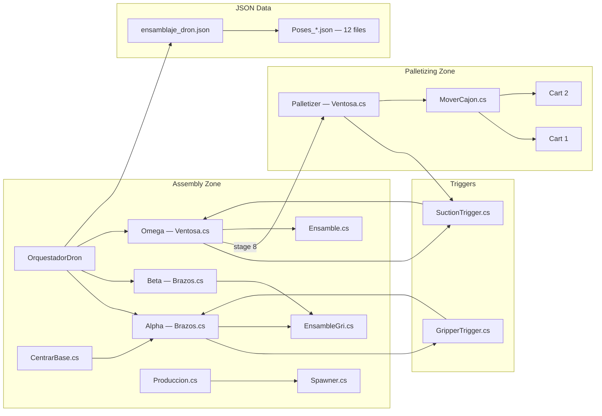
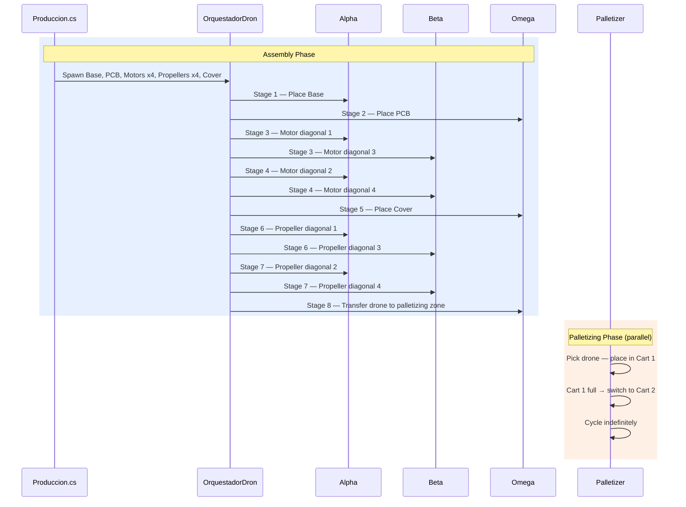
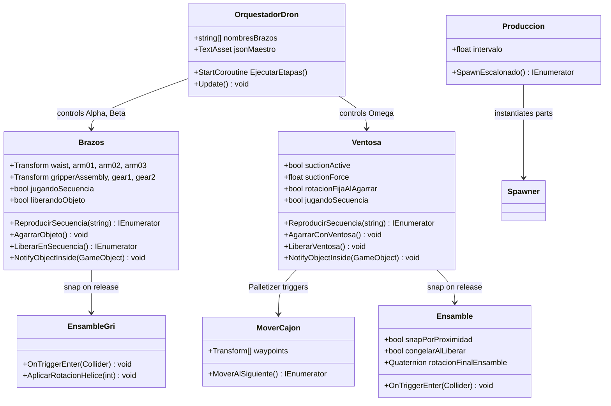
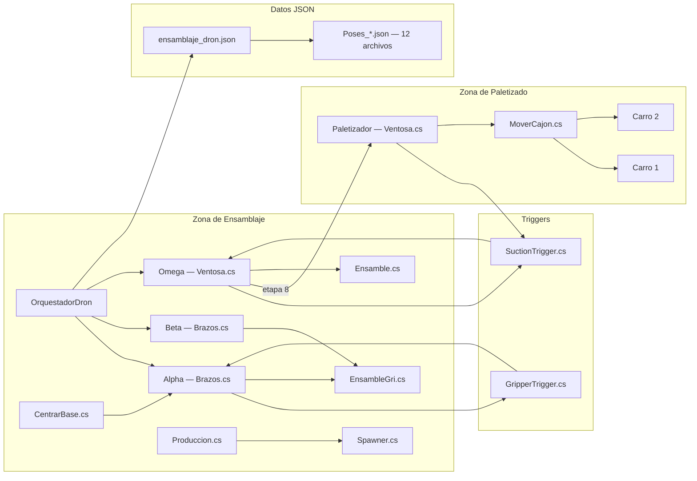
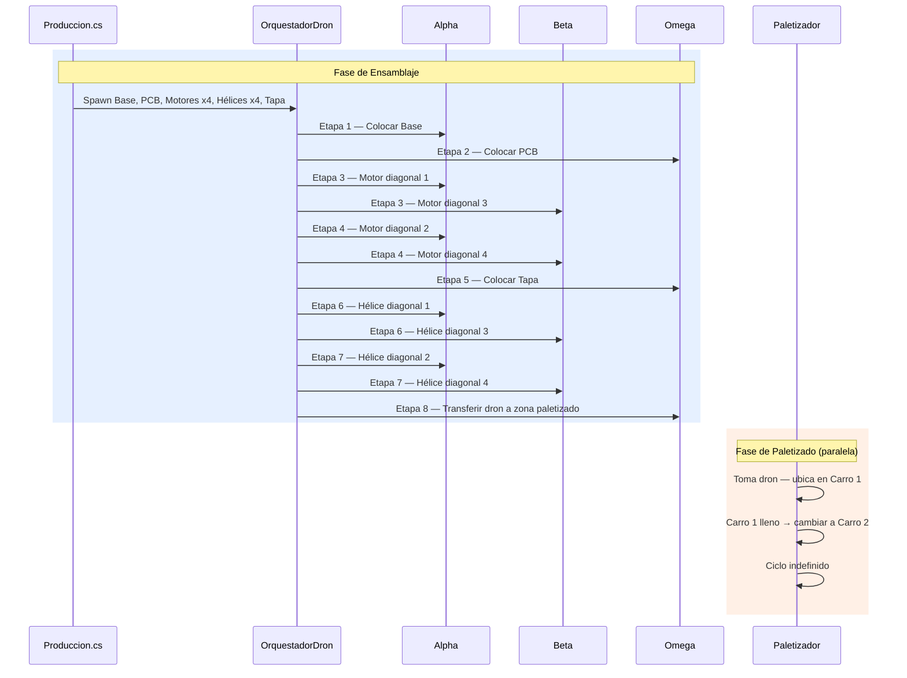
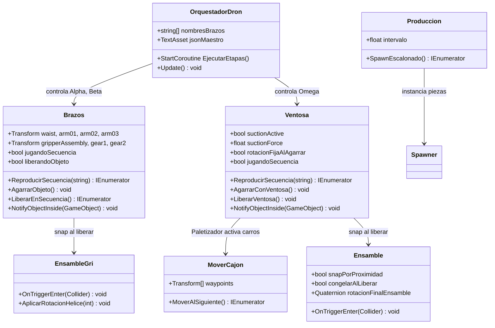

# Drone Packaging Simulation — Unity

**Repository**: https://github.com/jorgefajardom-coder/drone-packaging-simulation-unity  
**Engine**: Unity 2021.3.45f1 LTS  
**Language**: C# 10.0  
**Main Scene**: `Assets/Scenes/SampleScene.unity`  
**Authors**: Jorge Andres Fajardo Mora · Laura Vanesa Castro Sierra

---

> **Español** → [Ver sección en español](#simulación-de-empaque-de-drones--unity)

---

## Overview

Unity simulation of a robotic assembly and palletizing cell for drones. Four articulated arms collaborate to fully assemble a drone in under one minute and continuously package it into production carts.

The simulation recreates an automated process with part manipulation, articulated robotic arms, realistic physical interaction, and a continuous production flow managed by a JSON-driven orchestrator.

---

## The 4 Arms

| Arm | Class | End Effector | Description |
|-----|-------|--------------|-------------|
| **Alpha** | `Brazos.cs` | Gripper (clamp) | Fixed arm. Places the Base and, paired with Beta, assembles diagonal motors and propellers. |
| **Beta** | `Brazos.cs` | Gripper (clamp) | Fixed arm. Works in tandem with Alpha for diagonal motor and propeller pairs. |
| **Omega** | `Ventosa.cs` | Suction cup | Fixed arm. Places PCB and Cover. In stage 8, picks the completed drone and transfers it to the Palletizer zone. |
| **Palletizer** | `Ventosa.cs` | Suction cup | Moves across the floor with **mecanum wheels** (omnidirectional). Picks the drone from the palletizing zone and places it into Cart 1 or Cart 2. |

---

## Assembly Sequence (8 Stages)

| Stage | Arm(s) | Action |
|-------|--------|--------|
| 1 | Alpha | Places the Base at the assembly point |
| 2 | Omega | Places the PCB on the Base (suction) |
| 3 | Alpha + Beta | Assemble the 2 motors of diagonal pair 1 and 3 simultaneously |
| 4 | Alpha + Beta | Assemble the 2 motors of diagonal pair 2 and 4 simultaneously |
| 5 | Omega | Places the Cover (final closure, suction) |
| 6 | Alpha + Beta | Assemble the 2 propellers of diagonal pair 1 and 3 simultaneously |
| 7 | Alpha + Beta | Assemble the 2 propellers of diagonal pair 2 and 4 simultaneously |
| 8 | Omega | Picks the completed drone and transfers it to the Palletizer zone |

Estimated full cycle time: **< 1 minute**.

---

## Palletizing System

The Palletizer operates in a parallel loop from stage 8, independent of the assembly sequence:

```
Cart 1 active   → Palletizer fills boxes
Cart 1 full     → Cart 1 exits the zone
                → Palletizer switches to Cart 2
Cart 1 returns empty while Cart 2 is being filled
                → Palletizer finishes Cart 2 → returns to Cart 1
                → Indefinite cycle
```

The palletizing time per cart is ≤ one assembly cycle time, guaranteeing that a cart is always available.

---

## Architecture Diagram



---

## Sequence Diagram



---

## Class Diagram



---

## Scripts

| Script | Lines | Description |
|--------|-------|-------------|
| `Brazos.cs` | 579 | Gripper arm control. Manages joints (Waist, Arm01–03, GripperAssembly, Gear1/2), pose sequences from JSON, object grab and release. |
| `Ventosa.cs` | 660 | Suction arm control. Same structure as Brazos but with suction logic (`suctionActive`, `suctionForce`, `rotacionFijaAlAgarrar`). |
| `OrquestadorDron.cs` | — | Master coordinator. Reads `ensamblaje_dron.json`, activates arms by name (`Alpha`, `Beta`, `Omega`, `Palletizer`), polls `jugandoSecuencia` in `Update()`. |
| `Ensamble.cs` | — | Snap logic for suction parts (PCB, Cover). Supports `snapPorProximidad`, `congelarAlLiberar`, `rotacionFinalEnsamble`. |
| `EnsambleGri.cs` | — | Snap logic for gripper parts (Motors, Propellers). Detects propellers by name, applies absolute rotation per propeller number (1–4). |
| `Spawner.cs` | — | Instantiates prefabs at runtime, assigns `puntoEnsamble` and `baseParent` to the created prefab. |
| `Produccion.cs` | — | Staggered spawn sequence with coroutine. Spawns Base, PCB, Motors ×4, Propellers ×4 and Cover with 2-second intervals. |
| `CentrarBase.cs` | — | Centers the Base on the XZ axis after Alpha releases it. |
| `GripperTrigger.cs` | — | `OnTriggerEnter` → calls `Brazos.NotifyObjectInside()` for objects tagged `Pickable`. |
| `SuctionTrigger.cs` | — | `OnTriggerEnter` → calls `Ventosa.NotifyObjectInside()` for objects tagged `Pickable`. |
| `MoverCajon.cs` | — | Moves the cart between waypoints (manages Cart 1 / Cart 2 rotation logic). |
| `Angulos.cs` | — | Manual joint angle control (debug/test tool). |

---

## JSON Pose Files (12 total)

| File | Arm | Description |
|------|-----|-------------|
| `Poses_BaseNueva.json` | Alpha | Place Base (6 poses) |
| `Poses_PCB.json` | Omega | Place PCB with suction |
| `Poses_Motor1.json` | Alpha | Diagonal motor 1 (6 poses) |
| `Poses_Motor2.json` | Alpha | Diagonal motor 2 (6 poses) |
| `Poses_Motor3.json` | Beta | Diagonal motor 3 |
| `Poses_Motor4.json` | Beta | Diagonal motor 4 |
| `Poses_Tapa.json` | Omega | Place Cover |
| `Poses_Alpha.json` | Alpha | Alternative sequence |
| `Poses_Beta.json` | Beta | Alternative sequence |
| `Poses_Omega.json` | Omega | Alternative sequence |
| `Poses_Palet.json` | Palletizer | Palletizing / cart movement sequence |
| `poses2_cubo.json` | — | Testing / debug |

**RobotPose structure:**
```json
{
  "waist": 180.0,
  "arm01": 35.0,
  "arm02": 0.0,
  "arm03": 0.0,
  "gripperAssembly": 0.0,
  "gripperClosed": true,
  "gripperOpenAngle": -20.0,
  "gripperClosedAngle": -15.0,
  "delay": 0.0
}
```

**Master JSON** (`ensamblaje_dron.json`) — located in `StreamingAssets/`:
```json
{
  "etapas": [
    { "nombre": "Colocar base",               "brazos": [{"brazo":"Alpha","archivo":"Poses_BaseNueva.json"}] },
    { "nombre": "Colocar PCB",                "brazos": [{"brazo":"Omega","archivo":"Poses_PCB.json"}] },
    { "nombre": "Motores diagonales 1 y 3",   "brazos": [{"brazo":"Alpha","archivo":"Poses_Motor1.json"},{"brazo":"Beta","archivo":"Poses_Motor3.json"}] },
    { "nombre": "Motores diagonales 2 y 4",   "brazos": [{"brazo":"Alpha","archivo":"Poses_Motor2.json"},{"brazo":"Beta","archivo":"Poses_Motor4.json"}] },
    { "nombre": "Colocar tapa",               "brazos": [{"brazo":"Omega","archivo":"Poses_Tapa.json"}] },
    { "nombre": "Helices diagonales 1 y 3",   "brazos": [{"brazo":"Alpha","archivo":"Poses_Helice1.json"},{"brazo":"Beta","archivo":"Poses_Helice3.json"}] },
    { "nombre": "Helices diagonales 2 y 4",   "brazos": [{"brazo":"Alpha","archivo":"Poses_Helice2.json"},{"brazo":"Beta","archivo":"Poses_Helice4.json"}] },
    { "nombre": "Transferir dron a zona paletizador", "brazos": [{"brazo":"Omega","archivo":"Poses_TransferDron.json"}] }
  ]
}
```

> The Palletizer has its own independent controller and is not part of `ensamblaje_dron.json`.

---

## Dependencies (`manifest.json`)

| Package | Version |
|---------|---------|
| `com.unity.formats.fbx` | 4.1.3 |
| `com.unity.textmeshpro` | 3.0.6 |
| `com.unity.timeline` | 1.6.5 |
| `com.unity.visualscripting` | 1.9.4 |
| `com.unity.collab-proxy` | 2.5.2 |
| `com.unity.test-framework` | 1.1.33 |

---

## Tags

```
"Pickable"  —  all graspable parts (Base, PCB, Motors, Propellers, Cover, completed drone)
"PCB"       —  specific tag for the PCB for specialized handling
```

---

## Project Structure

```
Assets/
├── Scripts/
│   ├── Brazos.cs                    # Gripper arm controller
│   ├── Ventosa.cs                   # Suction arm controller
│   ├── OrquestadorDron.cs           # Master orchestrator
│   ├── Ensamble.cs                  # Snap logic — suction parts
│   ├── EnsambleGri.cs               # Snap logic — gripper parts
│   ├── Spawner.cs                   # Prefab spawner
│   ├── Produccion.cs                # Staggered production spawner
│   ├── CentrarBase.cs               # Base XZ centering
│   ├── GripperTrigger.cs            # Gripper trigger detection
│   ├── SuctionTrigger.cs            # Suction trigger detection
│   ├── MoverCajon.cs                # Cart waypoint controller
│   └── Angulos.cs                   # Debug angle controller
├── Prefabs/                         # Drone part prefabs
├── Animations/                      # Animator assets
├── StreamingAssets/
│   └── ensamblaje_dron.json         # Master JSON — 8 assembly stages
├── JSON_Generados/                  # 12 JSON pose files (Alpha, Beta, Omega, Palletizer)
└── Scenes/
    └── SampleScene.unity            # Main simulation scene
Packages/
└── manifest.json                    # Unity package dependencies
ProjectSettings/                     # Unity project settings
```

---

## Installation

### Prerequisites

- **Unity Hub** 3.x or higher
- **Unity 2021.3.45f1 LTS** (installable from Unity Hub)
- **Git** (to clone the repository)
- **OS**: Windows 10/11, macOS 10.15+, or Ubuntu 20.04+

### Steps

1. **Clone the repository**
   ```bash
   git clone https://github.com/jorgefajardom-coder/drone-packaging-simulation-unity.git
   cd drone-packaging-simulation-unity
   ```

2. **Open in Unity Hub**
   - Open Unity Hub
   - Click "Add" → Select the project folder
   - Verify the version is **2021.3.45f1 LTS**
   - If not installed, Unity Hub will download it automatically

3. **First Run**
   - Open `Assets/Scenes/SampleScene.unity`
   - Wait for initial script compilation (1–2 min)
   - Press **Play** ▶

4. **JSON Configuration**
   - Verify paths in the `OrquestadorDron` Inspector
   - Master JSON: `Assets/StreamingAssets/ensamblaje_dron.json`
   - Individual pose JSONs: `Assets/JSON_Generados/Poses_*.json`
   - The arm name field must match exactly: `"Alpha"`, `"Beta"`, `"Omega"` or `"Palletizer"`

---

## Resolved Issues

### Issue 1: Rotation Flips on Grab

**Symptoms**: Object rotates 180° unexpectedly on `SetParent` — incorrect orientation after grabbing.

**Root cause:**
```csharp
// INCORRECT
objetoAgarrado.transform.SetParent(puntoAgarre);
objetoAgarrado.transform.localRotation = Quaternion.identity; // BUG
```

**Fix:**
```csharp
// CORRECT
Vector3 worldPos = objetoAgarrado.transform.position;
Quaternion worldRot = objetoAgarrado.transform.rotation;

objetoAgarrado.transform.SetParent(puntoAgarre);

objetoAgarrado.transform.position = worldPos;
objetoAgarrado.transform.rotation = worldRot;
// DO NOT touch localRotation
```

**Lesson**: Preserve **world-space** before and after `SetParent`.

---

### Issue 2: Cover Passes Through Components

**Symptoms**: Cover clips through previously assembled parts on release.

**Root cause**: Abrupt repositioning with gravity active while parts are non-kinematic.

**Fix:**
```csharp
// In Ensamble.cs
congelarAlLiberar = true;
rb.isKinematic = true; // before SetParent release
```

---

### Issue 3: Race Condition in Sequences

**Symptoms**: `LiberarEnSecuencia()` and `ReproducirSecuencia()` running in parallel cause incorrect arm behavior.

**Fix — semaphore flag:**
```csharp
private bool liberandoObjeto = false;

IEnumerator LiberarEnSecuencia() {
    liberandoObjeto = true;
    // ... release logic
    liberandoObjeto = false;
}

// In ReproducirSecuencia:
yield return new WaitUntil(() => !liberandoObjeto);
```

---

### Issue 4: Incorrect Propeller Rotation

**Symptoms**: Propellers snap in the wrong orientation.

**Root cause**: Inconsistent orientations from the spawner.

**Fix in `EnsambleGri.cs`** — absolute rotation per propeller number:
```csharp
switch (numeroPaleta) {
    case 1: rot = Quaternion.Euler(0, 45, 0);   break;
    case 2: rot = Quaternion.Euler(0, 135, 0);  break;
    case 3: rot = Quaternion.Euler(0, 225, 0);  break;
    case 4: rot = Quaternion.Euler(0, 315, 0);  break;
}
transform.rotation = rot;
```

---

### Issue 5: Movement Stuttering

**Symptoms**: Arm joints stutter or jerk during interpolation.

**Root cause**: `t` not accumulating correctly in Lerp.

**Fix:**
```csharp
// INCORRECT
t = Time.deltaTime / duracion;

// CORRECT
t += Time.deltaTime / duracion;
```

---

### Issue 6: Inconsistent Post-Snap Heights

**Symptoms**: Parts snap at incorrect heights depending on the piece type.

**Root cause**: Incorrect pivots in CAD-exported prefabs.

**Temporary fix in `Ensamble.cs`** — per-part-type offsets:
```csharp
switch (tipoPieza) {
    case "PCB":   offset = new Vector3(0, 0.02f, 0); break;
    case "Tapa":  offset = new Vector3(0, 0.05f, 0); break;
    default:      offset = Vector3.zero; break;
}
snapTarget.position = puntoEnsamble.position + offset;
```

> Permanent fix requires correcting pivot points directly in the CAD source files.

---

## Implementation Status

| Feature | Status |
|---------|--------|
| Alpha, Beta, Omega — functional | ✅ Implemented |
| Stages 1–4 (Base, PCB, Motors) | ✅ Implemented |
| Snap system (Ensamble + EnsambleGri) | ✅ Implemented |
| Staggered production spawner | ✅ Implemented |
| Stages 5–8 (Cover, Propellers, Transfer) | ✅ Implemented |
| Palletizer with mecanum wheels | ✅ Implemented |
| Dual-cart rotation logic (MoverCajon.cs) | ✅ Implemented |
| Pivot correction in CAD prefabs | ⚠️ Pending |

---

---

# Simulación de Empaque de Drones — Unity

**Repositorio**: https://github.com/jorgefajardom-coder/drone-packaging-simulation-unity  
**Motor**: Unity 2021.3.45f1 LTS  
**Lenguaje**: C# 10.0  
**Escena principal**: `Assets/Scenes/SampleScene.unity`  
**Autores**: Jorge Andres Fajardo Mora · Laura Vanesa Castro Sierra

---

> **English** → [See English section](#drone-packaging-simulation--unity)

---

## Resumen

Simulación en Unity de una celda robótica de ensamblaje y paletizado de drones. Cuatro brazos articulados colaboran para ensamblar un dron completo en menos de un minuto y empaquetarlo en carros de producción de forma continua.

La simulación recrea un proceso automatizado con manipulación de piezas, brazos robóticos articulados, interacción física realista y un flujo de producción continuo gestionado por un orquestador basado en JSON.

---

## Los 4 Brazos

| Brazo | Clase | Efector | Descripción |
|-------|-------|---------|-------------|
| **Alpha** | `Brazos.cs` | Gripper (pinza) | Brazo fijo. Coloca la Base y, en pareja con Beta, ensambla motores y hélices diagonales. |
| **Beta** | `Brazos.cs` | Gripper (pinza) | Brazo fijo. Trabaja en pareja con Alpha para los pares diagonales de motores y hélices. |
| **Omega** | `Ventosa.cs` | Ventosa (succión) | Brazo fijo. Coloca PCB y Tapa. En la etapa 8 toma el dron completo y lo transfiere a la zona del Paletizador. |
| **Paletizador** | `Ventosa.cs` | Ventosa (succión) | Se desplaza por el suelo con **ruedas mecanum** (movimiento omnidireccional). Recoge el dron de la zona de paletizado y lo ubica en cajas de Carro 1 o Carro 2. |

---

## Secuencia de Ensamblaje (8 Etapas)

| Etapa | Brazo(s) | Acción |
|-------|----------|--------|
| 1 | Alpha | Coloca la Base en el punto de ensamble |
| 2 | Omega | Coloca el PCB sobre la Base (ventosa) |
| 3 | Alpha + Beta | Ensamblan los 2 motores del par diagonal 1 y 3 simultáneamente |
| 4 | Alpha + Beta | Ensamblan los 2 motores del par diagonal 2 y 4 simultáneamente |
| 5 | Omega | Coloca la Tapa (cierre final, ventosa) |
| 6 | Alpha + Beta | Ensamblan las 2 hélices del par diagonal 1 y 3 simultáneamente |
| 7 | Alpha + Beta | Ensamblan las 2 hélices del par diagonal 2 y 4 simultáneamente |
| 8 | Omega | Toma el dron completo y lo transfiere a la zona del Paletizador |

Tiempo estimado del ciclo completo: **< 1 minuto**.

---

## Sistema de Paletizado

El Paletizador opera en bucle paralelo a partir de la etapa 8, de forma independiente a la secuencia de ensamblaje:

```
Carro 1 activo  → Paletizador llena cajas
Carro 1 lleno   → Carro 1 se retira
                → Paletizador cambia a Carro 2
Carro 1 regresa con cajas vacías mientras se llena Carro 2
                → Paletizador termina Carro 2 → vuelve a Carro 1
                → Ciclo indefinido
```

El tiempo de paletizado de un carro es ≤ al tiempo de un ciclo de ensamblaje, garantizando que siempre hay un carro disponible.

---

## Diagrama de Arquitectura



---

## Diagrama de Secuencia



---

## Diagrama de Clases



---

## Scripts

| Script | Líneas | Descripción |
|--------|--------|-------------|
| `Brazos.cs` | 579 | Control de brazos con gripper. Gestiona articulaciones (Waist, Arm01–03, GripperAssembly, Gear1/2), secuencias de poses desde JSON, agarre y liberación de objetos. |
| `Ventosa.cs` | 660 | Control de brazos con ventosa. Misma estructura que Brazos pero con lógica de succión (`suctionActive`, `suctionForce`, `rotacionFijaAlAgarrar`). |
| `OrquestadorDron.cs` | — | Coordinador maestro. Lee `ensamblaje_dron.json`, activa brazos por nombre (`Alpha`, `Beta`, `Omega`, `Paletizador`), sondea `jugandoSecuencia` en `Update()`. |
| `Ensamble.cs` | — | Lógica de snap para piezas de ventosa (PCB, Tapa). Soporta `snapPorProximidad`, `congelarAlLiberar`, `rotacionFinalEnsamble`. |
| `EnsambleGri.cs` | — | Lógica de snap para piezas de gripper (Motores, Hélices). Detecta hélices por nombre, aplica rotación absoluta por número de hélice (1–4). |
| `Spawner.cs` | — | Instancia prefabs en tiempo de ejecución, asigna `puntoEnsamble` y `baseParent` al prefab creado. |
| `Produccion.cs` | — | Secuencia escalonada de spawn con coroutine. Instancia Base, PCB, Motores ×4, Hélices ×4 y Tapa con intervalos de 2 segundos. |
| `CentrarBase.cs` | — | Centra la Base en el eje XZ tras ser soltada por Alpha. |
| `GripperTrigger.cs` | — | `OnTriggerEnter` → llama a `Brazos.NotifyObjectInside()` para objetos con tag `Pickable`. |
| `SuctionTrigger.cs` | — | `OnTriggerEnter` → llama a `Ventosa.NotifyObjectInside()` para objetos con tag `Pickable`. |
| `MoverCajon.cs` | — | Mueve el carro entre waypoints (gestiona la rotación Carro 1 / Carro 2). |
| `Angulos.cs` | — | Control manual de ángulos de articulaciones (herramienta de debug/test). |

---

## Archivos JSON de Poses (12 en total)

| Archivo | Brazo | Descripción |
|---------|-------|-------------|
| `Poses_BaseNueva.json` | Alpha | Colocar base (6 poses) |
| `Poses_PCB.json` | Omega | Colocar PCB con ventosa |
| `Poses_Motor1.json` | Alpha | Motor diagonal 1 (6 poses) |
| `Poses_Motor2.json` | Alpha | Motor diagonal 2 (6 poses) |
| `Poses_Motor3.json` | Beta | Motor diagonal 3 |
| `Poses_Motor4.json` | Beta | Motor diagonal 4 |
| `Poses_Tapa.json` | Omega | Colocar Tapa |
| `Poses_Alpha.json` | Alpha | Secuencia alternativa |
| `Poses_Beta.json` | Beta | Secuencia alternativa |
| `Poses_Omega.json` | Omega | Secuencia alternativa |
| `Poses_Palet.json` | Paletizador | Secuencia de paletizado / movimiento de carro |
| `poses2_cubo.json` | — | Prueba / debug |

**Estructura real de una pose (`RobotPose`):**
```json
{
  "waist": 180.0,
  "arm01": 35.0,
  "arm02": 0.0,
  "arm03": 0.0,
  "gripperAssembly": 0.0,
  "gripperClosed": true,
  "gripperOpenAngle": -20.0,
  "gripperClosedAngle": -15.0,
  "delay": 0.0
}
```

**JSON maestro** (`ensamblaje_dron.json`) — ubicado en `StreamingAssets/`:
```json
{
  "etapas": [
    { "nombre": "Colocar base",               "brazos": [{"brazo":"Alpha","archivo":"Poses_BaseNueva.json"}] },
    { "nombre": "Colocar PCB",                "brazos": [{"brazo":"Omega","archivo":"Poses_PCB.json"}] },
    { "nombre": "Motores diagonales 1 y 3",   "brazos": [{"brazo":"Alpha","archivo":"Poses_Motor1.json"},{"brazo":"Beta","archivo":"Poses_Motor3.json"}] },
    { "nombre": "Motores diagonales 2 y 4",   "brazos": [{"brazo":"Alpha","archivo":"Poses_Motor2.json"},{"brazo":"Beta","archivo":"Poses_Motor4.json"}] },
    { "nombre": "Colocar tapa",               "brazos": [{"brazo":"Omega","archivo":"Poses_Tapa.json"}] },
    { "nombre": "Helices diagonales 1 y 3",   "brazos": [{"brazo":"Alpha","archivo":"Poses_Helice1.json"},{"brazo":"Beta","archivo":"Poses_Helice3.json"}] },
    { "nombre": "Helices diagonales 2 y 4",   "brazos": [{"brazo":"Alpha","archivo":"Poses_Helice2.json"},{"brazo":"Beta","archivo":"Poses_Helice4.json"}] },
    { "nombre": "Transferir dron a zona paletizador", "brazos": [{"brazo":"Omega","archivo":"Poses_TransferDron.json"}] }
  ]
}
```

> El Paletizador tiene su propio controlador independiente y no forma parte de `ensamblaje_dron.json`.

---

## Dependencias (`manifest.json`)

| Paquete | Versión |
|---------|---------|
| `com.unity.formats.fbx` | 4.1.3 |
| `com.unity.textmeshpro` | 3.0.6 |
| `com.unity.timeline` | 1.6.5 |
| `com.unity.visualscripting` | 1.9.4 |
| `com.unity.collab-proxy` | 2.5.2 |
| `com.unity.test-framework` | 1.1.33 |

---

## Tags del Proyecto

```
"Pickable"  —  todas las piezas agarrables (Base, PCB, Motores, Hélices, Tapa, dron completo)
"PCB"       —  tag específico del PCB para manejo especializado
```

---

## Estructura del Proyecto

```
Assets/
├── Scripts/
│   ├── Brazos.cs                    # Controlador de brazos con gripper
│   ├── Ventosa.cs                   # Controlador de brazos con ventosa
│   ├── OrquestadorDron.cs           # Coordinador maestro
│   ├── Ensamble.cs                  # Lógica de snap — piezas de ventosa
│   ├── EnsambleGri.cs               # Lógica de snap — piezas de gripper
│   ├── Spawner.cs                   # Instanciador de prefabs
│   ├── Produccion.cs                # Spawn escalonado de producción
│   ├── CentrarBase.cs               # Centrado XZ de la Base
│   ├── GripperTrigger.cs            # Detección de trigger para gripper
│   ├── SuctionTrigger.cs            # Detección de trigger para ventosa
│   ├── MoverCajon.cs                # Controlador de waypoints del carro
│   └── Angulos.cs                   # Controlador de ángulos (debug)
├── Prefabs/                         # Prefabs de piezas del dron
├── Animations/                      # Recursos del animador
├── StreamingAssets/
│   └── ensamblaje_dron.json         # JSON maestro — 8 etapas de ensamblaje
├── JSON_Generados/                  # 12 archivos JSON de poses
└── Scenes/
    └── SampleScene.unity            # Escena principal de simulación
Packages/
└── manifest.json                    # Dependencias de paquetes Unity
ProjectSettings/                     # Configuración del proyecto Unity
```

---

## Instalación

### Requisitos Previos

- **Unity Hub** 3.x o superior
- **Unity 2021.3.45f1 LTS** (instalable desde Unity Hub)
- **Git** (para clonar el repositorio)
- **SO**: Windows 10/11, macOS 10.15+, o Ubuntu 20.04+

### Pasos de Instalación

1. **Clonar el repositorio**
   ```bash
   git clone https://github.com/jorgefajardom-coder/drone-packaging-simulation-unity.git
   cd drone-packaging-simulation-unity
   ```

2. **Abrir en Unity Hub**
   - Abrir Unity Hub
   - Click en "Add" → Seleccionar la carpeta del proyecto
   - Verificar que la versión sea **2021.3.45f1 LTS**
   - Si no está instalada, Unity Hub la descargará automáticamente

3. **Primera Ejecución**
   - Abrir `Assets/Scenes/SampleScene.unity`
   - Esperar compilación inicial de scripts (1–2 min)
   - Presionar **Play** ▶

4. **Configuración de JSON**
   - Verificar rutas en el Inspector de `OrquestadorDron`
   - JSON maestro: `Assets/StreamingAssets/ensamblaje_dron.json`
   - JSONs individuales de poses: `Assets/JSON_Generados/Poses_*.json`
   - El campo de nombre del brazo debe coincidir exactamente: `"Alpha"`, `"Beta"`, `"Omega"` o `"Paletizador"`

---

## Problemas Resueltos

### Problema 1: Flips de Rotación al Agarrar

**Síntomas**: El objeto rota 180° inesperadamente al hacer `SetParent` — orientación incorrecta después del agarre.

**Causa raíz:**
```csharp
// INCORRECTO
objetoAgarrado.transform.SetParent(puntoAgarre);
objetoAgarrado.transform.localRotation = Quaternion.identity; // BUG
```

**Solución:**
```csharp
// CORRECTO
Vector3 worldPos = objetoAgarrado.transform.position;
Quaternion worldRot = objetoAgarrado.transform.rotation;

objetoAgarrado.transform.SetParent(puntoAgarre);

objetoAgarrado.transform.position = worldPos;
objetoAgarrado.transform.rotation = worldRot;
// NO tocar localRotation
```

**Lección**: Preservar **world-space** antes y después de `SetParent`.

---

### Problema 2: La Tapa Atraviesa Componentes

**Síntomas**: La Tapa atraviesa las piezas ya ensambladas al ser soltada.

**Causa raíz**: Reposicionamiento brusco con gravedad activa y piezas no cinemáticas.

**Solución:**
```csharp
// En Ensamble.cs
congelarAlLiberar = true;
rb.isKinematic = true; // antes de liberar con SetParent
```

---

### Problema 3: Race Condition en Secuencias

**Síntomas**: `LiberarEnSecuencia()` y `ReproducirSecuencia()` en paralelo generan comportamiento incorrecto del brazo.

**Solución — flag semáforo:**
```csharp
private bool liberandoObjeto = false;

IEnumerator LiberarEnSecuencia() {
    liberandoObjeto = true;
    // ... lógica de liberación
    liberandoObjeto = false;
}

// En ReproducirSecuencia:
yield return new WaitUntil(() => !liberandoObjeto);
```

---

### Problema 4: Rotación Incorrecta de Hélices

**Síntomas**: Las hélices hacen snap con orientación incorrecta.

**Causa raíz**: Orientaciones inconsistentes del spawner.

**Solución en `EnsambleGri.cs`** — rotación absoluta por número de hélice:
```csharp
switch (numeroPaleta) {
    case 1: rot = Quaternion.Euler(0, 45, 0);   break;
    case 2: rot = Quaternion.Euler(0, 135, 0);  break;
    case 3: rot = Quaternion.Euler(0, 225, 0);  break;
    case 4: rot = Quaternion.Euler(0, 315, 0);  break;
}
transform.rotation = rot;
```

---

### Problema 5: Stuttering en Movimiento

**Síntomas**: Las articulaciones titiritean o se sacuden durante la interpolación.

**Causa raíz**: `t` no se acumulaba correctamente en el Lerp.

**Solución:**
```csharp
// INCORRECTO
t = Time.deltaTime / duracion;

// CORRECTO
t += Time.deltaTime / duracion;
```

---

### Problema 6: Alturas Inconsistentes Post-Snap

**Síntomas**: Las piezas hacen snap a alturas incorrectas dependiendo del tipo.

**Causa raíz**: Pivots incorrectos en prefabs exportados desde CAD.

**Solución temporal en `Ensamble.cs`** — offsets por tipo de pieza:
```csharp
switch (tipoPieza) {
    case "PCB":   offset = new Vector3(0, 0.02f, 0); break;
    case "Tapa":  offset = new Vector3(0, 0.05f, 0); break;
    default:      offset = Vector3.zero; break;
}
snapTarget.position = puntoEnsamble.position + offset;
```

> La corrección permanente requiere corregir los puntos de pivote directamente en los archivos CAD fuente.

---

## Estado de Implementación

| Característica | Estado |
|----------------|--------|
| Alpha, Beta, Omega funcionales | ✅ Implementado |
| Etapas 1–4 (Base, PCB, Motores) | ✅ Implementado |
| Sistema de snap (Ensamble + EnsambleGri) | ✅ Implementado |
| Spawner de producción escalonado | ✅ Implementado |
| Etapas 5–8 (Tapa, Hélices, Transferencia) | ✅ Implementado |
| Paletizador con ruedas mecanum | ✅ Implementado |
| Lógica de rotación de carros (MoverCajon.cs) | ✅ Implementado |
| Corrección de pivots en prefabs CAD | ⚠️ Pendiente |

---

## Licencia

**Todos los derechos reservados.**

Este repositorio y la totalidad de su contenido — incluyendo, entre otros, código fuente, scripts, archivos de configuración, archivos de datos y documentación — se proporcionan exclusivamente para **fines de lectura y referencia**.

**No se otorga ningún permiso** para copiar, modificar, distribuir, sublicenciar ni utilizar ninguna parte de este proyecto con fines comerciales o no comerciales sin **autorización escrita explícita** de los autores.

Queda **estrictamente prohibida** la reproducción o redistribución no autorizada de este trabajo, en todo o en parte.
